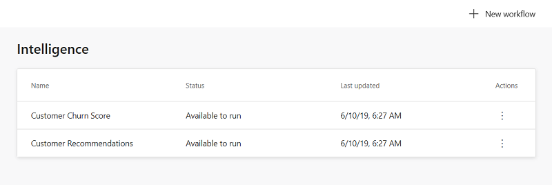
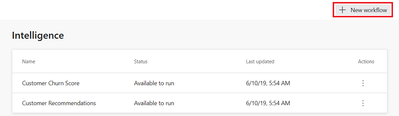
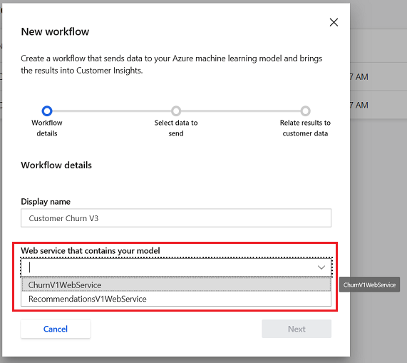
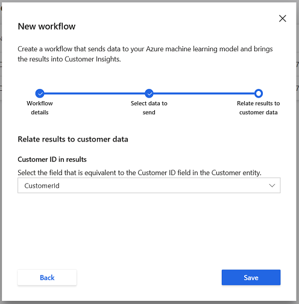

---
title: "Intelligence | MicrosoftDocs"
description: The Intelligence page shows you workflows that have been created to generate machine learning insights.
ms.custom: ""
ms.date: 06/18/2019
ms.reviewer: ""
ms.service: dynamics-365-ai
ms.suite: ""
ms.tgt_pltfrm: ""
ms.topic: "get-started-article"
applies_to: 
  - "Dynamics 365 (online)"
  - "Dynamics 365 Version 9.x"
ms.assetid: 
caps.latest.revision: 31
author: "jimholtz"
ms.author: "jimholtz"
manager: "kvivek"
---

# Intelligence

The **Intelligence** page shows you workflows created to generate machine learning insights. Workflows are designed to help you choose the data you want to use, select what will generate the machine learning insight, and map the results back into your Customer Insights data.

   > [!div class="mx-imgBorder"] 
   > 

## Add a new workflow

1. Within the **Intelligence** page, select **New Workflow**.

   > [!div class="mx-imgBorder"] 
   > 

2. Give your workflow a recognizable name in the **Display name** field, then select the web service you've published using Azure Machine Learning services in the **Web service that contains your model** drop down. For more information on how to deploy a web service, see: [Deploy an Azure Machine Learning Studio web service](https://docs.microsoft.com/azure/machine-learning/studio/publish-a-machine-learning-web-service). After you're done, select **Next**.

   > [!div class="mx-imgBorder"] 
   > 

3. For each **Web service input**, select the matching **Entity** from Customer Insights. When you're done, select **Next**.

   > [!div class="mx-imgBorder"] 
   > 

4. Select the matching attribute from the **Customer ID in results** drop down that maps to your Customer Insights CustomerId. When you're done, select **Save**.

   > [!div class="mx-imgBorder"] 
   > 

5. You'll see the **Workflow Saved** screen, and attributes about your new workflow that will be important to remember.

   1. **Workflow name:** This is the recognizable name for your workflow.
   2. **Entity created:** This is the name of the entity where the output from your workflow will be stored. You can find this entity in the **Entities** page.

   > [!div class="mx-imgBorder"] 
   > 

6. Select **Done** to return to the **Intelligence** page.

## Edit a workflow

1. Within the **Intelligence** page, select the vertical ellipses in the **Actions** column next to a workflow you've previously created, then select **Edit**.

   > [!div class="mx-imgBorder"] 
   > 

2. You can update your workflow's recognizable name in the **Display name** field, but changing the Web service is not possible. If you wish to create a new prediction using a different web service, you can refer to the Add a new workflow section for instructions. After you're done, select **Next**.

3. For each **Web service input**, select the matching **Entity** from Customer Insights.  When you're done, select **Next**.

4. Select the matching attribute from the **Customer ID in results** drop down that maps to your Customer Insights CustomerId. When you're done, select **Save**.

## Running a workflow

1. Within the **Intelligence** page, select the vertical ellipses in the **Actions** column next to a workflow you've previously created, then select **Run**.

   > [!div class="mx-imgBorder"] 
   > 

Your workflow will also automatically run each time you have a scheduled refresh. You can find more information on setting up scheduled refreshes here: https://docs.microsoft.com/en-us/dynamics365/ai/customer-insights/pm-settings#schedule-tab

## Deleting a workflow

1. Within the **Intelligence** page, select the vertical ellipses in the **Actions** column next to a workflow you've previously created, then select **Delete**.

   > [!div class="mx-imgBorder"] 
   > 

Your workflow will be deleted, but the entity that was created when you created the workflow will still remain in the **Entities** page.