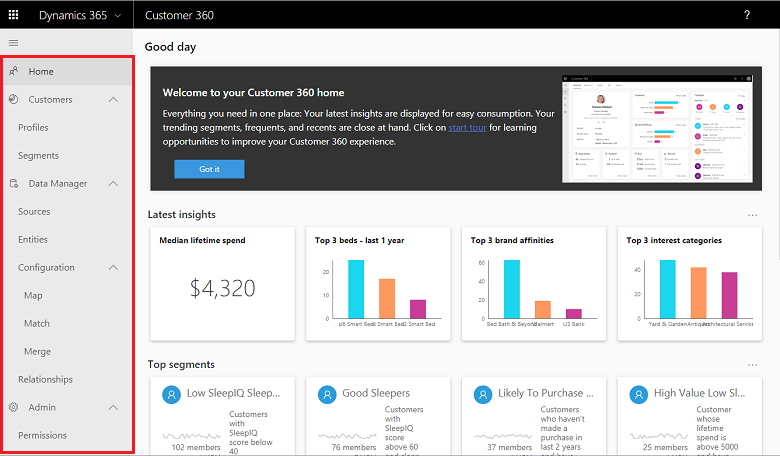
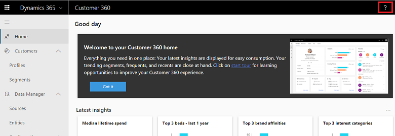

# Advanced Guide

[!INCLUDE [cc-beta-prerelease-disclaimer](../includes/cc-beta-prerelease-disclaimer.md)]

> [!IMPORTANT]
> - This feature currently has limited availability.
> - [!INCLUDE[cc_preview_features_definition](../includes/cc-preview-features-definition.md)]  
> - [!INCLUDE[cc_preview_features_expect_changes](../includes/cc-preview-features-expect-changes.md)]  
> - [!INCLUDE[cc_preview_features_no_MS_support](../includes/cc-preview-features-no-ms-support.md)]  

## How to use the Advanced Guide
All product sections are accessed through their corresponding tab names in the left-side menu of the app as shown below:

//Replace the image below with image 1:
> [!div class="mx-imgBorder"] 
> 

In order to best utilize this guide for your specific needs, you should identify your situation:
- ***I am new to the product*** -> In that case you may want to explore the guide from start to end. As shown below, product sections are represented by tabs on the left-side menu. **This guide's flow reflects the order by which you should work with the product: Completing the *Data Manager* and *Configure Data* sections and only then exploring the *Get Insights* sections.**  
- ***I am already using the product but incurring a specific issue*** -> In that case you may want to identify what product section this issue relates to and explore this particular section. 

// Update to final app menu once *Timeline* will be removed from it:
> [!div class="mx-imgBorder"] 
> 

**Note**: You can return to documentation on any of the product pages by clicking the question mark as shown below:
[complete image]

<!--
## Onboarding (for Administrators)
Currently missing (9/17)
-->

## Onboarding 
The first thing you should do is clicking the offer link and setting an instance:

- **If you are a new user, complete the following steps**:
  -**Clicking an Offer Link**: You should have been provided with the following link: 
  -**Choosing an instance**: Upon clicking the offer link you will get to the screen below. We automatically created for you an instance. Copy paste it into your browser to start using the app.

Complete the following steps in order to return to Customer 360:
-	**If you a returning user, follow those steps:
  -**Clicking the Offer Link**:
  -**Choosing an instance**: When you first used Customer 360 an instance was created for you. Copy paste this instance into your browser to continue using Customer 360. If, as part of using customer 360, you plan to create multiple instances, it’s highly recommended to give them an identifiable names through the *Settings* screen.

//add image 2:
[]

## Choose a business category
The second thing you do is select a business category that matches your industry:

> [!div class="mx-imgBorder"] 
> 

Select **More categories** to choose from more industries and business functions:

> [!div class="mx-imgBorder"] 
> 

## Workflow
If you never used Customer 360 before, you can expect to go through the workflow that is shown below:

//Update:
> [!div class="mx-imgBorder"] 
> 

Here is a reminder as for how to best utilize this guide if you are new to Customer 360:
- First review the **Data Manager** sections to learn how to ingest and edit your data.
- Then complete the **Configure Data** sections to learn how to combine your datasets into a unified dataset 
- Completing the **Data Manager** and **Configure Data** sections will will enable you to unlock unique insights on your customers. Hence at this point you should review the **Get Insights** sections. 
- **As an administrator**, if you wish to change permissions and settings (giving a name to an instance for example), you should review the **Customer 360 Administration** sections

