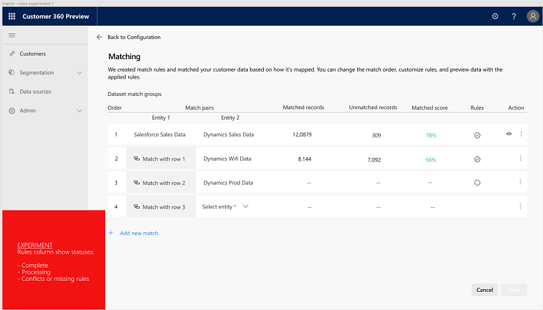

# Advanced Guide

[!INCLUDE [cc-beta-prerelease-disclaimer](../includes/cc-beta-prerelease-disclaimer.md)]

> [!IMPORTANT]
> - This feature currently has limited availability.
> - [!INCLUDE[cc_preview_features_definition](../includes/cc-preview-features-definition.md)]  
> - [!INCLUDE[cc_preview_features_expect_changes](../includes/cc-preview-features-expect-changes.md)]  
> - [!INCLUDE[cc_preview_features_no_MS_support](../includes/cc-preview-features-no-ms-support.md)]  

## How to Use the User Manual
In order to best utilize the user manual for your specific needs, you should identify yourself with one of the following options:
- ***I am new to the product AND I didn't go through Quick Start*** -> In that case you may want to explore the manual from start to end. As shown below, product sections are represented by tabs on the left side menu. This guide's flow reflects the order by which you should work with the product: **Completing the *Data Manager* sections and only then exploring *Segmentation, Profiles and Homepage***.
- ***I am new to the Advanced Mode but I did explore the Quick Start*** -> In that case you may want to skip the following sections: *Search and Browse Customer, Profile, Enrichment, Segmentation, and Administration* as these are the same as for *Quick Start*.   
- ***I am already using the product but inccuring an specific issue*** -> In that case you may want to identify what product section this issue relates to and read on this particular section.

(add app screenshot with highlighted left-side menu)

## Sources
In this section we will explain how to bring data from many of your sources: From CRM systems, to transactional and survey data, to clickstream, social and other data you might have. Connecting all your data sources and completing the Map, Match and Merge phases described below, will enable you to unlock one of the unique promises of the product - consolidating and reconciling data on your customers from multiple sources that once were disperate and conflicting. 

o	Connectors (sources that are not supported by the CDM template)
o	Go deep on .csv files

## Entities

## Configuration

### Intro to Configuration
Once ingested your data, you are ready to unlock the unique data-configuration features that Dynamics AI for Customer Insights offers. In the flow below, you can get a sense for the different relations that exist between your ingested data sets. In Dynamics AI for Customer Insights, those datasets are called **Customer Entities**. Clicking the **Map** tile at the bottom of the screen will take you to the first stage in the data configuration process.

### Map
There are two main goals behind the Map screen (shown below):
- Entity selection: Identifying the customer entities which might include overlapping or partially ovelapping data
- Attribute selection: For each customer entity, identifying the columns upon which you will want to merge your data (also called **Attributes**)

Clicking each of the customer entities tabs on the left will open it's corresponding attributes table. Below we will explore each of this table's columns, going left to right:
- **Primary Key:** For executing the identity-resoultion process it's mandatory to **select one attribute as a unique key** for each of the customer entities. For example, if one of your data sources is a contacts dataset, you may want to assign *customer name* as the unique key for that source, while for a call logs file you may define *phone number* as a unique key.
- **Match:** Also required selection. Here you want to select **all** the attributes that might correspond to attributes in other customer entities. Examples range from customer ID, to email address, to many other attributes that you might find in multiple datasets 
- **Entity Type:** Categories under which your attributes fall such as email or name. Adding a custome entity type is also possible.
- **Normalize:** Optional column. Here you can select whether and how to normalize all the data that you use for the matching prcosess. Several options are available such as removing whitespaces, normalizing digits, removing punctuation, and others. 

In addition, three additional actions are available in the Map screen:

- **Add customer entity:** Available upon clicking the **Add** drop-down menu (shown below, left image). Here you can bring additional data sets from your data sources on the basis of which you wish to match your data. 
    - Using the customer entitys panel (shown below, center image), first you want to click on the data source from which you wish to add more customer entities. In the example below, clicking the *Dynamics* datasource opened a list with all the entities for that source. You may also use the search botton to find a specific entity.
    - Next, you want to select the entities that you want to add. In the example below (right image) few entities have been selected.

      

    - Lastly, you want to save your selection and now these will be added as new tabs to the left of the entity table. 
      
      
- **Add attributes to an existing customer entity:** Available upon clicking the **Add** drop-down menu (left image below). Choosing this option for one of your customer entities will enable you to take more attributes into consideration as part of the matching process. [UX is not ready for selection panel]

- **Keep unmatched records:** As part of the next stage (match), it is possible that not all of your data entities will be matched. Upon checking this box (shown below), you choose to save all the records (or dataset rows) of your unmatched entities in your master data profile for future use. This option is recommended if.. [(to complete)] 

(add "Map keep unmatched records" screen)

### Match
Once mapping is completed, you are ready to match your mapped entities. Clicking the *Match* tile in the configuration screen will take you to the Match screen.

(add "configuration" screen with highlighted Match tile)

In the Match screen below, some matches were already automatically identified based on your map pahse selections. However, since there are many ways and orders by which customer entities might be matched, this phase enables you to specify the match logic that best resonates with:
- Your understanding of how your datasources are related to one another
- Your understanding of what sources are most reliable for your mapped attributes.  

#### Exploring the Match screen
The match screen includes several componenets. We will explore these from left to right.
- **Match Pair**: Clicking an entity in one of the match pair columns will enlist all the entities that are availalbe for match pairs. Those entities were selected during the Map stage. 
- **Matched Records**: Number of records (or dataset rows) that were matched for the specific match pair
- **Unmatched Records**: Number of records (or dataset rows) that were unmatched for the specific match pair
- **Matched Score**: Relative score that reflects the number of successful matches for that pair compared to the other pairs
- **Rules**: While the concept of *Roles* will be explained within the next section, this checkbox has three states:
  1. Checked circle: Implies that at least one rule was defined for that match pair.
  2. Warning triangle sign: Implies that no rules were defined for that match pair.
  3. ?: Suggests that there are conflicting rules for that match pair. 
- **Action**: Clicking the "eye" icon will enable you to see all the records for that pair. Clicking the "three dots" icon will enable you to either remove a pair or edit it's roles (the concept of match pair roles will be explained within the next section). 

#### Editing Match Pair Roles
The roles for each match pair are accessable through the "three dots" icon under the *Action* culumn as shown above. 
**Match Pair Rules** dictate the attribute-level conditions by which specific pair of entities (a match pair) will be mathced. In the example below, two rules are listed for the match pair Saleforce Sales Data : Dynamics 365 sales data. - The first rule includes the Name attribute for both entities
- The second rule includes... for the Saleforce Sales Data entity and ... for the Dynamics 365 Sales data entity
- These rules has an "Or" condition which states that either one of the rules should be executed when matching these pair entities
- Upon the first role execution, 5,108 records will be matched, while upon the second rule execution, 3,081 records will be matched

#### Editing Match Pairs Order
In addition to roles, we can edit the order by which our entities will be matched. This is done by clicking the *Add Match Pair* option:
(Add Match image from figma and highlight the Add Match Pair click-to-action)

- In the example below, *Salesforce Sales Data* and *Dynamics Sales Data* were defined as the first match pair and hence will be the first two entities to be matched. Next, the user added another match pair (shown in row two): This pair includes the matched data set that resulted from the first match and a new customer entity that was selected by the user. The same process repeats for the third pair.

- Upon clicking *Save* at the right bottom corner of the Match screen, the match pairs will be matched according to the order specified. Moreover, each and each match pair will be matched according to the rules specified for that match pair. 

### Merge
This is the last step within the data configuration process and it's all about reconciling conflicting data. Examples for such a conflicting data might be the customer name which resides in two of your datasets but shows a little bit different (Grant Marshall versus Grant for instance), or a phone number format that slightly differs (617-8030-910 versus 6178030910 for instance). Merging those conflicting data points is done on a attribute-by-attribute basis as detailed below.

- **Viewing pre-identified merged attributes**: These attributes are shown under *Merged Attributes* in the highlighted screen part below. In this example, the attribute *Name* was selected and the table shown includes all the values that were found for that attribute within all the customer entities. Moreover, a specific attribute value (for example the name *Grant*) can be searched for using the ***search icon*** above the values table.  

- **Prioritizing sources for pre-identified merged attributes**: Continuing with *Name* as an example for merged attribute, in this section we will learn how to prioritize contradicting values for that attribute. We start by clicking the *three dots* icon below: 

- We will conduct the prioritization process within the *Edit Attribute* panel as shown below. This panel consists of three parts: *Attribute Name* (upper part), *Attribute Source* (middle part) and *Merge Policy* (lower part). 

  - First we will consider to edit the *Attribute Source* part. This part specifies all the sources that include values for the *Name* attribute. we can see that by default, all these sources are selected and hence values for the *Name* attribute are taken into consideration from all three sources. If we wish **not** to consider one or more of the sources we will unselect them.
  
  - Second, we will consider to edit the *Merge Policy* part. This part specifies only the sources that were selected within *Attribute Source*. Here we will prioritize those sources: If we think for example that *Dynamics WiFidata* includes the most accurate data about *Names*, than in the panel shown above, we will click the arrow sign next to *Salesforce Sales Data* and as a result *Salesforce Sales Data* will move to first priority while *Dynamics WiFidata* will move to second priority when pulling values on *Names*.

- **Adding a new merged attribute**: Adding a new merged attribute is available via the *Add Attribute* option as shown below. 

(Add merged attribute screen from figma with highlighted add merged attribute part)

- We will perform the attribute addition process within the *Add Attribute* panel as shown below. This panel consists of three parts: *Attribute Name* (upper part), *Select Attributes* (middle part) and *Merge Policy* (lower part). 

  - First we will type an attribute name in the *Attribute Name* field. This is the name we are giving to our merged attribute.
  
  - Then, within the *Select Attributes* menu, we will select all the attributes that we want to merge into our specified attribute.
  
  - Lastly, we will define the merge policy by clicking on the relevant arrows in the *Merge Policy* section as we did before.
  
- **Editing a group merged attribute**: In some cases, it will be valuable to group multiple attributes as one merged attribute. In the example shown below, the attribute *Address* is defined as a group attribute as represented by the icon next to it (such icon doesn't appear next to single attributes). The table shown includes all the attributes that are included in the group attribute.
  

   - In order to edit a group attribute, we will click on the *three dots* icon just as we used to do for a single attribute.
   - In the next stage, we will use the *Edit Group Attribute* panel that is shown below. We want to find all the attributes that should be included in this group attribute and we will achieve that by typing those attributes names in the *search* field.
     
 

## Enrichment
Once completed the data configuration process, you are ready to unlock another unique feature. As part of the **Enrichment** process,  your configurated data will be enriched with unique data on customers' top interests and preferred brands. Here Dynamics 365 Ai for customer insights will automatically do for you the hard work:

- **Interests** may range from *Shoes*, to *Banking Services* to *4 Star Hotels* to any one of the other 300+ categories that the app extracts from the Microsoft Graph

- **Preferred Brands** may include *Nike*, *Walmart*, *Nokia*, or any one of the other 1200+ categories that the app extracts from the Microsoft Graph 

(add enrichment screen from ?) 

- **Understanding the enriched data**: Once being configurated, now your data is also enriched. For each of your customers you can view the top ten interests and preferred brands based on online behavior. 

(add enrichment screen with close-up on the interests and brands columns for a couple of rows)

You can filter your customers by one or more of the following:
    - **Location, State** (note: at this point only US-locations are supported by enrichment)
    - **Location, City** (same note holds true for cities)
    - **Gender:** Either Male or Female or Unknown or all categories (Male, Female and Unknown taken together)
    - **Age:** Either age bucket 20-34, age bucket 35-44, age bucket 45-54 or 55+ 
    
(add enrichment screen with filter panel opened)

## Relationships

# Customers

## Profile

### Search and browse customer 
Once you've connected to a data source, AI for Customer Insights creates some customer profiles based on your industry type.

> [!div class="mx-imgBorder"] 
> 

Select **View more** to see more customers sorted by the profile type. In this example, **Top paying** is the profile type.

> [!div class="mx-imgBorder"] 
> 

You can use the customer profiles page to filter and sort the profiles.

> [!div class="mx-imgBorder"] 
> 

What's in the sort list depends on the category you selected earlier and the profile type. This example is xyz category with **Top paying** as the profile type.

> [!div class="mx-imgBorder"] 
> 

## Segmentation
There are three available segmentation types: *Static Segments*, *Dynamic Segments*, and *Customized Segments*. First we will discuss **segment creation** and learn two ways to perforam that task. Then we will move to discuss **segment exploration**. Lastly we will discuss **segment exportation**.  

### Creating Segments from the Left Menu Bar
This menu includes three tabs. The tabs that are used for segment creation are the *Dynamics Segment* and *Static Segment*.

- **Static Segment Page:** Clicking the Static Segment tab will open this page. Here one can create sophisticated segments of customers   with minimum effort. Cases that fit static segments are for example: 1. , 2.

[divS1]

   - **We start by defining the segment's properties**: We will give our segment a name and description, choose whether it's a segment  
     that is created for accounts (---) or contacts (---), and ensure to leave the Dynamic (blue) switch in "off" state since it is a 
     static segment: 
     
     [divS2]
     
   - **In step two, we will start creating our first filter**. Upon clicking the "filter" bar an entity can be selected. Once we 
     selected an entity type, we need to choose the specific attributes we want to group by our customers. Note that attributes can have      one of three value types: A numerical, a string or a date. In the example below, an attribute with a numerical value is used as a 
     filter:
     
     [divS3]
     
   - **In step three, which is optional, we will add two rules to our filter**. Two roles are available on the entity level: 
     ***AND*** and ***OR***. In the example below, we added to our first role two additional roles. The middle row demonstrates the 
     creation of an "AND" role (this time with a string attribute), while the lower row demonstrates an "OR" role (created for a time 
     attribute):
     
     [divS4]
     
   - **In step four, we will show how to combine multiple filters that are created for multiple entities**. Upon clicking "Add Group" 
     botton, three options will show up: ***Union***, ***Intersect*** and ***Exclude***. Clicking each of these options will result in 
     the creation of a new filter for a new entity and the consolidation of this new filter with the filter we created in steps 2-3.            - Choosing ***Union*** will dictate that the new segment will be fully added to the older segment - no data will be excluded
       
     [divS5]

- **Dynamic Segments Page:** Clicking the Dynamic Segment tab will open this page. Here one can create segments that are automatically updated with time. Cases that fit dynamic segments are for example: 1. , 2.

### Creating Segments from the Customers Page

### Exploring Segments from the Segmentation Page

### Exploring a Particular Segment from the Segment Page

### Acting Upon the Data: Exporting a Segment

o	Work with operators to produce segments (both static and dynamic segments)
o	Act (export segments)

User is able do segmentation atop CDS-A profiles
Show how a user can analyze CDS-A customer profiles/relationships/interactions and export the results as segments to other apps (e.g. CSV file)
Show how we enable developers to query customer profiles from CDS-A and build into app experience (e.g. a Dynamics 365 for Marketing)

> [!div class="mx-imgBorder"] 
> 

# Homepage

# Administration

This is where you can set up roles and permissions for using Dynamics 365 AI for Customer Insights across your organization. The main administration screen is the **Permissions** screen which is accessable via the **Administration tab** as shown below:  

(add "permissions" screen from the administration part on the app)

Within the **Permissions** screen you can view organization members for whom roles and permissions where assigned. Note that while roles are specified under the *Roles* column, permissions are specified under the *Type* column. Lastly, you can sort the results by each of the columns types by clicking on the arrow icon next to the column name as shown below.  

(add "add permissions" screen from the administration part on the app plus highlight the sorting arrow next to the "Name" column)

- **Adding Roles and Permissions:** 
    -In terms of roles, it's possible to define organization members as either ***Administrators***, ***Contributors*** or ***Readers***. This definition process is done via the **Adding Permissions** panel that can be accessed via the *Add* botton at the top of the permissions screen:

(add permissions screen with opened "add permissions" panel from the administration part on the app and highlight the role field)

   -When it comes to permissions, those can be defined in the same panel as shown below:
   
(add permissions screen with opened "add permissions" panel from the administration part on the app and highlight the permissions field)

- **Viewing current number of users per role:** This can be done via the **Roles** panel that can be accessed via the *Roles* botton at the top of the permissions screen:

(add permissions screen with opened "roles" panel from the administration part on the app)

- **Filtering Permissions by a Role**: This can be achieved by opening the **Filter** panel through the *Filter* botton at the top of the permissions screen, and choosing whether to filter the permissions by the ***Administrator***, ***Contributor*** or ***Reader*** roles.

(add permissions screen with opened "filter" panel from the administration part of the app)
Within the panel above, you may want 

(add "filter" screen from the administration part on the app)

# Extensibilities

## Power BI

## APIs - Swagger

User can drive insights in Customer360 to action

Show how a user can setup triggers to drive actions (e.g. use Flow to ! mail to account manager when churn score increases by 10+%)
Show how a user can setup triggers on events detected in profile to drive relevant actions (e.g. if a customer tweets a complaint, notify customer service department to reach out and resolve)

> [!div class="mx-imgBorder"] 
> 

## PowerApps and Flow
Content.

> [!div class="mx-imgBorder"] 
> 

