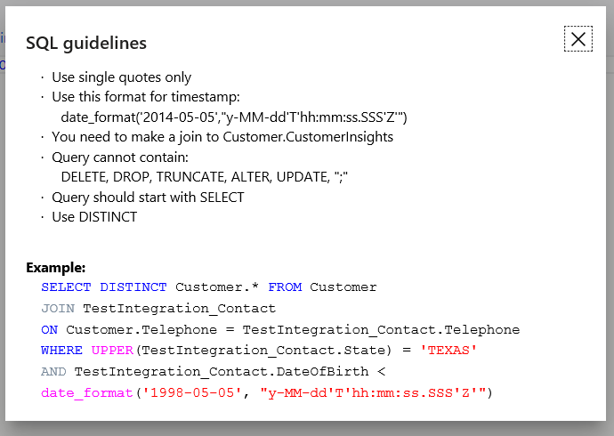

# Advanced mode 

[!INCLUDE [cc-beta-prerelease-disclaimer](../includes/cc-beta-prerelease-disclaimer.md)]

## Overview

Advanced mode allows you to use raw SQL data to define any segment. Advanced mode is a capability on the **Segment builder** screen that is described [here](pm-segments.md). 

> [!IMPORTANT] 
>
> - Customer Insights uses the SQL dialect of **Spark 2.3 (HDI 3.6)**. There are minor differences from a raw SQL which you should be aware of before you type the SQL query for your segment.
> - View the SQL guidelines later in this topic.
> - View the Spark 2.3 [documentation](https://spark.apache.org/docs/2.3.0/). 

### When should I use advanced mode? 

Use advanced mode when you want to create a segment that is difficult or impossible to create on the **Segment builder** screen. For example, consider the following scenarios which can't be achieved using the Segment builder:

- Nesting an **AND** operator within an **OR** operator.
- Using operators that don’t exist in the builder, such as **Time** or **Percentile**.
- Using group filters (**Unite**, **Intersect** and **Exclude**) in ways that are not supported in the builder.
 
For scenarios such as these, you may want to consider using advanced mode. 

### What skills should I have to use advanced mode?

To use advanced mode, you need the skill (or access to someone with the skill) of writing a SQL query which produces your segment as an output.

## Get started with advanced mode

There are two ways to enter Advanced mode:

- The **Create segment** panel:

// add image 1

> [!NOTE]
> When you create a segment using advanced mode, all future edits to this segment will be done using the advanced mode.

- The **Complete segment definition using SQL** button on the **Segment builder** screen:

// add image 2

> [!NOTE]
> When you select the **Complete segment definition using SQL** button,  a notification appears which you have to accept to continue. Upon acceptance, you commit to perform all future edits to this segment using the advanced mode screen rather than the segment builder screen.

## The Advanced mode screen

The Advanced mode screen includes four components:

// can we crop the top and bottom parts?

1. ***Editor* window:** This is your working area where you enter your SQL query. Your segment output must include all the fields from the *Customer Insights* entity.  This requirement is already fulfilled through the code that is populated on the first line. Note that if you wish to include additional fields in your segment output you need to write a corresponding statement.

2. ***View guidelines* link:** Make sure you know the few differences between a free-format SQL code and the code format used in Customer Insights. The image below shows some of these guidelines as well as an example for a valid SQL query. Make sure to visit the Spark 2.3 [documentation](link) for more details.

3. ***Save* button:** Use this button to save and process your segment. If it’s a valid query, it will produce a segment and you should expect to see it in the **Segments** screen. If it’s an invalid query, your segment definition will be saved as a draft. Visit the **Segments** topic for more details on the **Draft mode.**

4. ***Back to segments***: Use this button to go back to the **Segments** screen.

## Edit, rename or delete a segment

Any segment that you create or edit using advanced mode must also be edited in advanced mode. You can not use the **Segment builder** screen to edit these segments. Within the corresponding segment tile on the **Segments** screen, click the **…** button to show the **Edit**, **Rename**, and **Delete** options. 
