# Configuration

[!INCLUDE [cc-beta-prerelease-disclaimer](../includes/cc-beta-prerelease-disclaimer.md)]

> [!IMPORTANT]
> - This feature currently has limited availability.
> - [!INCLUDE[cc_preview_features_definition](../includes/cc-preview-features-definition.md)]  
> - [!INCLUDE[cc_preview_features_expect_changes](../includes/cc-preview-features-expect-changes.md)]  
> - [!INCLUDE[cc_preview_features_no_MS_support](../includes/cc-preview-features-no-ms-support.md)]  

## Configuration

### Intro to Configuration
Once ingested your data, you are ready to unlock the unique data-configuration features that Customer 360 offers. In Customer 360, the ingested datasets are called **Customer Entities**. Clicking the **Map** tile at the **Configuration page** will take you to the first stage in the data configuration process.

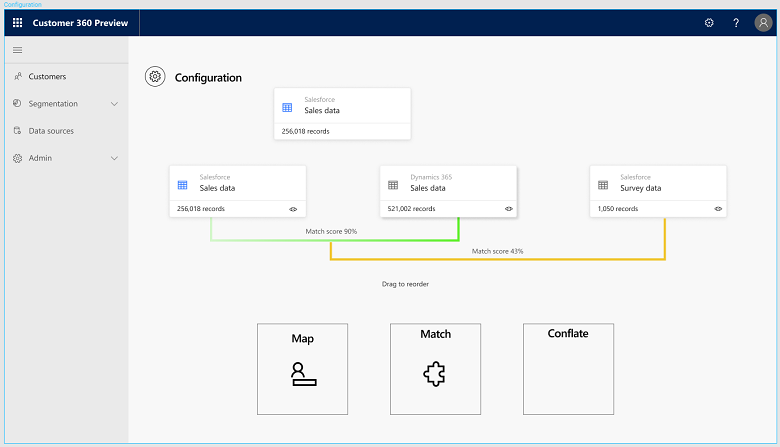

### Map
There are two main goals behind the Map page (shown below):
- Entity selection: Identifying the customer entities which might include overlapping or partially ovelapping data
- Attribute selection: For each customer entity, identifying the columns upon which you will want to merge your data (also called **Attributes**)

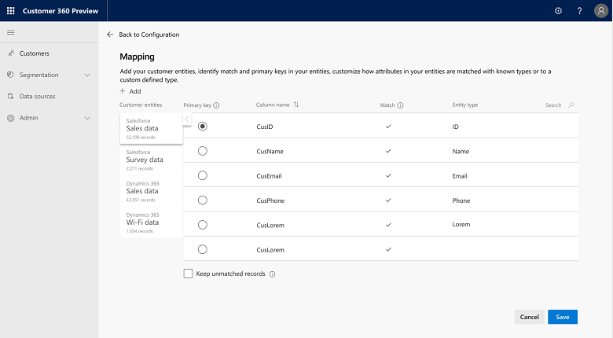

Clicking each of the customer entities tabs on the left will open it's corresponding attributes table. Below we will explore each of this table's columns, going left to right:
- **Primary Key:** For executing the identity-resoultion process it's mandatory to **select one attribute as a unique key** for each of the customer entities. For example, if one of your data sources is a *Contacts* dataset, you may want to assign *Customer Name* as the unique key for that source, while for a *Call-Logs* file you may prefer to define *Phone Number* as a unique key. 
- **Name**: The attribute name
- **Type:** Categories under which your attributes fall such as email or name. Adding a custom entity type is also possible: Upon clicking the type for a given attribute and selecting **Custom** you will be able to type your custom type
- **Normalize:** Optional column. Here you can select whether and how to normalize all the data that you use for the matching process. Several options are available such as removing whitespaces, normalizing digits, removing punctuation, and others. 

In addition, three additional actions are available in the Map page:

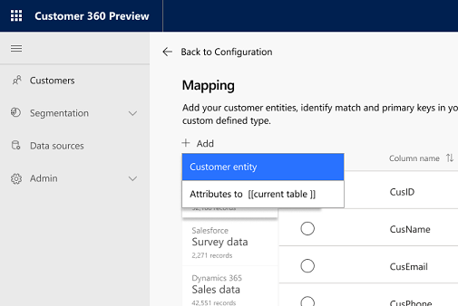

- **Add customer entity:** Available upon clicking the **Add** drop-down menu (shown below). If you think there are additional entities on the basis of which your data should be merged, you should add them at this point.
    - Using the customer entities panel (shown below), first you want to click on the data source from which you wish to add more customer entities. In the example below, clicking the *Dynamics* data source opened a list with all the entities for that source. You may also use the search button to find a specific entity.
    
    - Next, you want to select the entities that you want to add. In the example below (right image) few entities have been selected.

      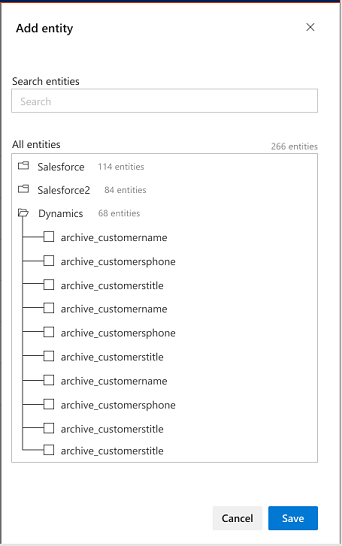

    - Lastly, you want to save your selection and now these will be added as new tabs to the left of the entity table. 
      
      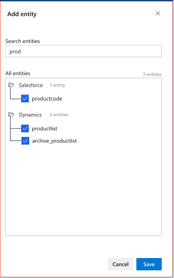
- **Add attributes to an existing customer entity:** Available upon clicking the **Add** drop-down menu (as shown below). Choosing this option for one of your customer entities will enable you to take more attributes into consideration as part of the matching process. [UX is not ready for selection panel]

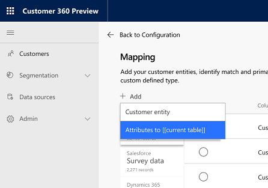

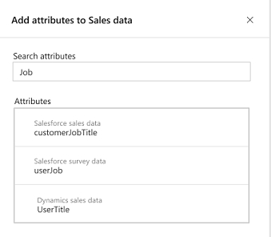

- **Keep unmatched records:** As part of the next stage (match), it is possible that not all of your data entities will be matched. Upon checking this box (shown below), you choose to save all the records (or dataset rows) of your unmatched entities in your master data profile for future use. This option is recommended if.. [(to complete)] 

> [!div class="mx-imgBorder"] 
> 

### Match
Once mapping is completed, you are ready to match your mapped entities. Clicking the *Match* tile in the *Configuration page* will take you to the *Match page*.

In the *Match* page below, some matches were already automatically identified based on your Map phase selections. However, since there are many ways and orders by which customer entities might be matched, this phase enables you to specify the match logic that best resonates with:
- Your understanding of how your datasources are related to one another
- Your understanding of what sources are most reliable for your mapped attributes

#### Exploring the Match page
The *Match* page includes several components as explored below. Once you complete editing those components select **Run** at the bottom of the page to execute all the matchings you have specified. 

- **Match Pairs Diagram**: The diagram includes the hirarchy in which the match pairs will be matched. 
    - Each of the entities is represented by a tile with the entity's name, number of records, end possibility to view those records by clicking the *eye* icon at the right corner of the tile. 
    - Each of the match percentages is specificed on top of the link that represents that match.
[]

- **Match Pair Table**: for each of the match pairs in the diagram there is a match pair table in the lower part of the page. Each row represents a separate *Role* for that particular match. *Role* stands for the attributes' combination on the basis of which you want to perform that specific match. For example, if *Phone + Email* is selected as a role (more on defining roles below), then the data in those two match pair entities will be matched on the basis of these two attributes. Also note that the order of these roles will dictate the order by which the specific match will be executed. 

What is included within each *Role* row? Let us explore from left to right:
    - **Matched Records**: Number of records (or dataset rows) that can be matched for the specific match pair under this role
    - **Eye Icon**: Clicking this icon will enable you to see all the records for the specific match pair under this role
    - **Three Dots Icon**: Clicking this icon will enable you to edit the specific role (more on editing roles below)

#### Editing Match Pairs Hirarchy:
This can be easily done by dragging and dropping the entities tiles. In the example below, Contact and SleepIQ will be matched first and only then the WebAccount entity will be matched with the result of the first match:

[]

#### Editing Match Pair Role:
As mentioned above, this can be done via the *Three dots Icon* on each of the roles rows. 
Upon clicking the icon, the *Role Editing Panel* appears:

[]

besides the role name, this panel enables you to specify all the ***Criteria*** for that role. Each Criteria is represented by a row that includes (going left to right):
- The attribute that will be used for matching within the first match pair entities
- The attribute that will be used for matching within the second match pair entities
- The method used for that criteria where selecting ***Exact*** will dictate that only matching records will be matched and selecting ***Fuzzy*** will dictate that records that are not 100% matching will also be matched. The threshold for Fuzzy matches will be selected next to it: You can define these as either *Low*, *Medium* or *High*.
- An either *OR* or *AND* operator where:
  - *AND* states that the criteria will be executed together with the next criteria
  - *OR* states that either this or the next criteria should be executed

 
### Merge
This is the last step within the data configuration process and it's all about reconciling conflicting data. Examples for such a conflicting data might be the customer name which resides in two of your datasets but shows a little bit different (Grant Marshall versus Grant for instance), or a phone number format that slightly differs (617-8030-91X versus 617803091X for instance). Merging those conflicting data points is done on a attribute-by-attribute basis as detailed below.

- **Viewing pre-identified merged attributes**: These attributes are shown under *Merged Attributes* in the highlighted page part below. In this example, the attribute *Name* was selected and the table shown includes all the values that were found for that attribute within all the customer entities. Moreover, a specific attribute value (for example the name *Grant*) can be searched for using the ***search icon*** above the values table.  

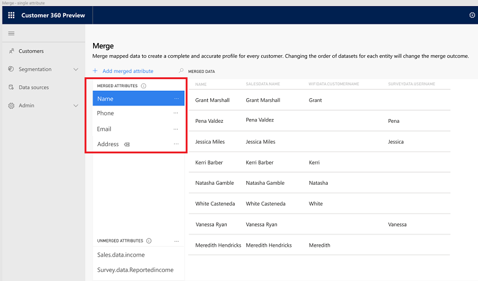

- **Prioritizing sources for pre-identified merged attributes**: Continuing with *Name* as an example for merged attribute, in this section we will learn how to prioritize contradicting values for that attribute. We start by selecting <b>...</b> below: 

- We will conduct the prioritization process within the *Edit Attribute* panel as shown below. This panel consists of three parts: *Attribute Name* (upper part), *Attribute Source* (middle part) and *Merge Policy* (lower part). 

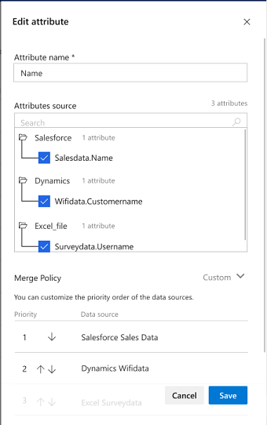

  - First we will consider to edit the *Attribute Source* part. This part specifies all the sources that include values for the *Name* attribute. we can see that by default, all these sources are selected and hence values for the *Name* attribute are taken into consideration from all three sources. If we wish **not** to consider one or more of the sources we will unselect them.
  
  - Second, we will consider to edit the *Merge Policy* part. This part specifies only the sources that were selected within *Attribute Source*. Here we will prioritize those sources: If we think for example that *Dynamics WiFidata* includes the most accurate data about *Names*, than in the panel shown above, we will click the arrow sign next to *Salesforce Sales Data* and as a result *Salesforce Sales Data* will move to first priority while *Dynamics WiFidata* will move to second priority when pulling values on *Names*.

- **Adding a merged attribute**: Adding a merged attribute is available via the *Add Attribute* option as shown below. 

> [!div class="mx-imgBorder"] 
> 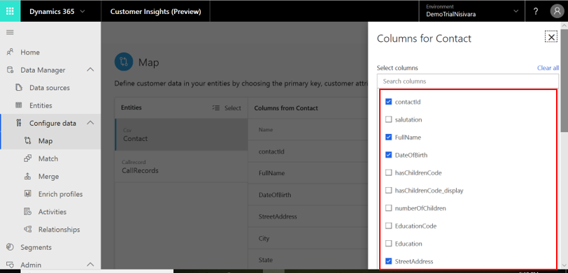

- We will perform the attribute addition process within the *Add Attribute* panel as shown below. This panel consists of three parts: *Attribute Name* (upper part), *Select Attributes* (middle part) and *Merge Policy* (lower part). 

  - First we will type an attribute name in the *Attribute Name* field. This is the name we are giving to our merged attribute.
  - Then, within the *Select Attributes* menu, we will select all the attributes that we want to merge into our specified attribute.
  - Lastly, we will define the merge policy by clicking on the relevant arrows in the *Merge Policy* section as we did before.
  
- **Editing a group merged attribute**: In some cases, it will be valuable to group multiple attributes as one merged attribute. In the example shown below, the attribute *Address* is defined as a group attribute as represented by the icon next to it (such icon doesn't appear next to single attributes). The table shown includes all the attributes that are included in the group attribute.
  
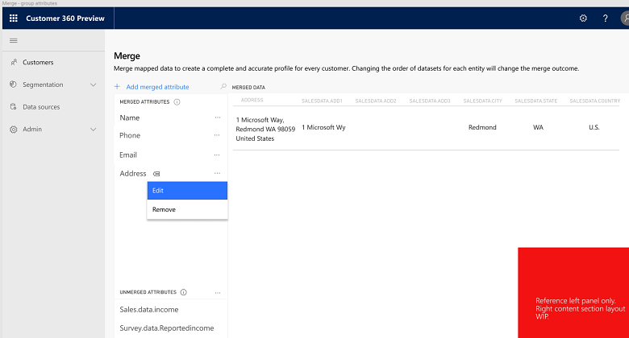

   - In order to edit a group attribute, we will click on the *three dots* icon just as we used to do for a single attribute.
   - In the next stage, we will use the *Edit Group Attribute* panel that is shown below. We want to find all the attributes that should be included in this group attribute and we will achieve that by typing those attributes names in the *search* field.
     
 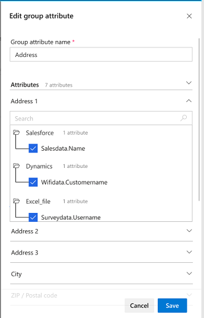

## Data Manager: Enrichment
Once completed the data configuration process, you are ready to unlock another unique feature. As part of the **Enrichment** process,  your configured data will be enriched with unique data on customers' top interests and preferred brands. Here AI for Customer Insights will automatically do for you the hard work:

- **Interests** may range from *Shoes*, to *Banking Services* to *4 Star Hotels* to any one of the other 300+ categories that the app extracts from the Microsoft Graph

- **Preferred Brands** may include *Nike*, *Walmart*, *Nokia*, or any one of the other 1200+ categories that the app extracts from the Microsoft Graph 

[add enrichment screen in the future]

- **Understanding the enriched data**: Once being configurated, now your data is also enriched. For each of your customers you can view the top ten interests and preferred brands based on online behavior. 
(add enrichment screen with close-up on the interests and brands columns for a couple of rows)

You can filter your customers by one or more of the following:
    - **Location, State** (note: at this point only US-locations are supported by enrichment)
    - **Location, City** (same note holds true for cities)
    - **Gender:** Either Male or Female or Unknown or all categories (Male, Female and Unknown taken together)
    - **Age:** Either age bucket 20-34, age bucket 35-44, age bucket 45-54 or 55+ 
    
[add enrichment screen with filter panel opened in the future]

content
