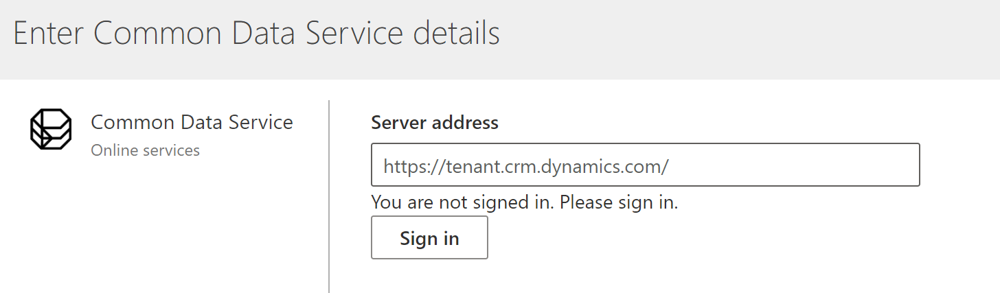
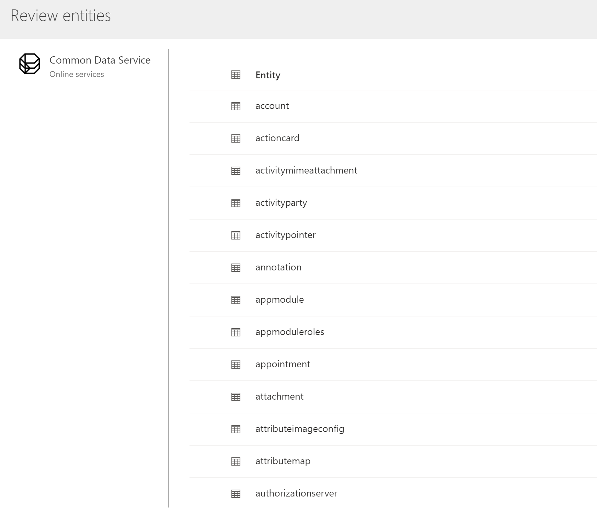

# Connect to data in a Common Data Service managed data lake

This article provides information on how existing Dynamics 365 customers can quickly connect to their analytical entities in the Common Data Service managed lake. You must be an admin on the Common Data Service organization to proceed and see the list of entities available in the managed lake.

## Important considerations

Data stored in online services, such as Azure Data Lake Storage, may be stored in a different location than where data is processed or stored in Dynamics 365 Customer Insights. By importing or connecting to data stored in online services, you agree that data can be transferred to and stored with Dynamics 365 Customer Insights. [Learn more at the Microsoft Trust Center.](https://www.microsoft.com/trust-center)

## Connect to a Common Data Service managed lake

1. Go to **Data** > **Data sources**.

2. Select **Add data source**.

3. Select **Connect to Common Data Service** and select **Next**.

4. Enter a **Name** for the data source and select **Next**.

5. Provide the **Server address** for your Common Data Service organization, and select **Sign in**.

   > [!div class="mx-imgBorder"]
   > 

6. Select the entities you want to use in Customer Insights from the available list.    

   > [!NOTE]
   > If some entities are already selected, they might be used by other Dynamics 365 applications (such as Dynamics 365 Sales Insights or Customer Service Insights). You can't change the selection. These entities will be available once the data source is created.

   > [!div class="mx-imgBorder"]
   > 

7. Save your selection to start syncing the selected entities to the Common Data Service managed lake. You'll find the newly added connection on the **Data sources** page. It will be queued for refresh and show the entities count as 0 until all the entities are synced.

Only one data source of an instance can simultaneously use the same Common Data Service managed lake.

## Edit a Common Data Service managed lake data source

You only edit the entity selection after creating the data source. For example, if additional entities were added to Common Data Service and you want to import them too.    
To connect to a different Common Data Service, [create a new data source](#connect-to-a-common-data-service-managed-lake).

1. Go to **Data** > **Data sources**.

2. Next to the data source you'd like to update, select the ellipsis.

3. Select the **Edit** option from the list.

4. Select additional entities from the available list of entities and select **Save**.
