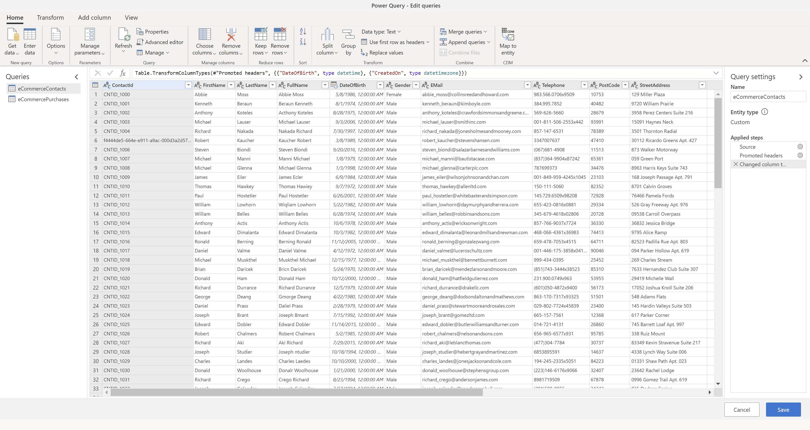

# Connect to a Power Query data source

Power Query offers a broad set of connectors to ingest data. Most of these connectors are supported by Dynamics 365 Customer Insights. Adding data sources based on Power Query connectors generally follows the steps outlined below. However, depending on the connector you use, different information is required. Refer to documentation about individual connectors in [Power Query connector reference](https://docs.microsoft.com/power-query/connectors/) for additional details.

## Create a new data source

1. Go to **Data** > **Data sources**.

1. Select **Add data source**.

1. Choose the **Import data** method and select **Next**.

1. Provide a **Name** for the data source, and select **Next** to create the data source.

1. Choose one of the [available connectors](#available-power-query-data-sources). For this example, we select the **Text/CSV** connector.

1. Enter the required details in the **Connection settings** for the selected connector and select **Next** to see a preview of the data.

1. Select **Transform data**. In this step, you'll add entities to your data source. Entities are datasets. If you have a database that includes multiple datasets, each dataset is its own entity.

1. The **Power Query - Edit queries** dialog lets you review and refine the data. The entities that the systems identified in your selected data source appear in the left pane.

   > [!div class="mx-imgBorder"]
   > 

1. You can also transform your data. Select an entity to edit or transform. Open one of the menus located at the top of the Power Query window to apply a specific transformation. Each transformation gets listed under **Applied steps**. Power Query provides a lot of pre-built transformation options. For more information, see [Power Query Transformations](https://docs.microsoft.com/power-query/power-query-what-is-power-query#transformations).

1. You can add additional entities to your data source by selecting **Get data** in the **Edit queries** dialog.

   These transformations are highly recommended:

   - If you're ingesting data from a CSV file, and the first row has headers, go to **Transform table** and select **Use headers as first row**.

   - Map your data to a standard format of data. For example, you can map your data to the Common Data Model. To do so, select **Map to standard** in the Power Query header, and then map fields from your source data to Common Data Model fields.

1. Select **Save** at the bottom of the Power Query window to save the transformations. After saving, you'll find your data source on **Data** > **Data sources**.

1. On the **Data sources** page, select the ellipsis next to the newly created data source and select **Refresh**.

## Available Power Query data sources

See the [Power Query connector reference](https://docs.microsoft.com/power-query/connectors/) for an up-to-date list of connectors that you can select to import data to Customer Insights. 

All connectors that have a checkmark in the **Customer Insights (Dataflows)** column are available when creating a new data source based on Power Query. Have a look at the connector reference of a specific connector to learn more about its prerequisites and other details.

## Edit Power Query data sources

> [!NOTE]
> It might not be possible to make changes to data sources that are currently being used in one of the app's processes (*segmentation*, *match*, or *merge*, for example). Using the **Settings** page, you can track the progress of each of the active processes. When a process completes, you can return to the **Data Sources** page and make your changes.

1. Go to **Data** > **Data sources**.

2. Select the vertical ellipsis next to the data source you want to change and select **Edit** from the drop-down menu.

   > [!div class="mx-imgBorder"]
   > 

3. Apply your changes and transformations in the **Power Query - Edit queries** dialog and refer to the section above for additional details.

4. Select **Save** in Power Query after completing your edits to save your changes.
