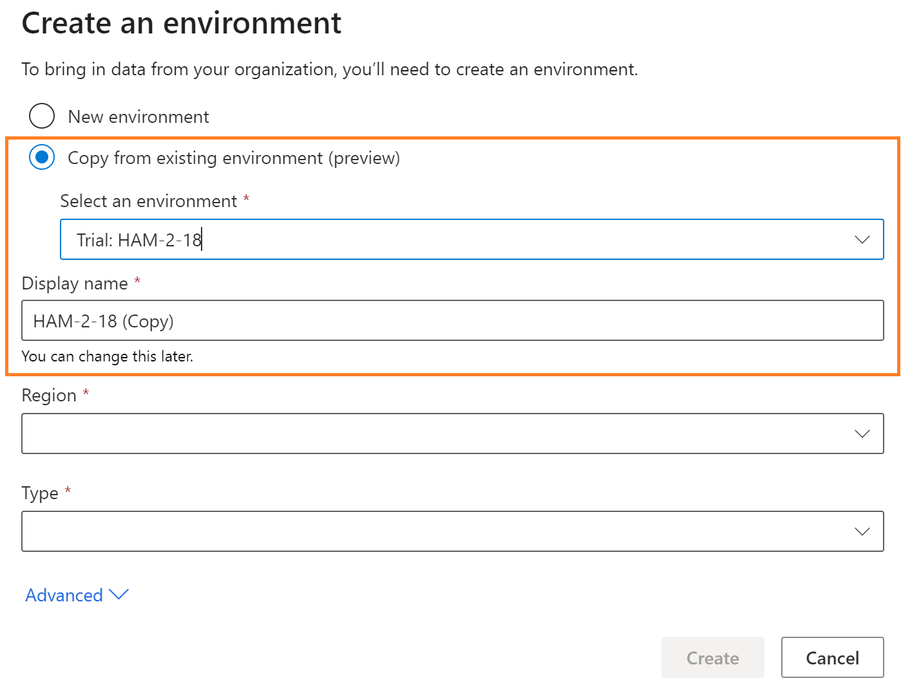
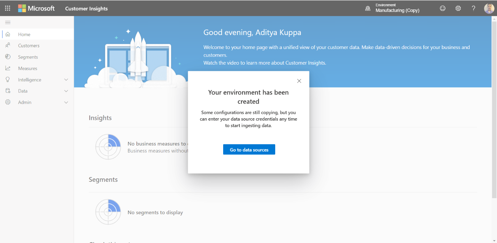

# Manage environments

This article explains how to create a Dynamics 365 Customer Insights instance and how to provision an environment.

## Sign up for Customer Insights and create the first instance

1. In your browser, go to the [Dynamics 365 Customer Insights](https://dynamics.microsoft.com/ai/customer-insights/) website.

2. Select **Get Started**.

3. Choose your preferred sign-up scenario and select the corresponding link.

4. You may need to accept the terms and conditions and select **Continue** to start creating the instance.

5. After the environment is created, you'll be redirected to [your Customer Insights instance](https://home.ci.ai.dynamics.com).

6. You can use the demo environment to explore the app, or create a new environment. Learn more about specifying the settings to create an environment.

7. After specifying the environment settings, select **Create**.

8. You'll be signed in to Customer Insights when the environment was created successfully.

## Create an environment from an existing Customer Insights instance

1. Select the **Settings** symbol in the header of the app.

2. Select **Environments**.

3. In the panel on the right side of the screen, select **New environment**.

4. Specify the basic and advanced settings and select **Create** to create the environment.

## New environment settings

   - You can create a new environment either by creating as a new environment altogether or copy from an existing environment.
   - If you choose to copy configuration from an existing environment, you will need to select the “Copy from existing environment” option and you will see a list of available environments from your tenant where you can copy from.
   - Once you select an environment from the available list, display name will be automatically copied from that selected environment name. You can edit this name if you want to.

Specify basic settings, and optionally, some advanced settings.

1. In the **Create new environment** dialog, provide the following details:
   - **Display name**: The name that represents this environment in the Customer Insights app. This field will be prepopulated with a name if you choose "Copy from existing environment" option. You can edit this name if you want to.
   - **Region**: The region into which the service is deployed and hosted
   - **Type**: Select if you want to create a Production environment or a Sandbox environment
    > 
    
2. Optionally, you can select **Advanced** to configure additional settings:

   - **Storage**: Specifies where you want to store the output data generated from Customer Insights. You'll have two options: **Customer Insights storage** (an Azure Data Lake managed by the Customer Insights team) and **Azure Data Lake Storage Gen2** (your own Azure Data Lake Storage). By default, the Customer Insights storage option is selected.

   > [!NOTE]
   > By saving data to Azure Data Lake Storage, you agree that data will be transferred to and stored in the appropriate geographic location for that Azure storage account, which may differ from where data is stored in Dynamics 365 Customer Insights. [Learn more at the Microsoft Trust Center.](https://www.microsoft.com/trust-center)
   >
   > Currently, ingested entities are always stored in the Customer Insights managed data lake.
   > We support only Azure Data Lake Gen2 Hierarchical Name Space (HNS) enabled storage accounts. Non-HNS storage accounts aren't supported yet.

   - For the Azure Data Lake Storage Gen2 option, you need to specify **Account name** and **Account key** for your storage account. The container name is always set to **customerinsights** and can't be changed.
     > [!div class="mx-imgBorder"]
     > 

   When you perform operations in Customer Insights, such as data ingestion or segment creation, corresponding folders will be created in the storage account you specified above. Data files and model.json files will be created and added to the respective subfolders based on the operations you perform.

   If you create multiple instances of Customer Insights and choose to save the output entities from those instances in your storage account, separate folders will be created for each instance with ci_<instanceid> in the container.

## Additional notes on "Copy from existing environment" option

 > [!NOTE]
   - This copy configuration will only copy the configuration settings. Currently we support copy of the data source settings, data unification settings, relationships, measures, segments, and user permissions. We plan to include additional components in the next releases.
   - No data source credentials and data will be copied. You need to provide the credentials for every data source and refresh the data sources manually. 
   - “Common Data Model folder " and “Common data Service managed lake” data sources will not be copied over. You will need to create those data sources manually with exact name as seen in the source environment.
   - Once data sources are refreshed, you will need to manually execute the data unification processes as well as execute the measures and segments etc.
   
   Once you create an new environment using “copy configuration” option, you will see a confirmation message that the environment has been created and the configurations are copied over. You can click on the “Go to data sources” button to go the datasources page directly where you can see all the data sources listed down.

> 

All the data sources will be “Credentials required” state and you can edit the data source to enter the credentials to refresh them and start using them in the your processes.

> 

Once the data sources are refreshed and you go to the Unify page, you will find that the Unify settings from the source environment are copied over and you can edit them as you need or simply click Run to execute the data unification process to create the Customer entity.

Once the Merge step in the unification is complete, you can go to the Measures and Segments pages to refresh those components.
   
## Edit an existing environment

You can edit some of the details of existing environments.

1. Select the **Settings** symbol in the header of the app.

2. Select **Environments**.

3. In the Environments panel, select the ellipsis next to the environment you want to edit and select **Edit**.

4. You can update the **Display name** but you can't change **Region** and **Type** of the environment.

5. If an environment is configured to store data in Azure Data Lake Storage Gen2, you can update the **Account key**. However, you can't change **Account name** and **Container** name.

## Deleting an existing environment

1. Select the **Settings** symbol in the header of the app.

2. Select **Environments**.

3. In the Environments panel, select the ellipsis next to the environment you want to edit and select **Delete**.

4. To confirm the deletion, enter the environment name and select **Delete**.
