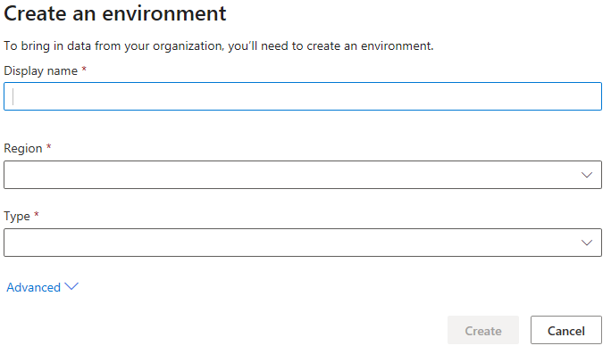

# Create a Customer Insights instance

This article explains how to create a Dynamics 365 Customer Insights instance and how to provision an environment.

## Sign up for Customer Insights and create the first instance

1. In your browser, go to the [Dynamics 365 Customer Insights](https://dynamics.microsoft.com/ai/customer-insights/) website.

2. Select **Get Started**.

3. Choose your preferred sign-up scenario and select the corresponding link.

4. You may need to accept the terms and conditions and select **Continue** to start creating the instance.

5. After the environment is created, you'll be redirected to [your Customer Insights instance](https://home.ci.ai.dynamics.com).

6. You can use the demo environment to explore the app, or create a new environment. Learn more about specifying the settings to create an environment.

7. After specifying the environment settings, select **Create**.

8. You'll be signed in to Customer Insights when the environment was created successfully.

## Create an environment from an existing Customer Insights instance

1. Select the **Settings** symbol in the header of the app.

2. Select **Environments**.

3. In the panel on the right side of the screen, select **New environment**.

4. Specify the basic and advanced settings and select **Create** to create the environment.

## New environment settings

When you create a new environment, you can specify basic settings, and optionally, some advanced settings.

1. In the **Create new environment** dialog, provide the following details:
   - **Display name**: The name that represents this enviroment in the Customer Insights app
   - **Region**: The region into which the service is deployed and hosted
   - **Type**: Select if you want to create a Production environment or a Sandbox environment
    > [!div class="mx-imgBorder"]
    > 

2. Optionally, you can select **Advanced** to configure additional settings:

   - **Storage**: Specifies where you want to store the output data generated from Customer Insights. You'll have two options: **Customer Insights storage** (a Azure Data Lake managed by the Customer Insights team) and **Azure Data Lake Storage Gen2** (your own Azure Data Lake storage). By default, Customer Insights storage option is selected. 

   > [!NOTE]
   > By saving data to Azure Data Lake Storage, you agree that data will be transferred to and stored in the appropriate geographic location for that Azure storage account, which may differ from where data is stored in Dynamics 365 Customer Insights. [Learn more at the Microsoft Trust Center.](https://www.microsoft.com/trust-center)
   >
   > Currently, ingested entities are always stored in the Customer Insights managed data lake.
   > We support only Azure Data Lake Gen2 Hierarchical Name Space (HNS) enabled storage accounts. Non-HNS storage accounts aren't supported yet.

   - For the Azure Data Lake Storage Gen2 option, you need to specify **Account name** and **Account key** for your storage account. The container name is always set to **customerinsights** and you can't change it.
     > [!div class="mx-imgBorder"]
     > 

   When you start performing operations in Customer Insights like data ingestion, running data unification, creating segments, etc. the corresponding folders will get created in the storage account you specified above, and the data files and model.json files will get created and added to the respective sub-folders based on the operations you perform.

   If you create multiple instances of Customer Insights and choose to save the output entities from all those instances in your storage account, separate folders will be created for each instance with ci_<instanceid> in the container.

## Edit an existing environment

You can edit some of the details of existing environments.

1. Select the **Settings** symbol in the header of the app.

2. Select **Environments**.

3. In the Environments panel, select the ellipsis next to the environment you want to edit and select **Edit**.

4. You can update the **Display name** but you can't change **Region** and **Type** of the environment.

5. If an environment is configured to store data in Azure Data Lake Storage Gen2, you can update the **Account key**. However, you can't change **Account name** and **Container** name.

## Deleting an existing environment

1. Select the **Settings** symbol in the header of the app.

2. Select **Environments**.

3. In the Environments panel, select the ellipsis next to the environment you want to edit and select **Delete**.

4. To confirm the deletion, enter the the environment name and select **Delete**.
