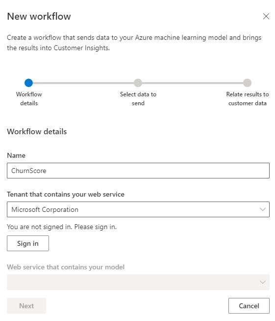
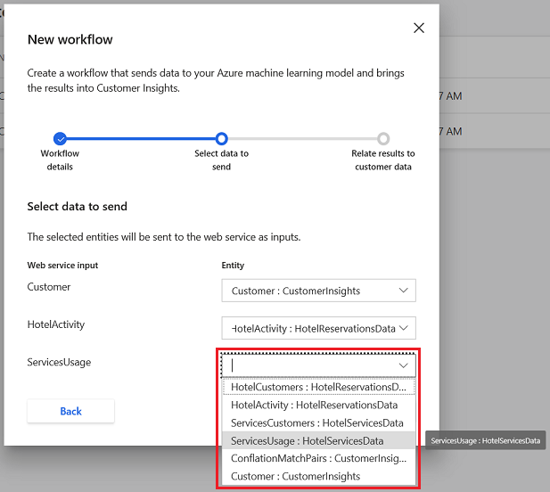

# Custom machine learning models

**Intelligence** > **Custom Models** lets you manage workflows based on Azure Machine Learning models. Workflows help you choose the data you want to generate from insights and map the results to your Customer Insights data. [Read the blog about extending Customer Insights with custom models](https://cloudblogs.microsoft.com/dynamics365/it/2019/10/04/extending-dynamics-365-customer-insights-with-azure-ml-based-custom-models/) and the [blog with examples of custom models](https://cloudblogs.microsoft.com/dynamics365/it/2019/10/05/examples-of-extending-dynamics-365-customer-insights-with-azure-ml/).

## Prerequisites

- To deploy a web service, you need [Azure Machine Learning Enterprise edition](https://azure.microsoft.com/pricing/details/machine-learning/).

- Currently, this feature only supports web services published through [Azure Machine Learning Classic](https://studio.azureml.net).

- You need an Azure Data Lake Storage Gen2 storage account associated with your Azure Studio instance to use this feature. For more information, see [Create an Azure Data Lake Storage Gen2 storage account](https://docs.microsoft.com/azure/storage/blobs/data-lake-storage-quickstart-create-account)

## Add a new workflow

1. Go to **Intelligence** > **Custom Models** and select **New Workflow**.

1. Give your custom model a recognizable name in the **Name** field.

   > [!div class="mx-imgBorder"]
   > 

1. Select the organization that contains the web service in **Tenant that contains your web service**.

1. If your Azure Machine Learning subscription is in a different tenant than Customer Insights, select **Sign in** with your credentials for the selected organization.

1. Choose the [web service you've published using Azure Machine Learning](https://docs.microsoft.com/azure/machine-learning/studio/deploy-a-machine-learning-web-service#deploy-it-as-a-new-web-service) in the **Web service that contains your model** dropdown. Then, select **Next**.

1. For each **Web service input**, select the matching **Entity** from Customer Insights and select **Next**.

   > [!div class="mx-imgBorder"]
   > 

1. Select the matching attribute from the **Customer ID in results** drop-down list that identifies customers in Customer Insights and select **Save**.

1. You'll see the **Workflow Saved** screen with details about the workflow.

1. Select **Done**.

## Edit a workflow

1. On the **Custom Models** page, select the vertical ellipsis in the **Actions** column next to a workflow you've previously created and select **Edit**.

2. You can update your workflow's recognizable name in the **Display name** field, but you can't change the web service. Select **Next**.

3. For each **Web service input**, select the matching **Entity** from Customer Insights.  Then, select **Next**.

4. Select the matching attribute from the **Customer ID in results** drop-down list.  When you're done, select **Save**.

## Run a workflow

1. On the **Custom Models** page, select the vertical ellipsis in the **Actions** column next to a workflow you've previously created.

2. Select **Run**.

Your workflow also runs automatically with every scheduled refresh. Learn more about [setting up scheduled refreshes](system.md#schedule-tab).

## Delete a workflow

1. On the **Custom Models** page, select the vertical ellipsis in the **Actions** column next to a workflow you've previously created.

2. Select **Delete** and confirm your deletion.

Your workflow will be deleted. The [entity](entities.md) that was created when you created the workflow persists, and can be viewed from the **Entities** page.
