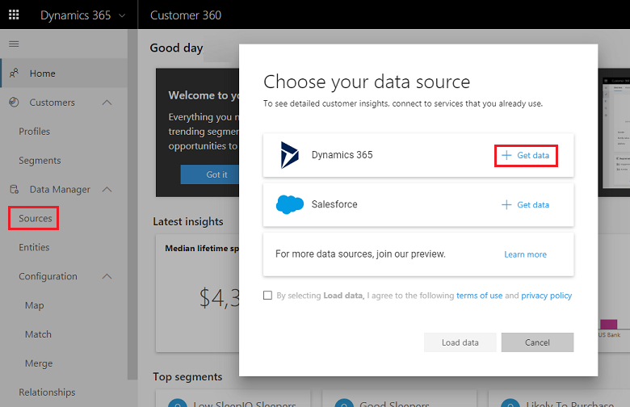
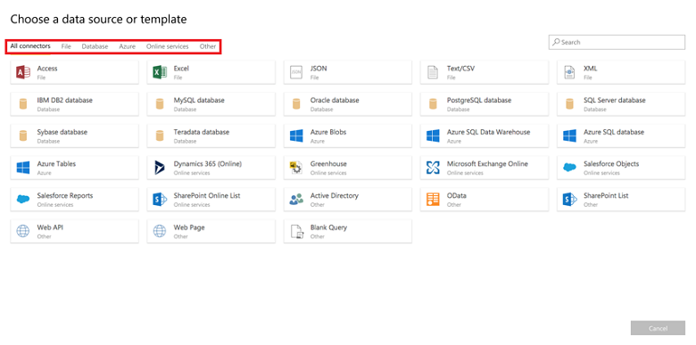
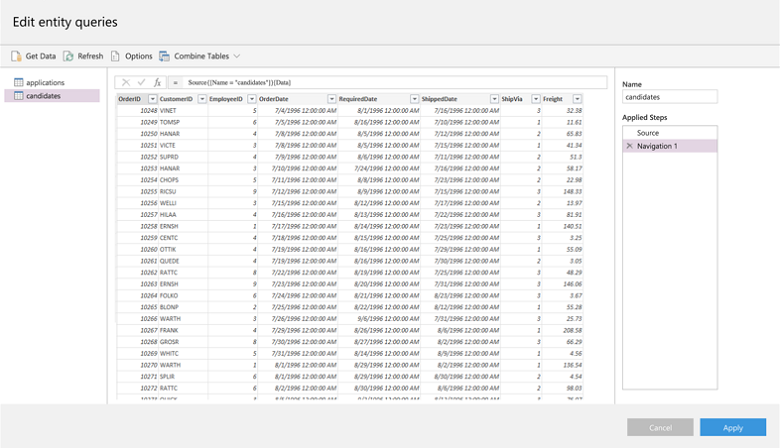
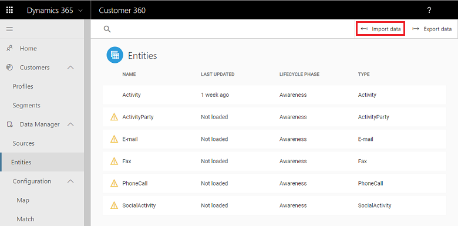
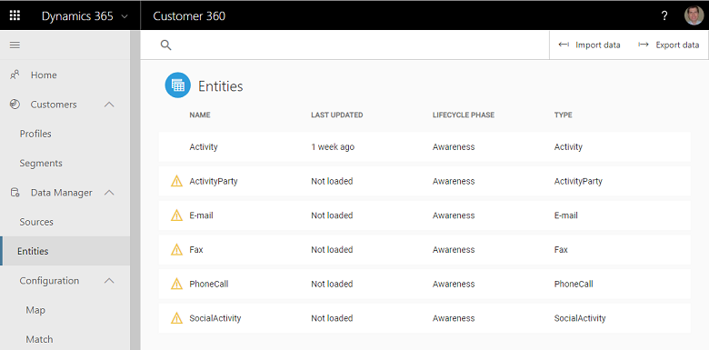

# Preview: Data Manager

[!INCLUDE [cc-beta-prerelease-disclaimer](../includes/cc-beta-prerelease-disclaimer.md)]

> [!IMPORTANT]
> - This feature currently has limited availability.
> - [!INCLUDE[cc_preview_features_definition](../includes/cc-preview-features-definition.md)]  
> - [!INCLUDE[cc_preview_features_expect_changes](../includes/cc-preview-features-expect-changes.md)]  
> - [!INCLUDE[cc_preview_features_no_MS_support](../includes/cc-preview-features-no-ms-support.md)]  

## Data Manager Sections
**Those include: Sources, Entities, Configuration, Enrichment and Relationships.** Completing those sections will enable you to unlock the unique insights Dynamics 365 AI for Customer Insights offers. Following the Data Manager sections, we will explore sections that are used for viewing and acting upon those insights (*Homepage*, *Segmentation* and *Profile*).

## Data Manager: Sources
In this section we will explain how to bring data from many of your sources: From CRM systems, to transactional and survey data, to clickstream, social and other data you might have. Connecting your data sources is the first step towards unlocking one of the unique product promises - consolidating and reconciling data on your customers from multiple sources that once were disparate and conflicting. 

- **Step One: Ingesting CRM data**: Upon selecting the **Sources** tab a pop-up screen shows up and here you should select **Get Data** for the CRM source you are using as shown below. Both Dynamics 365 and Salesforce are supported by the app. For .csv files (Excel) and other sources, continue to step two.

> [!div class="mx-imgBorder"] 
> 

- **Step Two: Identifying and ingesting additional data sources**: Upon selecting **Learn More** you will view many additional available sources. For locating the specific sources that apply to your organization, first identify their types which are represented by tabs at the top of the screen (as shown below). Then, search for your specific sources under the relevant tabs and select **Get Data** for each one of them. Lastly, approve by selecting **Load Data** at the bottom right corner of the screen. If you wish to remove source prior to data ingestion select **Remove Data** for that source.

> [!div class="mx-imgBorder"] 
> 

- (?) **Step Three: Data Pre-Processing**: After selecting **Load Data** the screen below will show up. This screen can be used to process specific datasets within your selected data sources prior to the completion of the data ingestion. A common example might be editing .csv file datasets. The example shown below includes some of the changes you can apply to your data:
  - In Red: Changing a column type
  - In Blue: Removing a column
  - In Green: Replacing *NA* within a specific record with another string
Clearly, other processing options are available too and those depend on the specific data source you wish to process.

> [!div class="mx-imgBorder"] 
> 

## Data Manager: Entities
Once ingesting the data, you can quickly evaluate how complete and useful it is using the ***Entities*** screen. If you suspect that your ingested data is not complete or useful enough, you can import more data using the **Import Data** icon as highlighted below. You can also export the entities table as a .csv file by selecting the **Export Data** button next to it.

> [!div class="mx-imgBorder"] 
> 

The ***Entities*** table includes four columns (explored from left to right): 
- **Name**: The names of your data entities. Those may range from Account to Activity to many other categories. Moreover, note that if there is a warning sign next to one of the entities names, it implies that the data for that entity didn't load successfully. 
- **Last Update**: Answers the question *When was the last time this entity's data was last updated?*
- **Lifecycle Phase**: A typical customer journey goes from Awereness, to Engagement, to Fulfillement (or Conversion), to Service (or Support) , to Advocacy. Within this column each entity is mapped to a specific phase within this journey so your future ability to act upon the data becomes more targeted and ROI-optimized. 
- **Type**: The types of your data entities. In some cases will be the same as your entities names while in others can be different.

The app automatically identifies values for these four columns within your ingested data sources and if the identification fails it returns *NA*. Both for *NA* and all the other values, it is recommended to go over the table and make any corrections to it by using the *Edit Data* botton as shown below:

> [!div class="mx-imgBorder"] 
> 