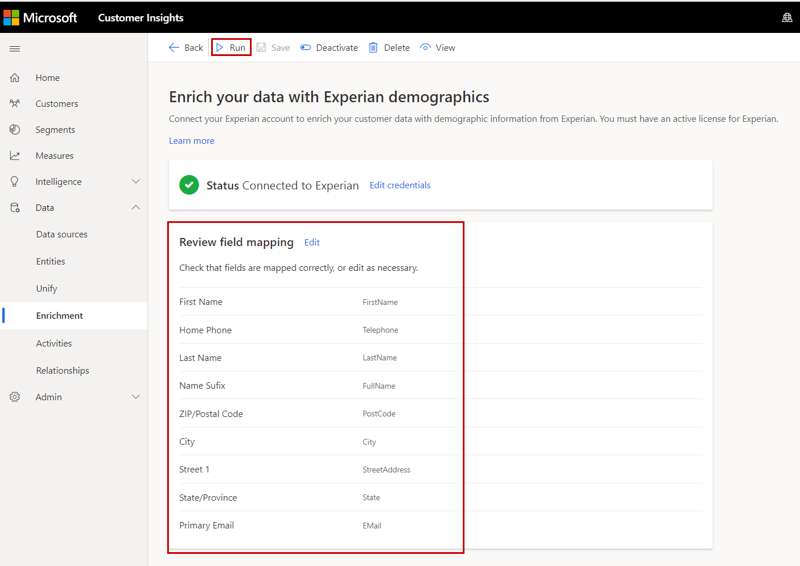

# Enrich customer profiles with demographics from Experian (preview)

Experian is a global leader in consumer and business credit reporting and marketing services. With Experian’s data enrichment services, you can build a deeper understanding of your customers by enriching your customer profiles with demographic data such as household size, income, and more.

## Prerequisites

To configure Experian, the following prerequisites must be met:

- You have an active Experian subscription. To get a subscription, [contact Experian](https://www.experian.com/marketing-services/contact) directly. [Learn more about Experian Data Enrichment](https://www.experian.com/marketing-services/microsoft?cmpid=ems_web_mci_cdppage).
- You have the User ID, Party ID, and Model Number for your SSH-enabled Secure Transport (ST) account that Experian created for you.
- You have the [Administrator](permissions.md#administrator) role in Customer Insights.

## Configuration

1. Go to **Data** > **Enrichment** and select the **Discover** tab.

1. Select **Enrich my data** on the Experian tile.

   > [!div class="mx-imgBorder"]
   > 

1. Select **Get started** and enter the User ID, Party ID, and Model Number for your Experian Secure Transport account. Review and provide your consent for **Data privacy and compliance** by selecting the **I agree** checkbox. Confirm all inputs by selecting **Apply**.

## Map your fields

1. Select **Add data** and choose your key identifiers from **Name and Address**, **E-mail**, or **Phone** to send to Experian for identity resolution.

   > [!TIP]
   > More key identifier attributes sent to Experian likely yield a higher match rate.

1. Select **Next** and map the corresponding attributes from your unified customer entity for the selected key identifier fields.

1. Select **Add attribute** to map any additional attributes you would like to send to Experian.

1.	Select **Save** to complete the field mapping.

   > [!div class="mx-imgBorder"]
   > 

## Enrichment results

To start the enrichment process, select **Run** from the command bar. You can also let the system run the enrichment automatically as part of a [scheduled refresh](system.md#schedule-tab). The processing time will depend on the size of your customer data and the enrichment processes set up for your account by Experian.

After the enrichment process completes, you can review the newly enriched customer profiles data under **My enrichments**. Additionally, you'll find the time of the last update and the number of enriched profiles.

You can access a detailed view of each enriched profile by selecting **View enriched data**.

## Next steps

Build on top of your enriched customer data. Create [segments](segments.md), [measures](measures.md), and even [export the data](export-destinations.md) to deliver personalized experiences to your customers.
