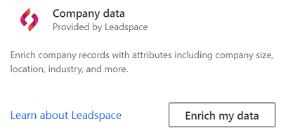

# Enrichment of company profiles with Leadspace (preview)

Leadspace is a data science company that provides a B2B Customer Data Platform. It enables customers with unified customer profiles for companies to enrich their data. Enrichments include additional attributes like company size, location, industry, and more.

## Prerequisites

To configure Leadspace, the following prerequisites must be met:

- You have an active Leadspace license and the “perpetual key” (referred to as **Leadspace token** in Customer Insights). Contact directly [Leadspace](https://www.leadspace.com/products/leadspace-on-demand/) for details about their product.
- You have the [Administrator](permissions.md#administrator) role in Customer Insights.
- You have [unified customer profiles](customer-profiles.md) for companies.

## Configuration

1. Go to **Data** > **Enrichment**.

1. Select **Enrich my data** on the Leadspace tile.

   > [!div class="mx-imgBorder"]
   > 

1. Select **Add token** and enter an active **Leadspace token** (perpetual key). Review and provide your consent for **Data privacy and compliance** by selecting the **I agree** checkbox. Confirm both inputs by selecting **Apply**.

   > [!div class="mx-imgBorder"]
   > 

1. Select **Add data** and define which fields from your unified profiles should be used to look for matching company data from Leadspace. The **company name** field is required. For a higher match accuracy, up two other fields, **company website** and **company location**, can be added.

1. Select **Save** to complete the field mapping.

1. Select **Run** to enrich the company profiles. How long refreshing an enrichment takes depends on the number of unified customer profiles. Expect it to take at least 1 minute per 1.000 profiles.

## Enrichment results

After refreshing the enrichment, you can review the newly enriched company data under [My enrichments](customer-profiles.md). You can find the time of the last update and the number of enriched profiles.

You can access a detailed view of each enriched profile by selecting **View enriched data**.

For more information, see [Leadspace APIs](https://support.leadspace.com/hc/en-us/sections/201997649-API).
