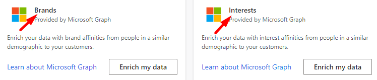

# Enrich customer profiles with brand and interest affinities (preview)

Use proprietary data from the Microsoft Graph to enrich your customer data with brand and interest affinities. These affinities are determined based on data from people with similar demographics to your customers. This information helps you to better understand and segment your customers based on their affinities to specific brands and interests.

In Customer Insights, go to **Data** > **Enrichment** to [configure and view enrichments](enrichment-hub.md).

To configure brand affinities enrichment, go to the **Discover** tab and select **Enrich my data** on the **Brands** tile.

To configure interest affinities enrichment, go to the **Discover** tab and select **Enrich my data** on the **Interests** tile.

   > [!div class="mx-imgBorder"]
   > 

## About Microsoft Graph

We use online search data from the Microsoft Graph to find affinities for brands and interests across various demographic segments (defined by age, gender, or location). The online search volume for a brand or interest determines how much affinity a demographic segment, compared to other segments, has to that brand or interest.

[Learn more about Microsoft Graph](https://docs.microsoft.com/graph/overview).

## Affinity score and confidence

The **affinity score** is calculated on a 100-point scale, with 100 representing the segment that has the highest affinity for a brand or interest.

The **affinity confidence** is also calculated on a 100-point scale. It indicates the system's confidence level that a segment has an affinity for the brand or interest. Confidence level is based on the segment size and the segment granularity. Segment size is determined by the amount of data we have for a given segment. Segment granularity is determined by how many attributes (age, gender, location) are available in a profile.

We don't normalize the scores for your dataset. Consequently, you may not see all possible affinity score values for your dataset. For example, there may be no enriched customer profile with affinity score 100 in your data. That's possible if no customers exist in the demographic segment that scored 100 for a given brand or interest.

> [!TIP]
> When [creating segments](segments.md) using affinity scores, review the distribution of affinity scores for your dataset before deciding on the appropriate score thresholds. For example, an affinity score of 10 can be considered significant in a dataset that has a highest affinity score of only 25 for a given brand or interest.

## Supported countries/regions

We currently support the following country/region options: Australia, Canada (English), France, Germany, United Kingdom, or United States (English).

To select a country, open the **Brands enrichment** or **Interest enrichment** and select **Change** next to **Country/Region**. In the **Country/Region settings** pane, choose an option and select **Apply**.

### Implications related to country selection

- When [choosing your own brands](#define-your-brands-or-interests), we will provide suggestions based on the selected country/region.

- When [choosing an industry](#define-your-brands-or-interests), we will identify the most relevant brands or interests based on the selected country/region.

- When [mapping your fields](#map-your-fields), if the Country/Region field isn't mapped, we'll use Microsoft Graph data from the selected country/region to enrich your customer profiles. We'll also use that selection to enrich your customer profiles that don't have country/region data available.

- When [enriching profiles](#refresh-enrichment), we'll enrich all customer profiles for which we have Microsoft Graph data available for the selected brands and interests, including profiles that are not in the selected country/region. For example, if you selected Germany, we'll enrich profiles located in the United States if we have Microsoft Graph data available for the selected brands and interests in the US.

## Configure Enrichment

Configuring brands or interests enrichment consists of two steps:

### Define your brands or interests

Select one of the following options:

- **Industry**: The system identifies the top brands or interests relevant to your industry and enriches your customer data with them.
- **Choose your own**: Select up to five items from the list of brands or interests that are most relevant to your organization.

To add a brand or interest, enter it in the input area to get suggestions based on matching terms. If we don't list a brand or interest you're looking for, send us feedback using the **Suggest** link.

### Map your fields

Map fields from your unified customer entity to at least two attributes to define the demographic segment you want us to use for enriching your customer data. Select **Edit** to define the mapping of the fields and select **Apply** when you're done. Select **Save** to complete the field mapping.

The following formats and values are supported, values are not case-sensitive:

- **Date of Birth**: We recommend that date of birth is converted to DateTime type during data ingestion. Alternatively, it can be a string in [ISO 8601](https://www.iso.org/iso-8601-date-and-time-format.html) format "yyyy-MM-dd" or "yyyy-MM-ddTHH:mm:ssZ".
- **Gender**: Male, Female, Unknown
- **Postal code**: Five-digit ZIP Codes for US, standard postal code everywhere else
- **City**: City name in English
- **State/Province**: Two-letter abbreviation for the US and Canada. Two or three letter abbreviation for Australia. Not applicable for France, Germany, or the UK.
- **Country/Region**:

  - US: United States of America, United States, USA, US, America
  - CA: Canada, CA
  - GB: United Kingdom, UK, Great Britain, GB, United Kingdom of Great Britain and Northern Ireland, United Kingdom of Great Britain
  - AU: Australia, AU, Common Wealth of Australia
  - FR: France, FR, French Republic
  - DE: Germany, German, Deutschland, Allemagne, DE, Federal Republic of Germany, Republic of Germany

## Refresh enrichment

Run the enrichment after configuring brands, interests, and the field mapping for demographics. To start the process, select **Run** on the brand or interest configuration page. Additionally, you can let the system run the enrichment automatically as part of a scheduled refresh.
Depending on the size of your customer data, it may take several minutes for an enrichment run to complete.

> [!TIP]
> There are [six types of status](system.md#status-types) for tasks/processes in Customer Insights. Additionally, most processes [depend on other downstream processes](system.md#refresh-policies). You can select the status of a process to see details on the progress of the entire job. After selecting **See details** for one of the job's tasks, you find additional information: processing time, the last processing date, and all errors and warnings associated with the task.

## Enrichment results

After running the enrichment process, go to **My enrichments** to review the total number of enriched customers and a breakdown of brands or interests in the enriched customer profiles.

:::image type="content" source="media/my-enrichments.png" alt-text="Preview of results after running the enrichment process":::

Review the enriched data by selecting **View enriched data** in the chart. Enriched data for brands goes to the **BrandAffinityFromMicrosoft** entity. Data for interests is in the **InterestAffinityFromMicrosoft** entity. You'll also find these entities listed in the **Enrichment** group in **Data** > **Entities**.

## See enrichment data on the customer card

Brand and interest affinities can also be viewed on individual customer cards. Go to **Customers** and select a customer profile. In the customer card, you'll find charts for the brands or interests that people in that customer's demographic profile have affinity for.

:::image type="content" source="media/enrichment-customer-card.png" alt-text="Customer card with enriched data":::

## Next steps

Build on top of your enriched customer data. Create [Segments](segments.md), [Measures](measures.md), and even [export the data](export-destinations.md) to deliver personalized experiences to your customers.
