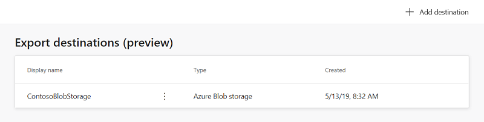
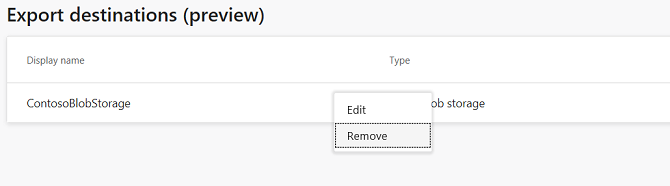
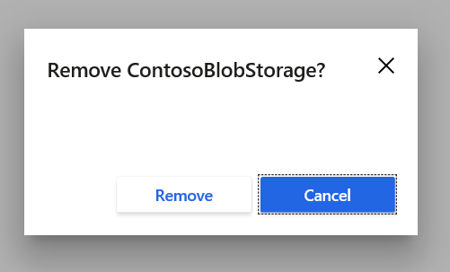

# Export destinations

The **Export destinations** page shows you all locations you’ve set up to export data to and allows you to add new destinations. To add or edit export destinations, you’ll need to be an administrator of your Customer Insights instance.

## Add a new Export destination

### Azure Blob storage

1. On the **Export destinations** page, select **Add destination**.

   > [!div class="mx-imgBorder"] 
   > 

2. Select **Azure Blob storage** in the **Type** drop-down list.

3. Enter the **Account name**, **Account key**, and **Container** for your Blob storage account.
    - To learn more about how to find the Azure Blob storage account name and account key, see [Manage storage account settings in the Azure portal](https://docs.microsoft.com/en-us/azure/storage/common/storage-account-manage).
    - To learn how to create a container, see [Create a container](https://docs.microsoft.com/en-us/azure/storage/blobs/storage-quickstart-blobs-portal#create-a-container).

    > [!div class="mx-imgBorder"] 
    > 

4. Give your destination a recognizable name in the **Display name** field.

5. Select **Next**.

6. Select the box next to each of the entities you want to export to this destination.

   > [!div class="mx-imgBorder"] 
   > 

7. Select **Save**.

Your export should start shortly if all prerequisites for export have been completed.  In addition, your export will run at the end of every scheduled refresh.  To learn more about scheduling, see [Schedule tab](https://docs.microsoft.com/en-us/dynamics365/ai/customer-insights/pm-settings#schedule-tab).

#### Azure Blob storage locations

<!--Note from editor: Is "set" correct in the next sentence, or should it be "set up"? -->

Data exported from the Export process will be stored in the Azure Blob storage container you set in your export destination.  The following folder paths are automatically created in your container:

  - Customer Insights generated entities: Dynamics365CustomerInsights/Export/%EntityName%/%EntityName%_%PartitionId%.csv
    - Example: Dynamics365CustomerInsights/Export/Customer/Customer_1.csv
  - Data Source entities: Dynamics365CustomerInsights/Export/%DataSourceName%_%EntityName%/%DataSourceName%_%EntityName%_%PartitionId%.csv
    - Example: Dynamics365CustomerInsights/Export/Retail_Contacts/Retail_Contacts_1.csv
	
### Dynamics 365 for Sales
1. On the **Export destinations** page, select **Add destination**.

   > [!div class="mx-imgBorder"] 
   > 

2. Choose **Dynamics 365 for Sales** in the **Type** drop-down list.

   > [!div class="mx-imgBorder"] 
   > 

<!--from editor: In the following paragraph, it looks like "Enter" would be a better choice than "Define." Also, is "Sign in" an action? If so, it shouldn't be in bold. -->

3. Define your Dynamics 365 for Sales URL in **Server address**, **Sign in**, select a Dynamics 365 for Sales account, and then give your destination a recognizable name in **Display name**.

4. Select **Add**.

## View Export destinations

When viewing the **Export destinations** page, if you’ve already created destination you will see a table containing several fields for destinations you’ve added, as described here:

   > [!div class="mx-imgBorder"] 
   > 
	
  - Display name: The name you created during the destination creation.
  - Type: The destination type set during the destination creation.  Currently supports:
    - Azure Blob storage
    - Dynamics 365 for Sales
  - Created: The date you created the destination.

## Remove an Export destination

To remove an Export destination, start from the main Export destinations page.

> [!div class="mx-imgBorder"] 
> 

<!--from editor: The next two images are identical. Seems like the previous image should be used for step 1.  -->

1. Select the vertical ellipsis for the Export destination you want to remove.

   > [!div class="mx-imgBorder"] 
   > 

2. Select **Remove**.

   > [!div class="mx-imgBorder"] 
   > 

3. Finalize the removal by selecting **Remove** on the confirmation screen.

   > [!div class="mx-imgBorder"] 
   > 
