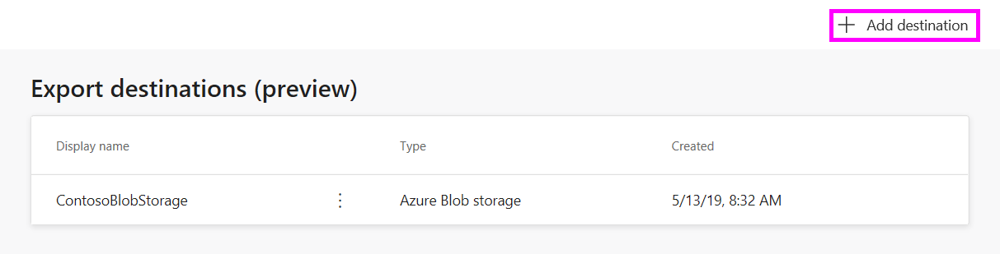
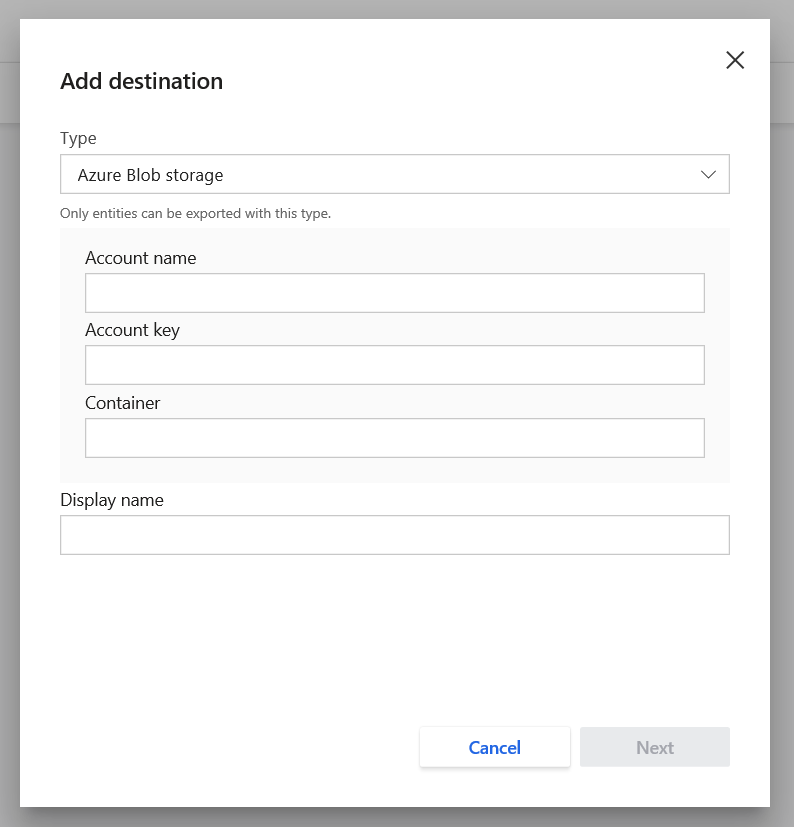
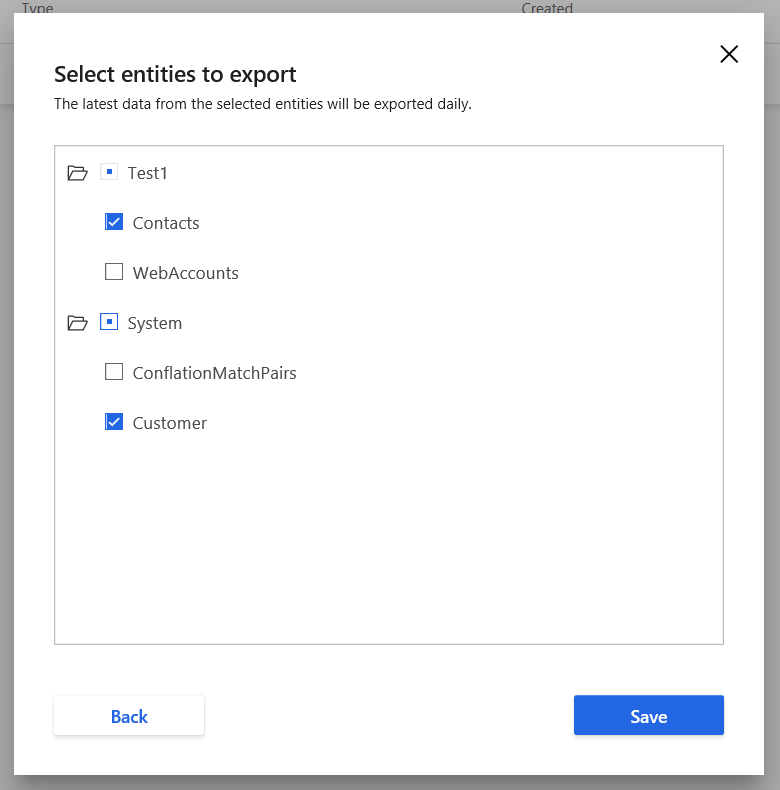
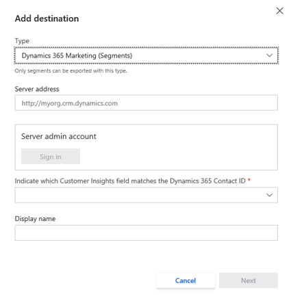
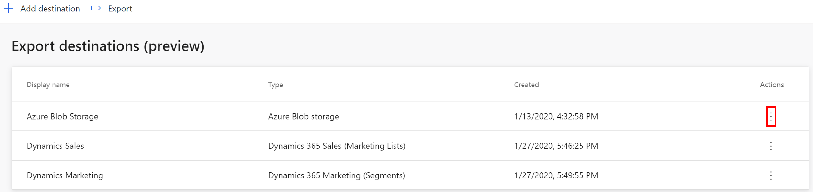

# Export destinations

The **Export destinations** page shows you all locations you’ve set up to export data to, and allows you to add new destinations. To add or edit export destinations, you’ll need to be an administrator of your Customer Insights instance.

## Add a new Export destination

<!--
### Azure Blob storage

1. On the **Export destinations** page, select **Add destination**.

   > [!div class="mx-imgBorder"] 
   > 

2. Select **Azure Blob storage** in the **Type** drop-down list.

3. Enter the **Account name**, **Account key**, and **Container** for your Blob storage account.
    - To learn more about how to find the Azure Blob storage account name and account key, see [Manage storage account settings in the Azure portal](https://docs.microsoft.com/azure/storage/common/storage-account-manage).
    - To learn how to create a container, see [Create a container](https://docs.microsoft.com/azure/storage/blobs/storage-quickstart-blobs-portal#create-a-container).

    > [!div class="mx-imgBorder"] 
    > 

4. Give your destination a recognizable name in the **Display name** field.

5. Select **Next**.

6. Select the box next to each of the entities you want to export to this destination.

   > [!div class="mx-imgBorder"] 
   > 

7. Select **Save**.

Your export should start shortly if all prerequisites for export have been completed.  In addition, your export will run at the end of every scheduled refresh.  To learn more about scheduling, see [Schedule tab](https://docs.microsoft.com/dynamics365/ai/customer-insights/pm-settings#schedule-tab).

#### Azure Blob storage locations

Data exported from the Export process will be stored in the Azure Blob storage container you set in your export destination.  The following folder paths are automatically created in your container:

  - Customer Insights generated entities: Dynamics365CustomerInsights/Export/%EntityName%/%EntityName%_%PartitionId%.csv
    - Example: Dynamics365CustomerInsights/Export/Customer/Customer_1.csv
  - Data Source entities: Dynamics365CustomerInsights/Export/%DataSourceName%_%EntityName%/%DataSourceName%_%EntityName%_%PartitionId%.csv
    - Example: Dynamics365CustomerInsights/Export/Retail_Contacts/Retail_Contacts_1.csv
-->

### Dynamics 365

You can create a Dynamics 365 destination to export your segments. Customer Insights supports two segment export destination types:

- Dynamics 365 Sales (Marketing List)
- Dynamics 365 Marketing (Segments)

1. On the **Export destinations** page, select **Add Destination**.

   > [!div class="mx-imgBorder"]
   > 

2. Choose "Dynamics 365 Sales" or "Dynamics 365 Marketing" in the **Type** dropdown list.

3. Specify your Dynamics 365 Sales or Dynamics 365 Marketing URL in **Server address**, select **Sign in**, and then select a Dynamics 365 Sales or Dynamics 365 Marketing account.

   > [!div class="mx-imgBorder"]
   > 

4. Indicate the field in Customer entity that maps to the Dynamics 365 Contact ID. Only contacts that can be mapped back to Dynamics 365 will be exported. Customer Insights does not create new contacts in Dynamics 365.

5. Give your destination a recognizable name in the **Display name** field.

6. Select **Next**.

7. Select the segments you wish to export, and then select **Save**.

## Run an Export

Once a destination is created, your export should start shortly if all prerequisites for export have been completed. In addition, your exports for all destinations will run at the end of every scheduled refresh. For more information, see [Schedule tab](pm-settings.md#schedule-tab).

You can also initiate an Export manually by selecting **Export** at the upper right of the page.

## View Export destinations

If you’ve already created any destinations, you'll see them listed in a table on the **Export destinations** page. This table has three columns:

- **Display name**: The name you entered when creating the destination.
- **Type**: The destination type you set when creating the destination. Currently supports:
  - Azure Blob storage
  - Dynamics 365 Sales
- **Created**: The date you created the destination.

## Remove an Export destination

To remove an Export destination, start from the main **Export destinations** page.

1. Select the vertical ellipsis for the Export destination you want to remove.

   > [!div class="mx-imgBorder"]
   > 

2. Select **Remove** from the dropdown menu.

3. Finalize the removal by selecting **Remove** on the confirmation screen.