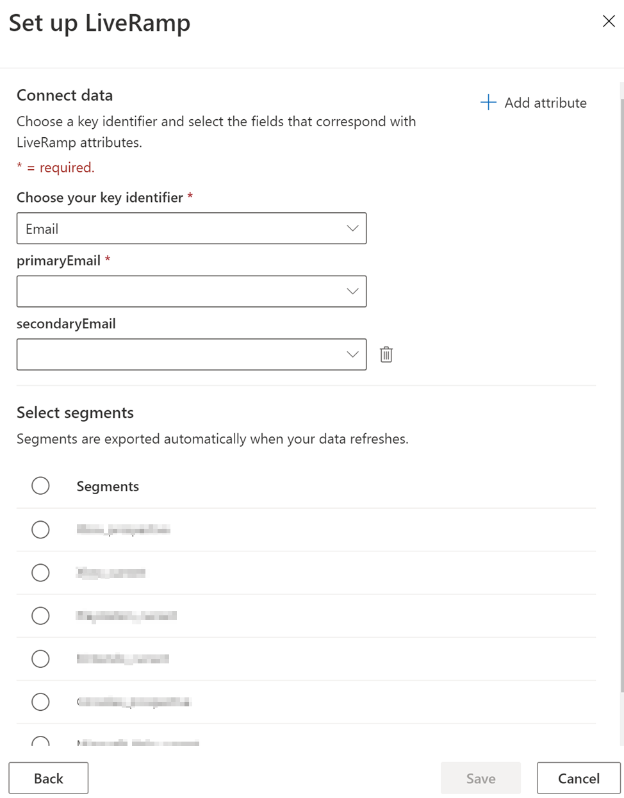

# LiveRamp&reg; connector (preview)

Activate your data in LiveRamp to connect with over 500 platforms across digital, social, and TV ecosystems. Work with your data in LiveRamp to target, suppress, and personalize ad campaigns.

## Prerequisites

- You need a LiveRamp subscription to use this connector.
- To get a subscription, [contact LiveRamp](https://liveramp.com/contact/) directly. [Learn more about LiveRamp Onboarding](https://liveramp.com/our-platform/data-onboarding/).

## Connect to LiveRamp

1. Go to **Admin** > **Export destinations**  and select **Add destination**.

1. Select **LiveRamp** in the **Type** dropdown list.

1. Give your destination a recognizable name in the **Display name** field.

1. Provide a **Username** and **Password** for your LiveRamp Secure FTP (SFTP) account.
These credentials may be different from your LiveRamp Onboarding credentials.

1. Select **Verify** to test the connection to LiveRamp.

1. After successful verification, provide your consent for **Data privacy and compliance** by selecting the **I agree** checkbox.

1. Select **Next** to set up the LiveRamp connector.

## Configure the connector

1. In the **Choose your key identifier** field, select **Email**,  **Name and address**, or **Phone** to send to LiveRamp for identity resolution.

1. Map the corresponding attributes from your unified customer entity for the selected key identifier.

1. Select **Add attribute** to map additional attributes to send to LiveRamp.

   > [!TIP]
   > Sending more key identifier attributes to LiveRamp is likely to get you a higher match rate.

1. Select the segments you want to export to LiveRamp.

1. Select **Save**.

> [!div class="mx-imgBorder"]
> 

## Export the data

The export will start shortly if all prerequisites for export have been completed. The export will also run with every [scheduled refresh](system.md#schedule-tab).
Once the export is successfully completed, you can sign in to LiveRamp Onboarding to activate and distribute your data.
