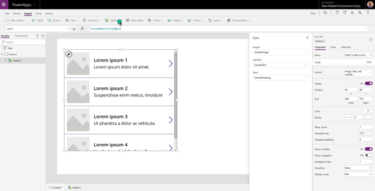
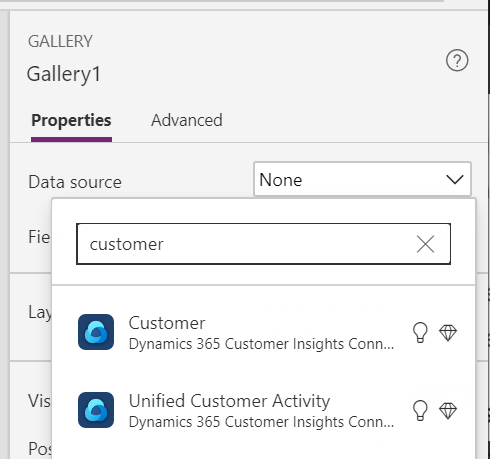

# Microsoft Power Apps connector (preview)

Bring unified customer profiles into your personalized apps with Power Apps.

## Connect Power Apps to Customer Insights

Customer Insights is one of the many [available sources for data in Power Apps](https://docs.microsoft.com/powerapps/maker/canvas-apps/working-with-data-sources).

Refer to the Power Apps documentation to learn how to [add a data connection to an app](https://docs.microsoft.com/powerapps/maker/canvas-apps/add-data-connection). We recommend you also review [how Power Apps uses delegation to handle large datasets in Canvas apps](https://docs.microsoft.com/powerapps/maker/canvas-apps/delegation-overview).

## Available entities

After adding Customer Insights as a data connection, you can choose the following entities in Power Apps:

- Customer: to use data from the [unified customer profile](customer-profiles.md).
- Unified Customer Activity: to display the [activity timeline](activities.md) on the app.

## Limitations

### Retrievable entities

You can only retrieve the **Customer**, **UnifiedActivity**, and **Segments** entities through the Power Apps connector. Other entities are shown because the underlying connector supports them through triggers in Power Automate.  

### Delegation

Delegation works for the Customer entity and UnifiedActivity entity. 

- Delegation for **Customer** entity: To use delegation for this entity, the fields need to be indexed in [Search & filter index](search-filter-index.md) in Customer Insights.  

- Delegation for **UnifiedActivity**: Delegation for this entity only works for the fields **ActivityId** and **CustomerId**.  

- For more information about delegation, see [Power Apps delegable functions and operations](https://docs.microsoft.com/connectors/commondataservice/#power-apps-delegable-functions-and-operations-for-the-cds-for-apps). 

## Example gallery control

An example to use Customer Insights data, is to show customer profiles in a [gallery control](https://docs.microsoft.com/powerapps/maker/canvas-apps/add-gallery).

1. Add a **Gallery** control to an app you're building.

> [!div class="mx-imgBorder"]
> 

1. Select **Customer** as the data source for items.

    > [!div class="mx-imgBorder"]
    > 

1. You can change the data panel on the right to select which field for the Customer entity to show on the gallery.

1. If you want to show any field from the selected customer on the gallery, fill in the Text property of a label:  **{Name_of_the_gallery}.Selected.{property_name}**

    Example: Gallery1.Selected.address1_city

1. To display the unified timeline for a customer, add a Gallery element, and add the Items property: **Filter('UnifiedActivity', CustomerId = {Customer_Id})**

    Example: Filter('UnifiedActivity', CustomerId = Gallery1.Selected.CustomerId)
