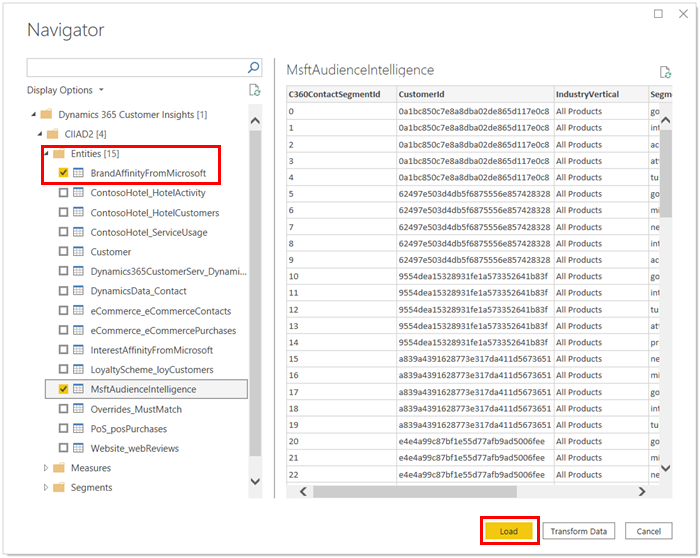

# Connector for Power BI (preview)

Create visualizations for your Customer Insights data with the Power BI Desktop Add-in. Generate additional insights and build reports with your unified customer data.

## Prerequisites

- You have unified customer profiles in Customer Insights.
- The latest version of [Microsoft Power BI Desktop](https://powerbi.microsoft.com/desktop/) is installed on your computer. [Learn more about Power BI Desktop](https://docs.microsoft.com/power-bi/desktop-what-is-desktop).

## Configure the connector for Power BI

1. In Power BI Desktop, select **File** > **Get Data**.

1. Select **See more** and search for **Dynamics 365 Customer Insights**

1. Select the result and select **Connect**.

1. **Sign in** with the same organizational account you use for Customer Insights and select **Connect**.
   > [!NOTE]
   > The account you indicate in this step is used to fetch data from Customer Insights and doesn't need to be the same you are signed in to Power BI. To reset the account that is used for data fetching from Customer Insights, open Power BI and go to **File** > **Options** > **Settings** > **Data source settings**. In the list of data sources, select **Dynamics 365 Customer Insights Login** and select **Clear permissions**.  

1. In the **Navigator** dialog box. you see the list of all Customer Insights instances you have access to. Expand an instance and open any of the folders (Entities, Measures, Segments, Enrichments). For example, open the **Entities** folder, to see all entities you can import.

   

1. Select the check boxes next to the entities to include and **Load**. You can select multiple entities from multiple environments.

1. You'll see a loading dialog box while your entities are loaded. Once all of your selected entities have loaded, you can use the capabilities of Power BI on Customer Insights data.

## Large data sets

The Customer Insights connector for Power BI is designed to work for data sets that contain up to 1 million customer profiles. Importing larger data sets may work, but it takes a long time. Additionally, the process could run into a time-out because of Power BI limitations. For more information, see [Power BI: Recommendations for large data sets](https://docs.microsoft.com/power-bi/admin/service-premium-what-is#large-datasets). 

### Work with a subset of data

Consider working with a subset of your Customer Insights data. For example, you can create [segments](segments.md) instead of exporting all Customer Insights entities to Power BI.
