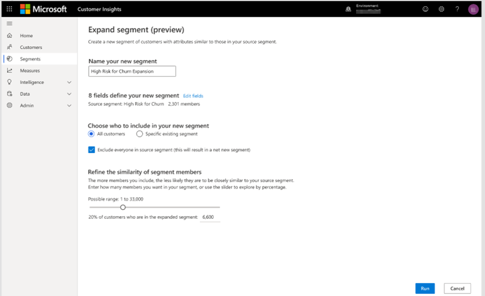

# Similar Customers (preview)

This feature lets you find similar customers in your customer base using artificial intelligence. You need to have at least one segment created to use this feature. Expanding the criteria of an existing segment help find customers that are similar to that segment.

> [!NOTE]
> *Find similar customers* uses automated means to evaluate data and make predictions based on that data, and therefore has the capability to be used as a method of profiling, as that term is defined by the General Data Protection Regulation (“GDPR”). Customer’s use of this feature to process data may be subject to GDPR or other laws or regulations. You are responsible for ensuring that your use of Customer Insights, including predictions, complies with all applicable laws and regulations, including laws related to privacy, personal data, biometric data, data protection, and confidentiality of communications.

## Finding similar customers

1. In Customer Insights, go to **Segments** and select the segment you want to base your new segment on. That's your *source segment*.

1. In the action bar, select **Find similar customers**.

<!--   > [!div class="mx-imgBorder"]
   >  -->

1. Review the suggested name for your new segment and change it if necessary.

1. Review the fields that define your new segment. These fields define the basis on which the system will try to find similar customers to your source segment. The system will select recommended fields by default.
  Fields that can significantly reduce the model performance are automatically excluded:
  
   - Fields with the following data types: StringType, BooleanType, CharType, LongType, IntType, DoubleType, FloatType, ShortType
   - Fields with a cardinality (the number of elements in a field) of less than 2 or more than 30

1. Choose if you want to include **All customers** or only customers in a **Specific existing segment** in your new segment.

1. Exclude customers in your source segment by selecting the **Exclude everyone in source segment** checkbox.

1. By default, the system suggests including only 20% of the target audience size in your output. Edit this threshold as needed. Increasing the threshold will reduce the precision.

1. Select **Run** at the bottom of the page to start a binary classification task (a method of machine learning) which analyzes the dataset.

## View the similar segment

After processing the similar segment, you'll find the new segment listed on the **Segments** page.

> [!div class="mx-imgBorder"]
> 

Select **View** in the action bar to open the segment detail. This view contains information about the result distribution across [similarity scores](#about-similarity-scores). You'll also find the similarity score values in the **Segment members preview**.

## Use the output of a similar segment

You can [work with the output of a similar segment](pm-segments.md) as you do with other segments. For example, export the segment or build a measure.

## Refresh and edit a similar segment

To refresh a similar segment, select it on the **Segments** page and select **Refresh** in the action bar.

Editing a similar segment will reprocess your data. The previously created segment gets updated with refreshed data.    
To edit a similar segment, select it on the **Segments** page and select **Edit** in the action bar. Apply your changes and select **Run** to start the processing.

## Delete a similar segment

Select the segment on the **Segments** page and select **Delete** in the action bar. Then, confirm your deletion.

## About similarity scores

The binary classification machine learning model assigns a score to customers in the similar segment. The score is based on the similarity to customers in the source segment.

- Similarity scores below 0.55 are customers the system classified as *not similar* to customers in the source segment
- Similarity scores between 0.55 – 0.7 are classified as *somewhat similar*
- Similarity scores between 0.7 – 0.85 are classified as *similar*
- Similarity scores between 0.85 – 1 are customers the system classified as *very similar*

Customers with similarity scores below 0.4 aren't included in the model output. The system doesn't consider them similar enough to the source segment.
