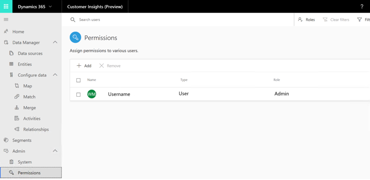

# Data Subject Rights (DSR) requests under GDPR

## Responding to GDPR data subject delete requests for Dynamics 365 Customer Insights

The “right to erasure” by the removal of personal data from an organization’s customer data is a key protection in the General Data Protection Regulation (GDPR). Removing personal data includes removing all personal data and system-generated logs, except audit log information.

### Manage data subject delete requests

Dynamics 365 Customer Insights offers the following in-product experiences to delete personal data for a specific customer or Customer Insights user:

- **Manage delete requests for customer data**: Customer data in Customer Insights is ingested from original data sources external to Customer Insights. All GDPR delete requests must be performed in the original data source.
- **Manage delete requests for Customer Insights user data**: Data for Customer Insights users is created by Customer Insights. All GDPR delete requests must be performed in Customer Insights.

#### Manage delete requests for customer data

A Customer Insights admin can follow these steps to remove customer data that was deleted in the data source:

1. Sign in to Dynamics 365 Customer Insights.
2. Navigate to the **Data sources** page.
3. For each data source in the list that contains deleted customer data:
   1. Select (...) and then select **Refresh**.
   2. Check the status of the data source under **Status**. A check mark means the refresh was successful. A warning triangle means something went wrong. If a warning triangle is displayed, contact D365CI@microsoft.com.

> [!div class="mx-imgBorder"]
> 

#### Manage delete requests for Customer Insights user data

A Customer Insights admin can follow these steps to delete Customer Insights user data:

1. Sign in to Dynamics 365 Customer Insights.
2. Navigate to the **Permissions** page.
3. Select the check box for the user you want to delete.
4. Select **Remove**.

> [!div class="mx-imgBorder"]
> 

## Responding to GDPR data subject export requests for Dynamics 365 Customer Insights

As part of our commitment to partner with you on your journey to the General Data Protection Regulation (GDPR), we’ve developed documentation to help you prepare. This documentation describes what we’re doing to prepare for the GDPR, and shares examples of steps you can take today with Microsoft to support GDPR compliance when using Customer Insights.

### Manage export and view requests

The right of data portability allows data subjects to request a copy of their personal data in an electronic format (a “structured, commonly used, machine readable, and interoperable format”) that can be transmitted to another data controller.

Dynamics 365 Customer Insights offers the following experiences to find or export personal data for a specific user:

- Export customer data (tenant admin).
- Export Customer Insights user data (tenant admin).

#### Export customer data (tenant admin)

A tenant administrator can follow these steps to export data:

1. Send an email to D365CI@microsoft.com specifying the customer’s email address in the request. An administrator from the Dynamics 365 Customer Insights team will send an email to the registered tenant admin email address, asking for confirmation to export data.
2. Acknowledge the confirmation to export the data for the requested customer.
3. Receive the exported data through the tenant admin email address.

#### Export Customer Insights user data (tenant admin)

1. Send an email to D365CI@microsoft.com specifying the user’s email address in the request. An administrator from the Dynamics 365 Customer Insights team will send an email to the registered tenant admin email address, asking for confirmation to export data.
2. Acknowledge the confirmation to export the data for the requested user.
3. Receive the exported data through the tenant admin email address.
