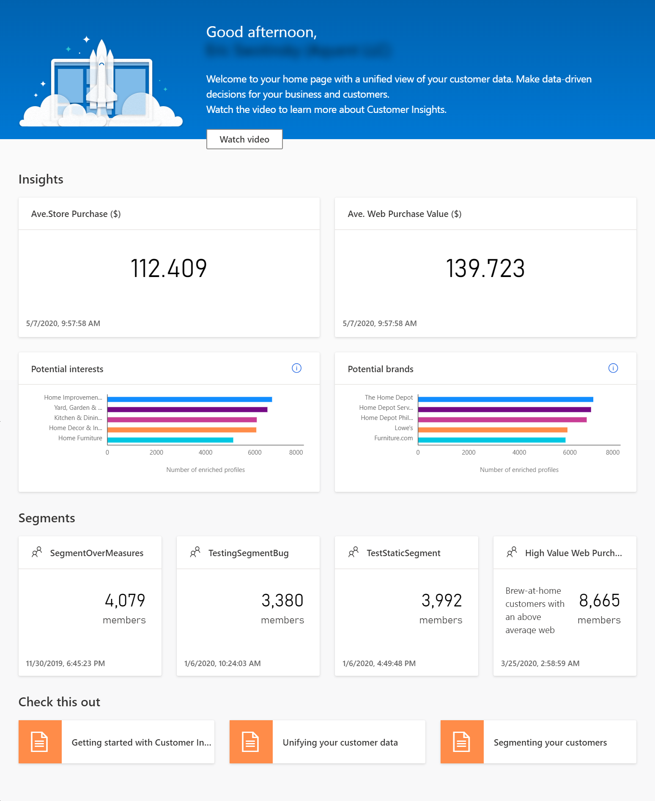

# Create a new environment

## Create a trial environment

You can sign up for a trial on the [trial sign up page](https://dynamics.microsoft.com/get-started/free-trial/?appname=customerinsights). 

> [!NOTE]
> Trials expire after 30 days.

1. Choose the **Sign up for a free trial** option and select **Sign up now**.

1. Provide your work or school email address, tell us a more about yourself and select **Next**.

1. Provide a **Name** for your new environment. 

1. Select the trial type.

1. Choose the **Region** for your environment.

1. Optionally, for admins of a Dynamics 365 organization: Select **Advanced settings** and provide the URL of your organization to use prediction features like customer churn.

1. Select **Create**. 

After the environment was created, you'll see the **Demo** environment which lets you explore the app with fictitious data. You can change the sample data to match your industry. Select the **Settings** icon in the header and select **Demo settings**. Additionally, you can change the visual theme. 

You [switch to the environment](#change-between-environments) you created during the sign-up process to work with your own data.

## Create a new production or sandbox environment

In your environment, select the **Settings** icon in the header and select **New environment**.

Follow the steps as if you [create a trial environment](#create-a-trial-environment). You get an additional option when selecting **Advanced settings** to store your data in your own Azure Data Lake. Provide your account name and account key to establish a connection to your Azure Data Lake. By default, data is stored in the Customer Insights managed data lake.

> [!IMPORTANT]
> By saving data to your Azure Data Lake Storage, you agree that data will be transferred to and stored in the appropriate geographic location for that Azure storage account, which may differ from where data is stored in Dynamics 365 Customer Insights. [Learn more at the Microsoft Trust Center.](https://www.microsoft.com/trust-center)

## Explore the home page

You can [access your Customer Insights instance](https://home.ci.ai.dynamics.com/) on the following URL: [https://home.ci.ai.dynamics.com/](https://home.ci.ai.dynamics.com/).
The **Home** page shows an overview of your customer base and key metrics to track the health of your business.

> [!div class="mx-imgBorder"] 
> 

Under **Recent segments**, you see groups of customers based on demographic, behavioral, or transactional attributes that you've defined. [Creating segments](segments.md) helps you to better target your business activities.

**Recent measures** show tiles with [measures](measures.md). Measures are key performance indicators (KPIs) that you've defined. For example, average likelihood of customer churn or average online spend per customer.

The **Recent enrichments** section lists the results of the enrichment runs that completed recently. Enrichments add information about your customer base. For example, by understanding the interests and brands that they have affinity for. This information can be unlocked using the [enrichment](enrichment-microsoft-graph.md) capabilities, after completing the [map](map-entities.md), [match](match-entities.md), and [merge](merge-entities.md) phases.

## Change between environments

Once you've set up and configured [data sources](data-sources.md), you'll want to switch from a demo environment to a live environment. Using the production environment lets you work with your own customer data. Select the **Environment** control in the upper-right corner of the page to change environments.

> [!div class="mx-imgBorder"] 
> 

Administrators can create and manage [multiple environments](manage-environments.md). Maintaining more than one environment may be useful if, for example, your organization operates internationally and you need to segregate data and insights in different ways.

## Next step

To see your own insights on the home page, you'll first need to [add data sources](data-sources.md) and [unify](data-unification.md) your data to build customer profiles.
