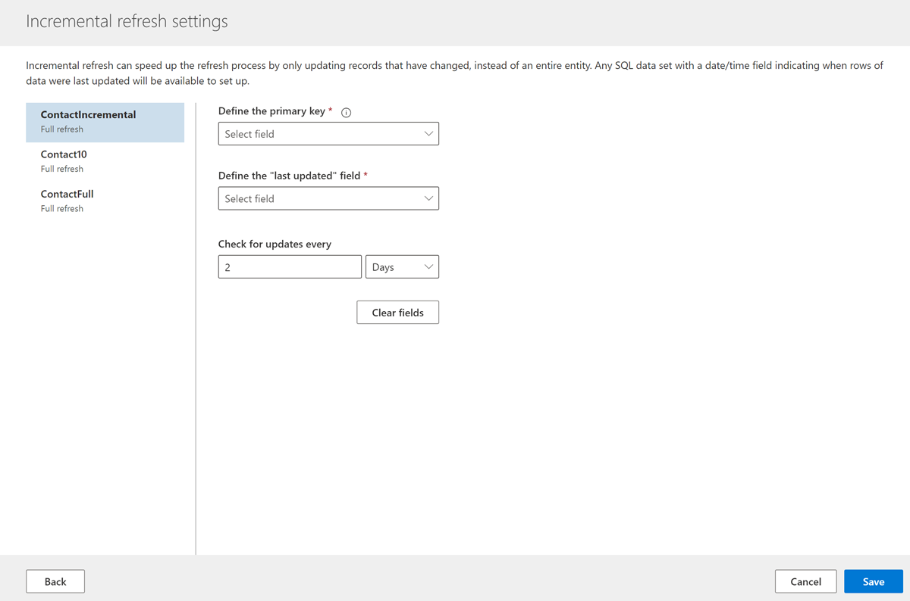

# Incremental refresh for data sources based on Power Query

Incremental refresh for data sources provides the following advantages:

- **Faster refreshes** - Only data that has changed gets refreshed. For example, you might refresh only the past five days of a historical dataset.
- **Increased reliability** - With smaller refreshes, you don't need to maintain connections to volatile source systems for as long, reducing the risk of connection issues.
- **Reduced resource consumption** - Refreshing only a subset of your total data leads to more efficient use of computing resources and decreases the environmental footprint.

## Configure incremental refresh

Dynamics 365 Customer Insights allows incremental refresh for data sources imported through Power Query that support incremental ingestion. For example, Azure SQL databases with date and time fields, which indicate when data records were last updated.

1. [Create a new data source based on Power Query](connect-power-query.md).

1. Provide a name for the data source.

1. Select a data source that supports incremental refresh, such as Azure SQL database.

1. Select the entities or tables to ingest.

1. Complete the transformation steps and select **Next**.

1. In the **Set up incremental refresh** dialog box, select **Set up** to open the **Incremental refresh settings**. If you select **Skip**, the data source will refresh the entire data set.
   > [!TIP]
   > You can also apply incremental refresh later by editing an existing data source.

1. On **Incremental refresh settings**, you'll configure the incremental refresh for all entities that you selected when creating the data source.

   > [!div class="mx-imgBorder"]
   > 

1. Select an entity, and provide the following details:

   - **Define the primary key**: Select a primary key for the entity or table.
   - **Define the "last updated" field**: This field will only display attributes of type date or time. Select an attribute that indicates when the records were last updated. It will be used to identify the records that fall within the incremental refresh time frame.
   - **Check for updates every**: Specify how long you want the incremental refresh time frame to be.

1. Select **Save** to complete the creation of the data source. The initial data refresh will be a full refresh. Afterwards, the incremental data refresh happens as configured in the previous step.
