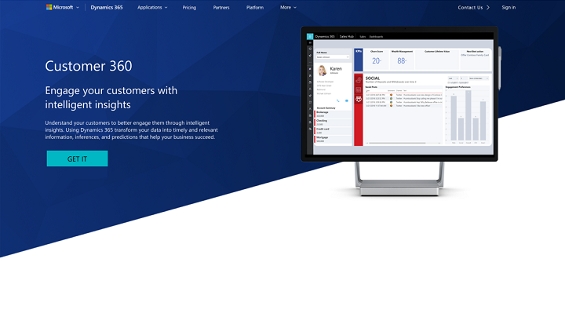

# Preview: Introducing Customer 360

[!INCLUDE [cc-beta-prerelease-disclaimer](../includes/cc-beta-prerelease-disclaimer.md)]

> [!IMPORTANT]
> - This feature currently has limited availability.
> - [!INCLUDE[cc_preview_features_definition](../includes/cc-preview-features-definition.md)]  
> - [!INCLUDE[cc_preview_features_expect_changes](../includes/cc-preview-features-expect-changes.md)]  
> - [!INCLUDE[cc_preview_features_no_MS_support](../includes/cc-preview-features-no-ms-support.md)]  

## Introducing Customer 360:
Turning customer data into actual actionable insights can be difficult, complicated and expensive from several well-known and yet unsolvable reasons. Among these are the overwhelming amounts of data organizations manage, the dispersed and conflicting nature of this multiple-source data, the rapidly changing behaviors of customers, and the lack of both unique and actionable insights to act upon.

Today, your customers expect relevant and tailored experiences. With Customer 360, you can immediately start extracting rich insights from your data, no matter how dispersed and ambiguous it is, so you can  engage customers in highly-personalized and effective ways without the need for a data mining specialist.

Harness the power of Customer 360 to:
- Combine all your data and gain a 360-angle view on your customers, displayed in an easy-to-use and visualization-rich dashboard
- Empower your employees with actionable customer insights
- Get both quick results via complete SaaS solution with pre-packaged analytics, and more in-depth results via machine-learning capabilities

## Prerequisites - to edit 

For Customer 360, you don’t need a Power BI account. You are only required to meet the following prerequisites:

- **Customer 360 app** – download the app either from AppSource [to add link] or from the following page [to add marketing page link]

- **Data source** - Currently several data sources are supported. Here are some of these: 

  - A Dynamics 365 (online) instance. If you don't have a subscription, you can start a free trial. See [Try Dynamics 365 (online)](https://docs.microsoft.com/dynamics365/customer-engagement/admin/try-dynamics-365-online).
  

## Installing Customer 360:
[User discovers app and has customer data we understand: data that we can bring through our CDS-A connectors into CDM
Show how user discovers app on AppSource]

> [!div class="mx-imgBorder"] 
> 
