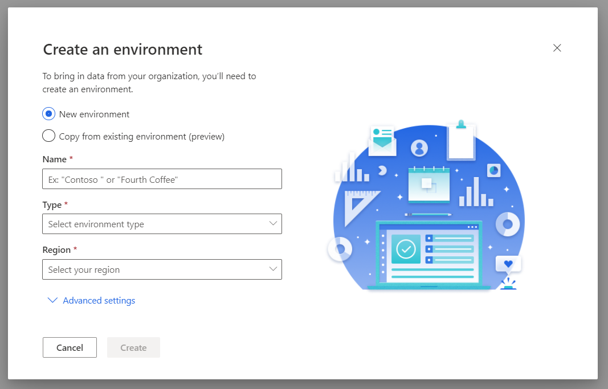

# Manage environments

This article explains how to create a Dynamics 365 Customer Insights instance and how to provision an environment.

## Sign up for Customer Insights and create an organization

1. Go to the [Dynamics 365 Customer Insights](https://dynamics.microsoft.com/ai/customer-insights/) website.

2. Select **Get Started**.

3. Choose your preferred sign-up scenario and select the corresponding link.

4. Accept the terms and conditions and select **Continue** to start creating the organization.

5. After the environment is created, you'll be redirected to [Customer Insights](https://home.ci.ai.dynamics.com).

6. Use the demo environment to explore the app, or create a new environment by following the steps in the next section.

7. After specifying the environment settings, select **Create**.

8. You'll be signed in to Customer Insights when the environment was created successfully.

## Create an environment in an existing organization

There are two ways to create a new environment. You can either specify an entirely new configuration, or you can copy some configuration settings from an existing environment.

To create an environment:

1. Select the **Settings** symbol in the header of the app.

1. Select **New environment**.

   > [!div class="mx-imgBorder"]
   > 

1. In the **Create new environment** dialog, select **New environment**.

   If you want to [copy data from the current environment](#additional-considerations-for-copy-configuration-preview), select **Copy from existing environment**. You'll see a list of all available environments in your organization where you can copy data from.

1. Provide the following details:
   - **Name**: The name that represents this environment in the Customer Insights app. This field is already filled in if you've copied an existing environment, but you can change it.
   - **Region**: The region into which the service is deployed and hosted.
   - **Type**: Select whether you want to create a Production or Sandbox environment.

2. Optionally, you can select **Advanced settings**:

   - **Save all data to**: Specifies where you want to store the output data generated from Customer Insights. You'll have two options: **Customer Insights storage** (an Azure Data Lake managed by the Customer Insights team) and **Azure Data Lake Storage Gen2** (your own Azure Data Lake Storage). By default, the Customer Insights storage option is selected.

   > [!NOTE]
   > By saving data to Azure Data Lake Storage, you agree that data will be transferred to and stored in the appropriate geographic location for that Azure storage account, which may differ from where data is stored in Dynamics 365 Customer Insights. [Learn more at the Microsoft Trust Center.](https://www.microsoft.com/trust-center)
   >
   > Currently, ingested entities are always stored in the Customer Insights managed data lake.
   > We support only Azure Data Lake Gen2 storage accounts from the same Azure region you selected above to provision your Customer Insights environment. Specifying an Azure Data Lake from a different Azure region is not supported.
   > We support only Azure Data Lake Gen2 Hierarchical Name Space (HNS) enabled storage accounts. Non-HNS storage accounts aren't supported yet.

   - For the Azure Data Lake Storage Gen2 option, you need to specify the **Account name** and **Account key** for your storage account. The **Container** name can't be changed.
   

   - If you want to use [predictions](predictions.md), enter your Common Data Service instance URL in the **Server address** field under **Use predictions**.

   When you run processes in Customer Insights, such as data ingestion or segment creation, corresponding folders will be created in the storage account you specified above. Data files and model.json files will be created and added to the respective subfolders based on the process you run.

   If you create multiple instances of Customer Insights and choose to save the output entities from those instances in your storage account, separate folders will be created for each instance with ci_<instanceid> in the container.

### Additional considerations for copy configuration (preview)

The following configuration settings are copied:

- Feature configurations
- Inegsted/imported data sources
- Data unification (Map, Match, Merge) configuration
- Segments
- Measures
- Relationships
- Activities
- Search & filter Index
- Export destinations
- Scheduled refresh
- Enrichments
- Model management
- Role assignments

The following settings are *not* copied:

- Customer profiles.
- Data source credentials. You'll have to provide the credentials for every data source and refresh the data sources manually.
- Data sources from Common Data Model folder and Common Data Service managed lake. You'll have to create those data sources manually with the same name as in the source environment.

When you copy an environment, you'll see a confirmation message that the new environment has been created. Select **Go to data sources** to see the list of data sources.

All the data sources will show a **Credentials Required** status. Edit the data sources and enter the credentials to refresh them.

> [!div class="mx-imgBorder"]
> 

After refreshing the data sources, go to **Data** > **Unify**. Here you'll find settings from the source environment. Edit them as needed or select **Run** to start the data unification process and create the unified customer entity.

When the data unification is complete, go to **Measures** and **Segments** to refresh them too.

## Edit an existing environment

You can edit some of the details of existing environments.

1. Go to **Admin** > **System** > **About**.

1. Select **Edit**.

1. You can update the environment's **Display name**, but you can't change the **Region** or **Type**.

1. If an environment is configured to store data in Azure Data Lake Storage Gen2, you can update the **Account key**. However, you can't change the **Account name** or **Container** name.

## Delete an existing environment

1. Go to **Admin** > **System** > **About**.

1. Select **Delete**.

1. To confirm the deletion, enter the environment name and select **Delete**.
