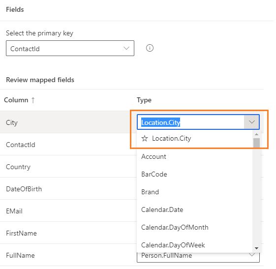

# Map entities and attributes

**Map** is the first stage in the data unification process in Dynamics 365 Customer Insights. Mapping consists of three phases:

- *Entity selection*: Identify the combinable entities that lead to a dataset with more complete information about your customers.
- *Attribute selection*: For each entity, identify the columns you want to combine and reconcile in the *match* and *merge* phases. In Customer Insights, these columns are called *Attributes*.
- *Primary key and semantic type selection*: For each entity, identify an attribute you want to define as the primary key for that entity, and for each attribute, identify a semantic type that best describes that attribute.

For more information about the general flow of data unification, see [Unify](data-unification.md).

## Select the first entities

1. In Customer Insights, go to **Data** > **Unify** > **Map**.

2. Start the map phase by selecting **+ Select entities**.

3. Select the entities and attributes you want to use in the *match* and *merge* phases. You can include all attributes from an entity by selecting the "include all fields" checbox at the entity level or select the required attributes individually from an entity. We recommend selecting at least two entities to benefit from the data unification process.

   > [!div class="mx-imgBorder"]
   > 

   For example, we're adding the **eCommerceContacts** and **loyCustomers** entities. By picking these entities to unify the customer data, you can derive meaningful insights on which of the online business customers are loyalty program members in your business.
   
   You can search on keywords across all attribute names and entity names and select the required attributes to map.
   
     > [!div class="mx-imgBorder"]
   > 

4. Select **Apply** to confirm your selections.

## Select primary key and define semantic type for attributes

After selecting your entities, the **Map** page lists the selected entities for your review. You need to define the primary key for an entity and identify the semantic type for an attribute in the entity.

- **Primary key**: Select one attribute as a primary key for each of your entities. For an attribute to be a valid primary key, it shouldn't include duplicate values, missing values, or null values. String and GUID data type attributes are supported as parimary keys and will be displayed in a field for you to select from. *Numeric data type support will be available in the upcoming releases.*

- **Attribute semantic type**: Categories of your attributes, such as email address or name. Adding a custom semantic type is also possible. Select the type field for that attribute, and type your custom attribute-type name. You can also change the attribute types that were auto-identified by the system.

All attributes for which a semantic type is auto-identified by the system are grouped into a *mapped fields* section. Those attributes include names, email address, and several others. Review these attributes and their specified types since they'll be used to combine your entities in the *merge* configuration phase.

Any attributes that are not auto-identified with a semantic type by the system will be grouped in *unmapped fields* section. Select the type field for that attribute, and type your custom attribute-type name. Once you identify a semantic type, that attribute will automatically be moved into the *mapped fields* section.

> [!div class="mx-imgBorder"]
> 

The type field displays the system recommended semantic type as the first value in the type fields with an star indicator.

> [!NOTE]
> One field should map to the semantic type Person.FullName to populate the customer name in customer card. Otherwise, the customer cards will appear nameless. 

> [!div class="mx-imgBorder"]
> 

## Add and remove attributes and entities

1. On **Unify** > **Map**, select **Edit fields**.

2. In the **Edit fields** panel, add or remove attributes and entities. Use the search or scroll down to find and select your attributes and entities of interest. You can't remove an attriute or an entity if they've already been matched.

   > [!div class="mx-imgBorder"]
   > 

3. Select **Apply**.

## Add images to profiles

If an entity contains URLs to publicly available profile images or logos, you can add them to the unified customer profile.

Select the entity and find the field that contains the URL to the profile image. In the **Type** input field manually enter the following value: 
- For a person: Person.ProfileImage
- For an organization: Organization.LogoImage

Proceed with the unification steps and ensure the attribute that contains the image URL is also added in the [Merge](merge-entities.md) step.

## Set attributes for organizations

For Organizations (Preview), the attribute type should be mapped to "Organization.Name"
> [!div class="mx-imgBorder"]
> 

## Next step

As part of the data unification process, go to the **Match** page. Visit [**Match**](match-entities.md) to learn about this phase.

> [!TIP]
> Check out the following video: [Getting Started: Creating a Unified Customer Profile](https://youtu.be/oBfGEhucAxs).
