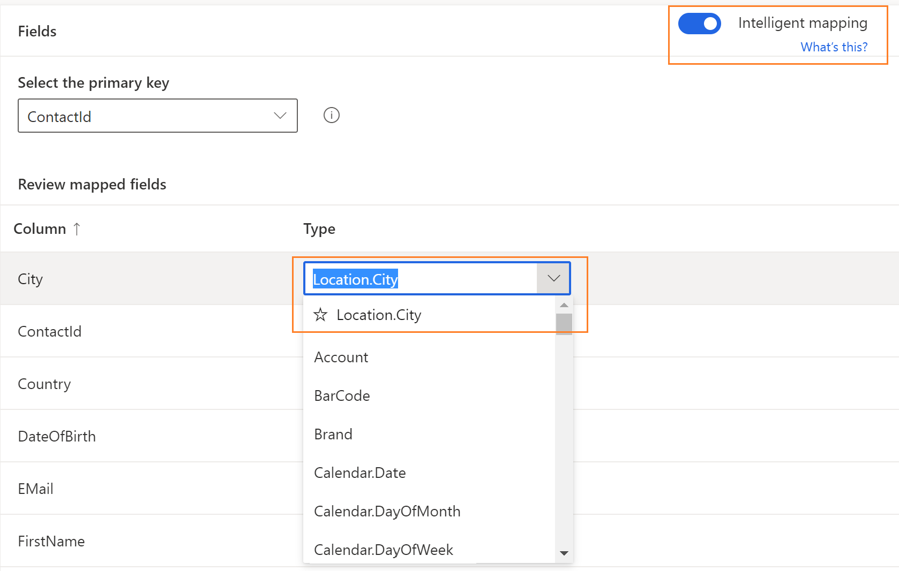
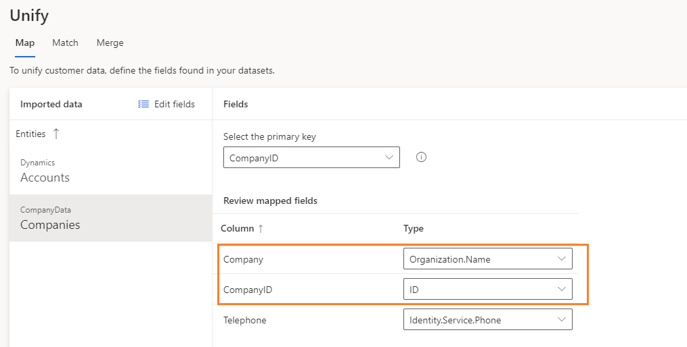

# Map entities and attributes

**Map** is the first stage in the data unification process in Dynamics 365 Customer Insights. Mapping consists of three phases:

- *Entity selection*: Identify the combinable entities that lead to a dataset with more complete information about your customers.
- *Attribute selection*: For each entity, identify the columns you want to combine and reconcile in the *match* and *merge* phases. In Customer Insights, these columns are called *Attributes*.
- *Primary key and semantic type selection*: For each entity, identify an attribute you want to define as the primary key for that entity, and for each attribute, identify a semantic type that best describes that attribute.

For more information about the general flow of data unification, see [Unify](data-unification.md).

## Select the first entities

1. In Customer Insights, go to **Data** > **Unify** > **Map**.

2. Start the map phase by selecting **Select entities**.

3. Select the entities and attributes you want to use in the *match* and *merge* phases. You can select the required attributes individually from an entity or include all attributes from an entity by selecting the **Include all fields** checkbox on the entity level. We recommend selecting at least two entities to benefit from the data unification process.

   > [!div class="mx-imgBorder"]
   > 

   In this example, we're adding the **eCommerceContacts** and **loyCustomers** entities. By choosing these entities, you can derive insights on which of the online business customers are loyalty program members.
   
   You can search on keywords across all attributes and entities to select the required attributes you want to map.
   
     > [!div class="mx-imgBorder"]
   > 

4. Select **Apply** to confirm your selections.

## Select primary key and semantic type for attributes

After selecting your entities, the **Map** page lists the selected entities for your review. Define the primary key for an entity and identify the semantic type for an attribute in the entity.

- **Primary key**: Select one attribute as a primary key for each of your entities. For an attribute to be a valid primary key, it shouldn't include duplicate values, missing values, or null values. String, integer, and GUID data type attributes are supported as primary keys and will be displayed in a field for you to select from.

- **Attribute semantic type**: Categories of your attributes, such as email address or name. To use AI models for smart prediction of semantics, save time and improve accuracy, set **Intelligent mapping** to **ON**. Intelligent mapping highlights AI-based semantics recommendation in the **Type** field. If you set it to **OFF**, you will see our regular mapping recommendations. You can select any semantic type from the available list of options and override the suggested selection.

> [!div class="mx-imgBorder"]
> 

Adding a custom semantic type is also possible. Select the type field for an attribute, and type your custom semantic type name. This way, you can also change the attribute types that were identified by the system.

All attributes for which a semantic type is automatically identified are grouped in the **Review mapped fields** section. Review these attributes and their semantic types because they'll be used to combine your entities in the merge step of data unification.

Attributes that aren't automatically mapped to a semantic type are grouped in the **Define the data in the unmapped fields** section. Select the semantic type field for the unmapped attributes, or enter your custom attribute-type name.

> [!div class="mx-imgBorder"]
> 

> [!NOTE]
> One field should map to the semantic type Person.FullName to populate the customer name in customer card. Otherwise, the customer cards will appear nameless. 

## Add and remove attributes and entities

1. On **Unify** > **Map**, select **Edit fields**.

2. In the **Edit fields** pane, add or remove attributes and entities. Use the search or scroll to find and select your attributes and entities of interest. You can't remove an attribute or an entity if they've already been matched.

   > [!div class="mx-imgBorder"]
   > 

3. Select **Apply**.

## Add images to profiles

If an entity contains URLs to publicly available profile images or logos, you can add them to the unified customer profile.

Select the entity and find the field that contains the URL to the profile image. In the **Type** input field, manually enter the following value: 
- For a person: Person.ProfileImage
- For an organization: Organization.LogoImage

Continue with the unification steps and ensure the attribute that contains the image URL is also added in the [Merge](merge-entities.md) step.

## Set attributes for organizations

For organizations (Preview), the attribute type should be mapped to "Organization.Name"
> [!div class="mx-imgBorder"]
> 

## Next step

As part of the data unification process, go to the **Match** page. Visit [**Match**](match-entities.md) to learn about this phase.

> [!TIP]
> Check out the following video: [Getting Started: Creating a Unified Customer Profile](https://youtu.be/oBfGEhucAxs).
