# Match entities

After completing the map phase, you're ready to match your entities. The match phase specifies how to combine your datasets into a unified customer profile dataset. The match phase requires at least [two mapped entities](map-entities.md).

## Specify the match order

Go to **Unify** > **Match** and select **Set order** to start the match phase.

Each match unifies two or more entities into a single entity, while persisting each unique customer record. In the following example, we selected three entities: **ContactCSV: TestData** as the **Primary** entity, **WebAccountCSV: TestData** as **Entity 2**, and **CallRecordSmall: TestData** as **Entity 3**. The diagram above the selections illustrates how the match order will be executed.

> [!div class="mx-imgBorder"]
> 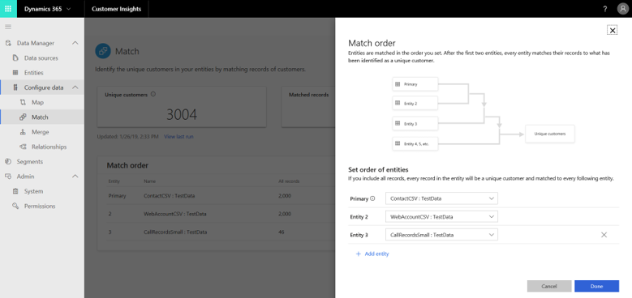
  
The **Primary** entity is matched with **Entity 2**. The dataset that results from the first match is matched with **Entity 3**.
In this example, we only selected two matches, but the system can support more.

> [!IMPORTANT]
> The entity that you choose as your **Primary** entity will serve as the basis for your unified master dataset. Additional entities that are selected during the match phase will be added to this entity. At the same time, this doesn't mean that the unified entity will include *all* of the data included in this entity.
>
> There are two considerations that can help you choose the hierarchy of your entities:
>
> - What entity do you consider having the most complete and reliable data about your customers?
> - Does the entity that you just identified have attributes that are also shared by other entities (for example, name, phone number, or email address)? If not, choose your second most reliable entity.

Select **Done** to save your match order.

## Define rules for your first match pair

After specifying the match order, you'll see the defined matches on the **Match** page. The tiles at the top of the screen will be empty until you run your match order.

> [!div class="mx-imgBorder"]
> 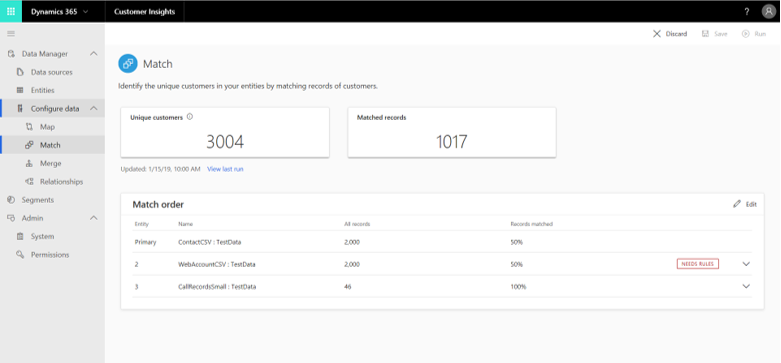

The **Needs Rules** warning suggests that no match rule is defined for a match pair. Match rules specify the logic by which a specific pair of entities will be matched.

1. To define your first rule, open the **Rule Definition** pane by selecting the corresponding match row in the matches table (1) and then selecting **Create new rule** (2).

   > [!div class="mx-imgBorder"]
   > 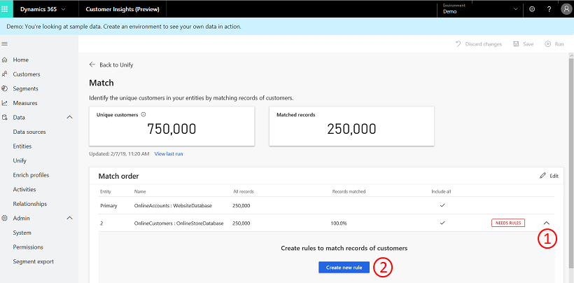

2. In the **Edit Rule** pane, configure the conditions for that rule. Each condition is represented by two rows that include mandatory selections.

   > [!div class="mx-imgBorder"]
   > 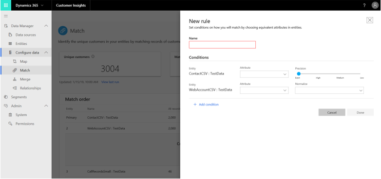

   Entity/Field (first) - An attribute that will be used for matching from the first match pair entity. Examples could include a phone number or email address. Choose an attribute that is likely to be unique to the customer.

   > [!TIP]
   > Avoid matching on the basis of activity-type attributes. In other words, if an attribute seems to be an activity, then it might be a poor criteria to match by.  

   Entity/Field (Second) - An attribute that will be used for matching from the second match pair entity.

   Normalize - **Normalization method**: Various normalization options are available for the selected attributes. For example, removing punctuation or removing spaces

   For Organization name normalization (Preview), you can also select **Type (Phone, Name, Organization)**

   > [!div class="mx-imgBorder"]
   > 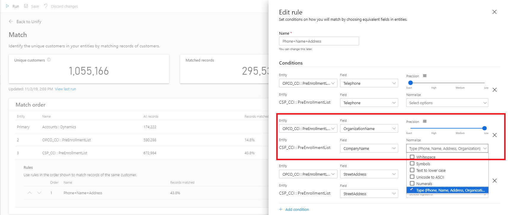

   Precision level - The level of precision that will be used for this condition. Setting a precision level for a match condition can have two types: **Basic** and **Custom**.  
   - Basic: Provides you with four options to select from: Low, Medium, High, and Exact. Select **Exact** to only match records that that match 100 percent. Select one of the other levels to match records that aren't 100 percent identical.
   - Custom: Use the slider to define the custom percentage that records need to match or enter a value in the **Custom** field. The system will only match records passing this threshold as conflated match pairs. Values on the slider are between 0 and 1. So 0.64 represents 64 percent.

3. Select **Done** to save the rule.

### Add multiple conditions

To match your entities only if multiple conditions are met, add more conditions that are linked through an AND operator.

1. In the **Edit rule** pane, select **Add condition**. You can also delete conditions by selecting the remove button next to an existing condition.

2. Select **Done** so save the rule.

## Add multiple rules

Each condition applies to a single pair of attributes, while rules represent sets of conditions. To have your entities matched by different sets of attributes, you can add more rules.

1. In Customer Insights, go to the **Match** page.

2. Select the entity you want to update and select **Add rules**.

3. Follow the procedure as outlined in [Define rules for your first match pair](#define-rules-for-your-first-match-pair).

> [!NOTE]
> The rule order matters. The matching algorithm tries to match on the basis of your first rule and continues to the second rule only if no matches were identified under the first rule.

## Define deduplication on a match entity

Along with specifying cross entity matching rules as outlined in the above sections, you can also specify deduplications rules. *Deduplication* is a process. It identifies duplicate records, merges them into one record, and links all the source records to this merged record with alternate IDs to the merged record.

After a deduplicated record is identified, that record will be used in the cross-entity matching process. Deduplication is implemented at the entity level and can be applied to every entity used in the Match process.

### Add deduplication rules

1. In Customer insights, go to **Data** > **Unify** > **Match**.

1. In the **Merged duplicates** section, select **Set entities**.

1. In the **Merge preferences** section, select the entities you want to apply deduplication to.

1. Specify how to merge the duplicate records and choose one of three merge options:
   - *Most filled*: Identifies the record with most filled attributes as the winner record. This is the default merge option.
   - *Most recent*: Identifies the winner record based on the most recency. Requires a date or a numeric field to define the recency.
   - *Least recent*: Identifies the winner record based on the least recency. Requires a date or a numeric field to define the recency.
 
   > [!div class="mx-imgBorder"]
   > 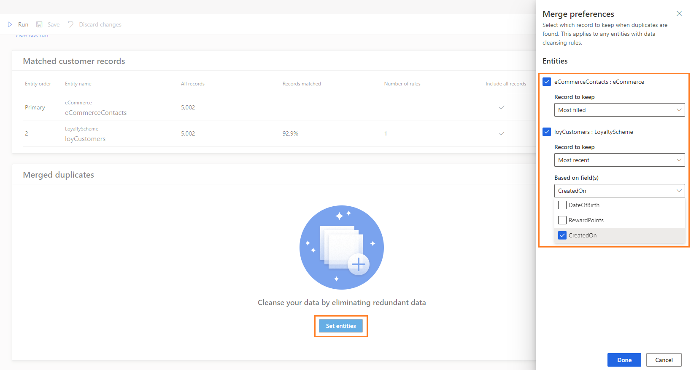
 
1. Once the entities are selected and their merge preference is set, select **Create new rule** to define the deduplication rules at an entity level.
   - **Select field** lists all the available fields from that entity you want to deduplicate source data on.
   - Specify the normalization and precision settings in similar way as specified in the cross entity matching.
   - You can define additional conditions by selecting **Add condition**.
 
   > [!div class="mx-imgBorder"]
   > 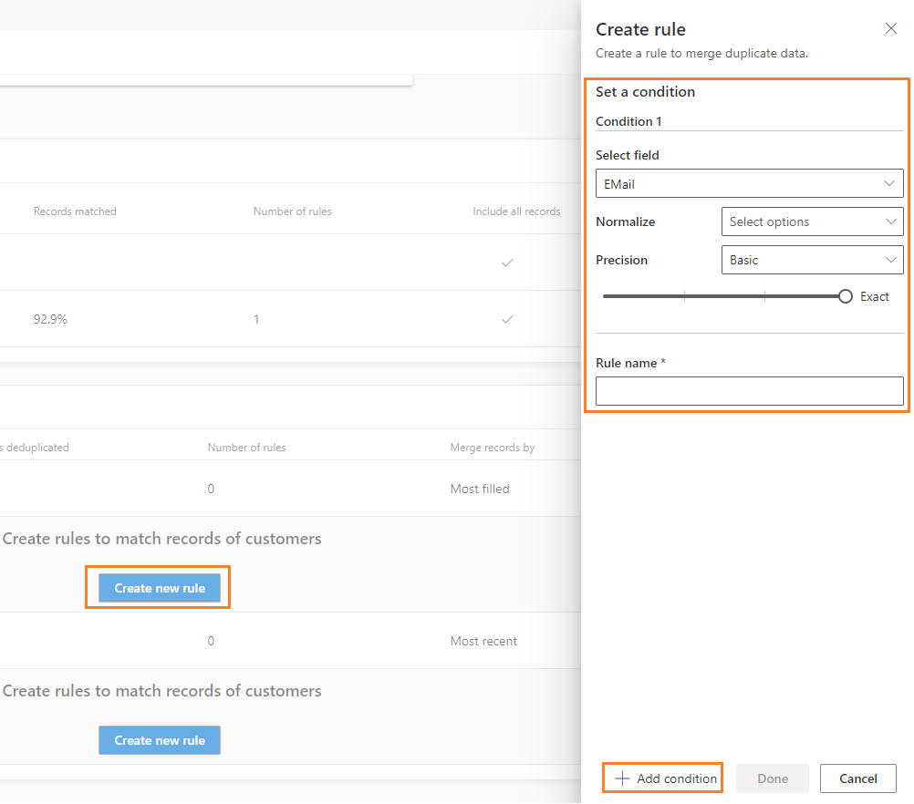

  You can create multiple deduplication rules for an entity. 

1. Running the match process now groups the records based on the conditions defined in the deduplication rules. After grouping the records, the merge policy is applied to identify the winner record.

1. This winner record is then passed on to the cross-entity matching.

1. Any custom match rules defined for always match and never match overrule deduplication rules. If a deduplication rule identifies matching records, and a custom match rule is set to never match those records, then these two records won't be matched.

1. After running the match process, you will see the deduplication stats.
   
> [!NOTE]
> Specifying deduplication rules isn't mandatory. If no such rules are configured, the system-defined rules are applied. They collapse all records that share the same value combination (exact match) from primary key and the fields in the matching rules into a single record before passing the entity data to cross-entity matching for enhanced performance and system sanity.

## Run your match order

After defining the match rules, including cross-entity matching and deduplication rules, you can run the match order. On the **Match** page, select **Run** to start the process. The matching algorithm might take some time to complete. You can't change properties on the **Match** page until the match process completes. You'll find the unified customer profile entity that was created on the **Entities** page. Your unified customer entity is called **ConflationMatchPairs:CustomerInsights**.

To make additional changes and rerun the step, you can cancel a match in progress. Select the **Refreshing ...** text and select **Cancel job** at the bottom of the side pane that appears.

When the match process is complete, the **Refreshing ...** text will change to **Successful** and you can use all functionality of the page again.

The first match process results in the creation of a unified master entity. All subsequent match runs result in the expansion of that entity.

> [!TIP]
> There are [six types of status](system.md#status-types) for tasks/processes in Customer Insights. Additionally, most processes [depend on other downstream processes](system.md#refresh-policies). You can select the status of a process to see details on the progress of the entire job. After selecting **See details** for one of the job's tasks, you find additional information: processing time, the last processing date, and all errors and warnings associated with the task.

## Review and validate your matches

Evaluate the quality of your match pairs and refine it:

- On the **Match** page, you'll find two tiles showing initial insights about your data.

  - **Unique customers**: shows the number of unique profiles that the system identified.
  - **Matched records**: shows the number of matches across all of your match pairs.

- In the **Match order** table, you can assess the results of each match pair by comparing the number of records that came from this match-pair entity against the percentage of successfully matched records.

- In the **Rules** section of an entity in the **Match order** table, you'll find the percentage of successfully matched records at the rule level. By selecting the table symbol next to a rule, you can view all these records on the rule level. We recommend that you review a subset of the records to validate that they were matched correctly.

- Experiment with different precision thresholds around your conditions to identify the optimal value.

  1. Select the ellipsis (...) for the match pair rule that you want to experiment with and select **Edit**.

  2. Select the condition that you want to experiment with. Each criterion is represented by one row in the **Match rule** pane.

  3. What you'll see on the **Criteria preview** page depends on the precision level you've selected for a condition. Find the number of matched and unmatched records for the selected condition.

     Get a rich understanding of the effects of different threshold levels. You can compare how many records will be matched under each of the threshold levels, and view the records under each option. Select each of the tiles and review the data in the table section.

## Optimize your matches

Increase the quality by reconfiguring some of your match parameters:

- **Change the match order** by selecting **Edit** and change the match order fields.

  > [!div class="mx-imgBorder"]
  > 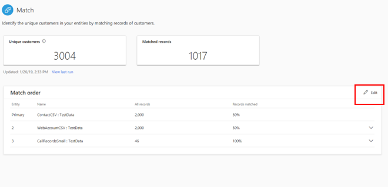

- **Change the order of your rules** if you defined multiple rules. You can reorder the match rules by selecting the **Move Up** and **Move Down** options in the match rules grid.

  > [!div class="mx-imgBorder"]
  > 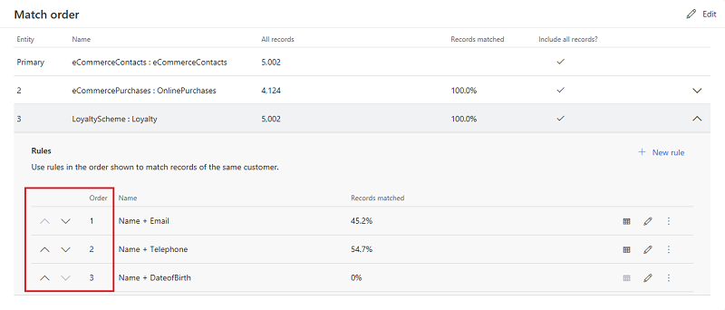

- **Duplicate your rules** if you've defined a match rule and would like to create a similar rule with modifications. Do so by selecting **Duplicate**.

  > [!div class="mx-imgBorder"]
  > 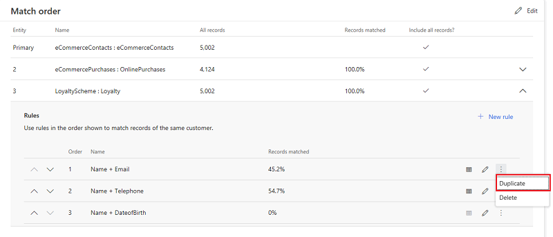

- **Edit your rules** by selecting the **Edit** symbol. You can apply the following changes:

  - Change attributes for a condition: Select new attributes within the specific condition row.
  - Change the threshold for a condition: Adjust the precision slider.
  - Change the normalization method for a condition: Update the normalization method.

## Specify your custom match records

You can specify conditions that certain records should always match or never match. These rules can be uploaded in bulk to the match process.

1. Select the **Custom match** option on the **Match order** screen.

   > [!div class="mx-imgBorder"]
   > 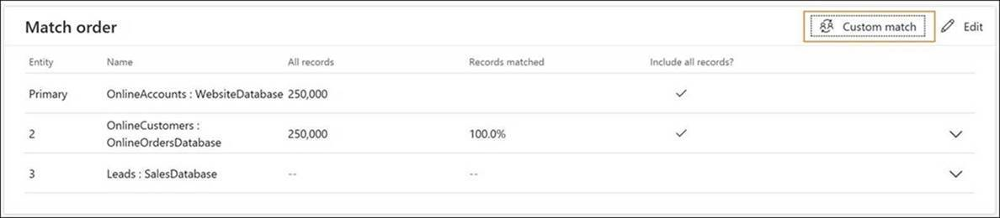

2. If you have no uploaded entities, you'll see a new **Custom match** dialog box that requires you to fill in some details. If you've provided these details earlier, skip to step 8.

   > [!div class="mx-imgBorder"]
   > 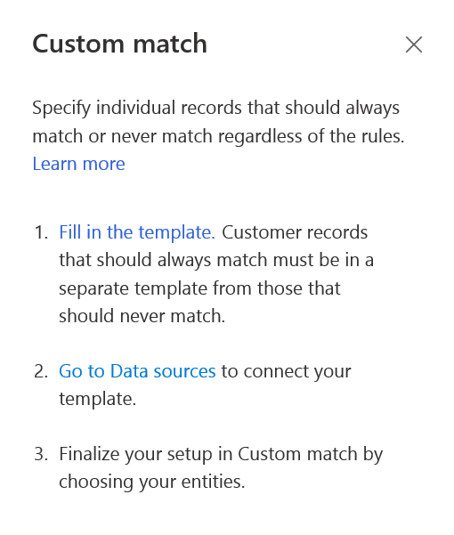

3. Select **Fill in the template** to get a template file that can specify which records from which entities should always match or never match. You'll need to separately fill in the "always match" records and "never match" records in two different files.

4. The template contains fields to specify the entity and the entity primary key values to be used in the custom match. For example, if you want primary key 12345 from Sales entity to always match with primary key 34567 from Contact entity, you'll need to specify as follows:
    - Entity1: Sales
    - Entity1Key: 12345
    - Entity2: Contact
    - Entity2Key: 34567

   The same template file can specify custom match records from multiple entities.

5. After adding all the overrides you want to apply, save the template file.

6. In Customer Insights, go to **Data sources** and ingest the template files as new entities. Once ingested, you can use them to specify the Match configuration.

7. After uploading the files and entities are available, select the **Custom match** option again. You'll see options to specify the entities you want to include. Select the required entities from the drop-down menu.

   > [!div class="mx-imgBorder"]
   > 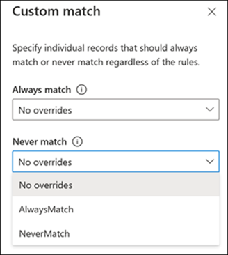

8. Select the entities you want to use for **Always match** and **Never match**, select **Done**.

9. Select **Save** on the **Match** page for the custom match configuration you just set up.

10. Select **Run** on the **Match** page to start the matching process, and the custom match configuration will be taken into effect. Any system matched rules are overridden by the configuration set.

11. Once the matching is complete, you can verify the **ConflationMatchPair** entity to confirm that the overrides are applied in the conflation matches.

## Next step

After completing the match process for at least one match pair, you may resolve possible contradictions in your data by going through the [**Merge**](merge-entities.md) topic.
