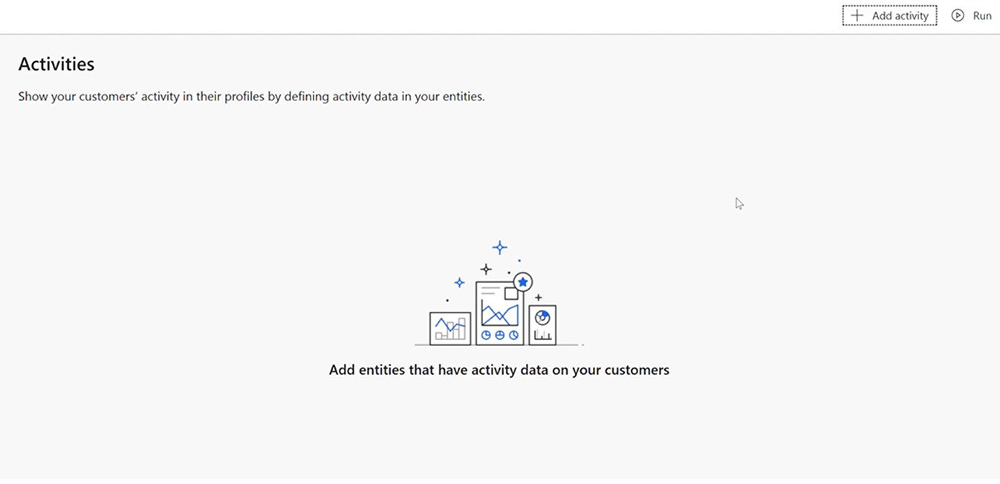
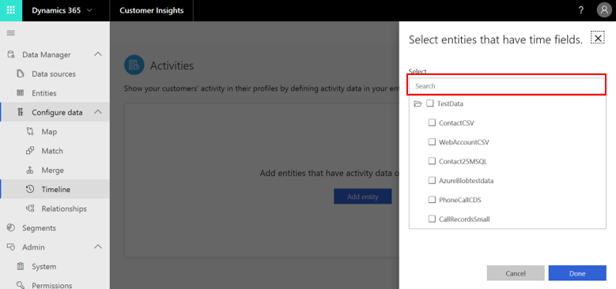
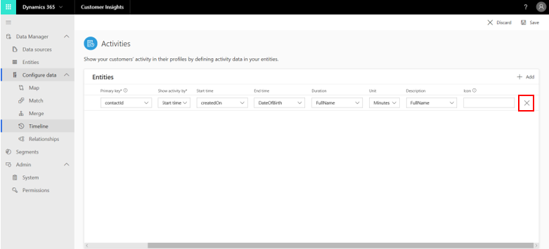
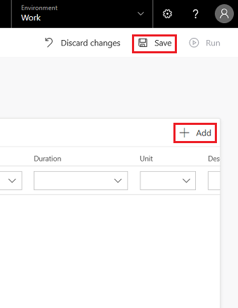

# Activities

[!INCLUDE [cc-beta-prerelease-disclaimer](../includes/cc-beta-prerelease-disclaimer.md)]

The Activities capability helps consolidate customer activities from various data sources. This creates a customer timeline view. Business analysts can configure activities to be displayed on a customer dashboard with a timeline view, which can be embedded in business applications.

The Activities capability includes two components:
- **Activities** page: Access this from the **Activities** tab on the left-side menu. Use it to define the activities that you want to view on the customer’s timeline grid.
- **Timeline grid:** This grid consolidates all the activities of one customer in chronological order, and it can be viewed either within a Customer Engagement app via the Customer Card add-in, or within a Power BI dashboard. A specific control is used for the creation of that grid. Visit the **Timeline Control** subsection within the **Customer Card Add-In** section to learn how to work with that control.

<!--note from editor:  Add links to cross-refs above  -->

This topic covers only the **Activities** page.

## Activities page

Your data sources include entities with transactional and activity data from multiple data sources. On this page, you will identify these entities and select the activities you want to view on the customer’s timeline grid.

## Step One: Entity selection

Choose the entity that includes your target activity or activities.

1. Select **Add entity**.
  
   > [!div class="mx-imgBorder"] 
   > 

2. Select all the entities that include transactional or activity data. You can enter an entity's name into Search (highlighted in the following example).
   
   > [!div class="mx-imgBorder"] 
   > 

3. Select **Done**. Once selected, you'll see the creation of a row for each selected entity. We will complete the required fields in Step Two. 

>[!NOTE]
>To be included in the timeline grid, an entity must have at least one attribute of type **Date**. Entities without **Date** fields will not be added.
 
   > [!div class="mx-imgBorder"] 
   > 

## Step Two: Activity definition

This step includes all your activity definitions. Using the following example, we will explore those definitions from left to right.

> [!div class="mx-imgBorder"] 
> 
    
- **Entity** (no selection is needed): Specifies your chosen entity's name.
- **Source** (no selection is needed): Specifies your chosen entity's data source name.
- **Primary key**: This field will be used to distinguish between all of your entity's records. This field should not contain any duplicate values, null values, or missing values. Options include **ActivityID**, **SessionID** and **OrderID**, but there are many others. 
- **Activity name**: Select the specific field that includes data on your activity. 
- **Show activity by**: The timeline grid is sorted by date in descending order (from newest to oldest). Decide if you want to show the activity by Start or End time for it to be placed correctly on the timeline. Using this field, choose which of the two options will serve as the primary method for placing the activity on the timeline grid. (In the following example, Start Time was chosen as the primary method.)
- **Start time or end time:** Depends on your previous selection. At this point, you should select the field that represents the start/end time. Only one field is required, but you can select both times if those are known for your activity.
- **Duration**: Select the field that represents the duration of your activity.
- **Unit**: Select the unit of time for the duration of your activity.
- **Description**: Select the field that represents a description of the activity
- **Icon**: You can add an icon to easily distinguish this activity on the timeline. You can add an icon to your activity if it's publicly available. A URL address or Unicode is required.
- **Delete** button: Selecting the button that is highlighted in the preceding image will delete that specific activity.
  
You can now define your next activity by selecting **Add**. Don't forget to save your activities.

> [!div class="mx-imgBorder"] 
> 
   
### Next step

<!--note from editor:  include links to topics  -->
Once you define your activities, you can:
1. Explore the **Timeline Control** subsection under the **Customer Card Add-in** section in order to learn how to view information on these activities for each of your customers.
2. Visit the **Connectors** section to learn how to set up the **Power BI** dashboard where you can also view information on these activities for each of your customers.

