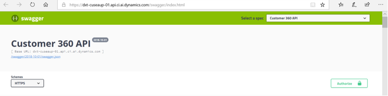
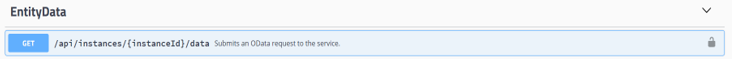

# APIs
*Note: this is a technical documentation. While it's purpose is to serve all users who wish to leverage the Customer Insights APIs, it might be most valuable for technical users.

[!INCLUDE [cc-beta-prerelease-disclaimer](../includes/cc-beta-prerelease-disclaimer.md)]

**When it comes to Customer Insights**, currently there are several types of APIs that you can start utilizing. The details (parameters, responses, etc) of these APIs can be found in the [Customer Insights Swagger webpage](https://tip.api.ci.ai.dynamics.com/swagger/index.html).

> [!div class="mx-imgBorder"] 
> 

The goal of this section is not to cover all the Customer Insights APIs but rather to:

- Provide guidance for how to use the Swagger tool
- Provide explanations around some of the most important functionalities that you, as a user, can leverage through our APIs

## How to use the Customer Insights Swagger webpage
If you are not familiar with Swagger, see the following step-by-step tutorial: [Swagger UI tutorial](https://idratherbewriting.com/learnapidoc/pubapis_swagger.html).

## Functionalities served with the Customer Insights Open Data Protocol APIs

> [!div class="mx-imgBorder"] 
> 

- *Put* API: /api/instances/{instanceId}/data/{relativePath}

|Functionality  |Guidance  |Limitations  |
|---------|---------|---------|
|1. **Export** any ingested dataset including the Master Customer Dataset that was created during the data configuration process (JSON/csv formats)     | Use **$Search** command with conte-type: text/csv header. For more information, see [Basic Tutorial](https://www.odata.org/getting-started/basic-tutorial/).        |1. Can be done only if **Customer ID** is present in the queried dataset 2. Can't be executed along with functionalities 2-5         |
|2. **Search and query** the Master Customer Dataset that was created during the data configuration process      | Use the **$Search** command. For more information, see [Basic Tutorial](https://www.odata.org/getting-started/basic-tutorial/).        | Currently not available.        |
|3. **Filter** the Master Customer Dataset     | Use the **$Filter** command. For more information, see [Basic Tutorial](https://www.odata.org/getting-started/basic-tutorial/).       | Currently not available.        |
|4. **Search and query** other ingested datasets     | Use the **$Search** command. For more information, see [Basic Tutorial](https://www.odata.org/getting-started/basic-tutorial/).         | 1. Can be done on if **Customer ID** is present in the queried dataset 2. Can't be executed along with 1      |
|5. **Filter** other ingested datasets     |Use the **$Filter** command. For more information, see [Basic Tutorial](https://www.odata.org/getting-started/basic-tutorial/).           | 1. Can be done on if **Customer ID** is present in the queried dataset 2. Can't be executed along with 1          |

## Limitations involved with using the Customer Insights conflation APIs

See the **Conflation** table in the [Customer Insights Swagger webpage](https://tip.api.ci.ai.dynamics.com/swagger/index.html).

### Limitations by field (across all Conflation APIs)

|Field  |Limitation  |
|---------|---------|
|{instanceId}     | Id must be the Id of an existing instance, and the user issuing the request must have access to that instance         |
|{entityName}     | It should be an entity name that has data ingested for the given instance (and a data source, if that is given as well)        |
|{datasourceId}     | Id must be the Id of a data source that exists inside of the given instance        |
|{conflationId}     | Id must be the Id of an existing conflation for the given instance        |

### Additional limitations by API

<table style="width:100%">
<tr>
<th>API</th>
<th>Limitations</th>
</tr>
<tr>
<td>PATCH /api/instances/{instanceId}/conflations/{conflationId}/entityInformation   </td>
<td><ol><li>  Request body will have a list of entity names, per data source. These must actually exist as ingested entities for the data source.</li> <li> Each entity named in request body must already have a primary key defined.</li></ol>     </td>
</tr>
<tr>
<td>PATCH /api/instances/{instanceId}/conflations/{conflationId}/entityInformation/{entityName}  </td>
<td>Same limitations as above EXCEPT the request body will have a single entity name, not a list   </td>
</tr>
<tr>
<td>PATCH /api/instances/{instanceId}/conflations/{conflationId}/datasources/ {datasourceId}/entityInformation/{entityName} </td>
<td>Same limitations as above</td>
</tr>
<tr>
<td>PATCH /api/instances/{instanceId}/conflations/{conflationId}/conflationPlan  </td>
<td> <ol><li> Any entity that appears in the plan must have been ingested in the referenced data source. </li>  <li> Any attribute that appears in the plan must actually exist as an attribute as the referenced entity.</li> <li> Any entity that appears in the plan must have a primary key defined.</li> <li> All entities in the ConflationOrder must have corresponding EntityConflationInformation</li> <li> At least 1 rule and criteria must be defined</li> <li> No copy criteria may be included in the plan</li> <li> All entities in the plan must appear in the entity conflation order</li> <li> Entities cannot appear in the plan out of the order defined in ConflationOrder</li> <li> All matched attributes must have the same type </li>  </ol>    </td>
</tr>
<tr>
<td>PATCH /api/instances/{instanceId}/conflations/{conflationId}/conflictResolutionRules  </td>
<td><ol><li> Same as above</li> <li> Same as above</li> <li> Same as above</li> <li> At least 1 resolution policy must be defined against at least 1 source attribute</li> All entities defined in the resolution policy must be part of the conflation plan </li> </ol>  </td>
</tr>
</table>

## Limitations involved with using the Customer Insights Relationship APIs 

See the **EntityMetadata** table in the [Customer Insights Swagger webpage](https://tip.api.ci.ai.dynamics.com/swagger/index.html).

### Limitations Common to all APIs

**First**, these APIs require that data has already been ingested, except for the following APIs:

- GET /api/instances/{instanceId}/manage/schema/entitySemanticLabels
- GET /api/instances/{instanceId}/manage/schema/attributeSemanticLabels
- GET /api/instances/{instanceId}/manage/relationships
- GET /api/instances/{instanceId}/manage/relationships/{relationshipName}
- DELETE /api/instances/{instanceId}/manage/relationships/{relationshipName}

**Second**, specifically for relationship APIs, any time {relationshipName} is provided, there must actually exist a relationship with that name in the given instance.

### Additional limitations by API

<table style="width:100%">
<tr>
<th>API</th>
<th>Limitations</th>
</tr>
<tr>
<td>PATCH /api/instances/{instanceId}/manage/datasources/{datasourceId}/ entities/entityInfo </td>
<td><ol><li> Request body will have a list of entity names. These must all have been ingested into the given data source.</li> <li> Request body will have a list of attribute names associated with each entity. These must actually exist as attributes of the entity.</li> <li> The ONLY allowed values for “EntityType” are “Activity” and “Unspecified”</li> <li> If EntityType  = Activity, then the entity with this EntityType must have a relationship to an entity with type Profile</li> <li> If the TimestampFieldName is provided for an entity, this must be the name of one of the attributes of that entity. That attribute must have type DateTime or long.</li> </ol></td>
</tr>
<tr>
<td>PATCH /api/instances/{instanceId}/manage/datasources/{datasourceId}/ entities/{entityName}/entityInfo</td>
<td><ol><li> Same as above, but for a single entity rather than a list</li> <li> Same as above</li> <li> Same as above</li> <li> Same as above</li> <li> Same as above</li> </ol>  </td>
</tr>
<tr>
<td>PATCH /api/instances/{instanceId}/manage/relationships </td>
<td><ol><li> Relationship name can only include letters, numbers, and underscores</li> <li> Relationship name must be unique</li> <li> Cardinality can ONLY have two values: “OneToMany”, and “ManyToOne”</li> <li> There are ONLY 4 possible relationship types: SingleKeyRelationshipOrigin, SingleKeyRelationshipDestination, DataSourceLineageOrigin, DataSourceLineageDestination</li> <li> Both the FromEntity and ToEntity must be the names of entities that actually exist in the instance</li> <li> Both the FromAttribute and ToAttribute must actually exist as attributes of the FromEntity and ToEntity </li> </ol>  </td>
</tr>
<tr>
<td>PATCH /api/instances/{instanceId}/manage/relationships/{relationshipName}</td>
<td>Same limitation as above EXCEPT #2 is not a limitation here, since the name was already validated during creation (whereas this is an update)  </td>
</tr>
</table>

## Functionalities served with the Customer Insights Segmentation APIs

1. Use APIs for managing segments: Create, update, get and delete segment definitions. Also activate and deactivate segments. 
2. Use APIs for querying: Get specific parts of a segment
3. Use APIs for searching and querying specific segment member data

See the **SegmentManagement** table in the [Customer Insights Swagger webpage](https://tip.api.ci.ai.dynamics.com/swagger/index.html).

<!-- 
## Functionalities and limitations by API
To complete:
|Table5  |Column2  |
|---------|---------|
|Row1     |         |
|Row2     |         |
|Row3     |         |
|Row4     |         |
|Row5     |         |
-->