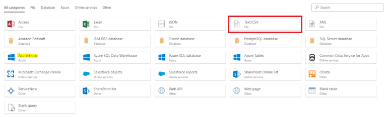
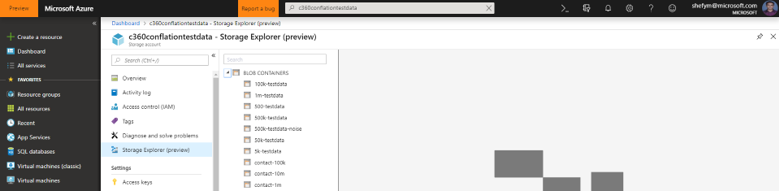
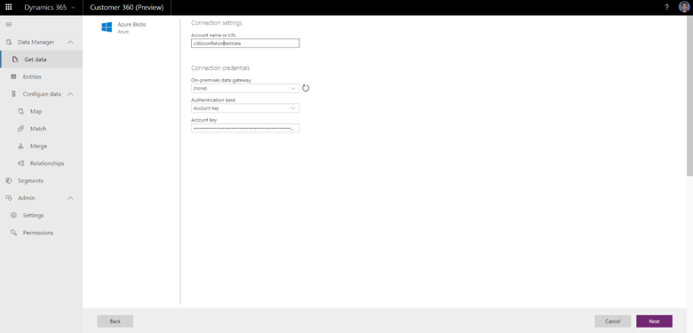
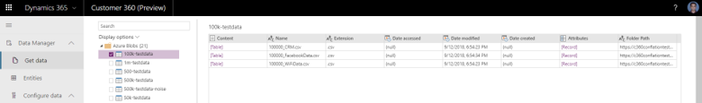
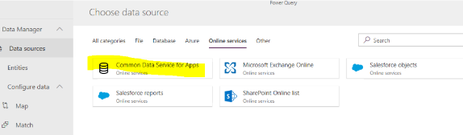
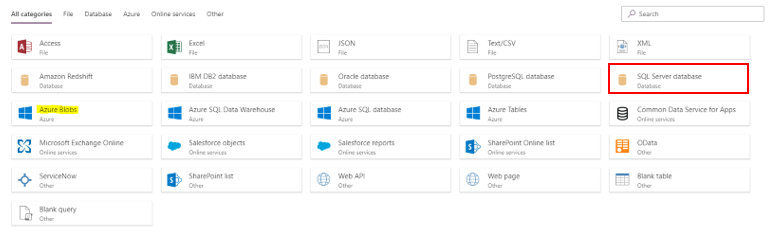

# Common Connectors Guidance

[!INCLUDE [cc-beta-prerelease-disclaimer](../includes/cc-beta-prerelease-disclaimer.md)]

## Common Connectors Guidance

***Important Note***: At this point (Novemebr 2018), on-prem data sources are not supported in Customer 360. 
We hope to enable that option soon.

### Ingest data from an Excel file (text/csv.)

1. If it’s a desktop file, you should first save it in SharePoint (as explained here: [https://support.office.com/en-us/article/Work-with-worksheet-data-in-OneDrive-C051A205-1C06-4FEB-94D8-793B0126B53A](https://support.office.com/en-us/article/Work-with-worksheet-data-in-OneDrive-C051A205-1C06-4FEB-94D8-793B0126B53A).

2. Select the **Text/csv** connector:

   > [!div class="mx-imgBorder"] 
   > 

//Jim can you add the content here? Thanks!

### Ingest data from a file hosted in Azure blob

   > [!div class="mx-imgBorder"] 
   > 

To ingest data to Dynamics 360 from a csv file hosted in a blob in an Azure subscription, follow these steps.

1. Select Blob connector from the list of connectors.

   > [!div class="mx-imgBorder"] 
   > 

2. Enter the account name and account key, and then select **Next**.

   > [!div class="mx-imgBorder"] 
   > 

   **Note**: You can find the account name and key from **Access keys** in the Azure portal as show below: 

   > [!div class="mx-imgBorder"] 
   > 

3. This will now list out all the containers in the blob, select the container with the CSV file and click next. 

   > [!div class="mx-imgBorder"] 
   > 

4.	Now you will see the various csv files in the container, click on **[Table]** in the content column to expand and see the file content preview. 

   > [!div class="mx-imgBorder"] 
   > 
   
### Ingest data from Dynamics 365 for Customer Engagement

Select **Common Data Service for Apps**.

> [!div class="mx-imgBorder"] 
> 

### Ingest data from Azure SQL database

Select **SQL Server database**.

> [!div class="mx-imgBorder"] 
> 
