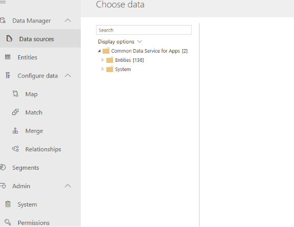
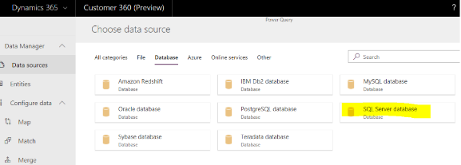
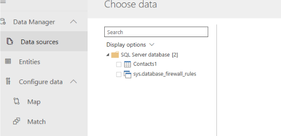
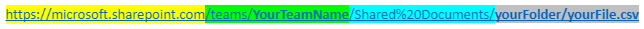
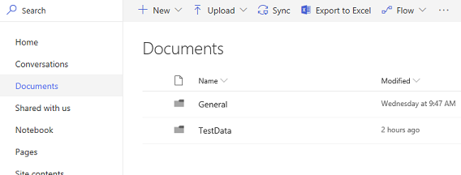
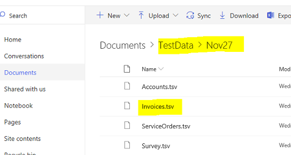

# Common connectors

This section provides more information atop the **Data Sources** section. 
In this section we will cover in detail how to load data from several connectors. Currently this
section covers the following connectors (in that order):
1. Ingest data from a file hosted in an **Azure blob**
2. Ingest data from **Dynamics 365**
3. Ingest data from the **Azure SQL database**
4. Ingest data from a **CSV file** 

> [!IMPORTANT]
> Currently, on-premises and OData data sources are not supported in Dynamics 365 Customer Insights. 

## Ingest data from a file hosted in an Azure blob

> [!div class="mx-imgBorder"] 
> 

<!-editor note: The alt/hover text above is the same as for the image below. Is that correct? -->

To ingest data to Customer Insights from a CSV file hosted within a blob location in a Microsoft Azure subscription, follow these steps:

1. Select **Azure Blobs** from the list of connectors.

   > [!div class="mx-imgBorder"] 
   > 

2. Enter the account name and account key, and then select **Next**.

   > [!div class="mx-imgBorder"] 
   > 

   > [!NOTE]
   > You can find the account name and key from the **Access keys** part of the Azure portal as shown in the following example. 

    > [!div class="mx-imgBorder"] 
    > 

3. You will now see a list of all the containers in the blob. Select the container that includes your CSV file, and select **Next**.

   > [!div class="mx-imgBorder"] 
   > 

4.	You will see the various CSV files in the container. Select **[Table]** in the content column to see a preview of the file's content.

<!--editor note: alt/hover text above is same as for image below. Is that right? -->

    > [!div class="mx-imgBorder"] 
    > 
   
## Ingest data from Dynamics 365

1. Select **Common Data Service**.

   > [!div class="mx-imgBorder"] 
   > 
 
2. Enter your server URL.

   > [!div class="mx-imgBorder"] 
   > 

3. Sign in with your username and password.

4. Choose your entities of interest from the left-side menu, and then review them on the right-side window:

<!--editor note: Is "Log in" accurate alt/hover text for the next image? I don't see any sign-in area. -->

   > [!div class="mx-imgBorder"] 
   > 

   > [!div class="mx-imgBorder"] 
   > 

## Ingest data from the Azure SQL database

1. Select **SQL Server database** from the connector list.

   > [!div class="mx-imgBorder"] 
   > 

3. Enter your database server, database name, username, and password.

   > [!div class="mx-imgBorder"] 
   > 

4. Choose data from the specific tables you want to bring into Customer Insights.

   > [!div class="mx-imgBorder"] 
   > 
   
## Ingest data from a CSV file

1. If the CSV file that contains the data you want to ingest is a desktop file, you should first save it in SharePoint as explained here: [Work with worksheet data in OneDrive](https://support.office.com/article/Work-with-worksheet-data-in-OneDrive-C051A205-1C06-4FEB-94D8-793B0126B53A)

2. Select the **Text/CSV** connector.

   > [!div class="mx-imgBorder"] 
   > 

3. Manually format the URL to your online document.

   Once you copy the URL to your online document from SharePoint, it should look like this: 

   https://microsoft.sharepoint.com/:u:/t/TeamName/EdP4Jh3iCj9DUteIBCzbdOX7C4bmVvzlDo81F0A?e=2Co1vj
   
   Format the URL as follows:

   > [!div class="mx-imgBorder"] 
   > 

   The final result for the preceding example is: 

   > [!div class="mx-imgBorder"] 
   > 

   Here is an example of a copied link: 
 https://microsoft.sharepoint.com/:u:/t/yourTeamName/EdP4G8Jk2dZJh3iCj9DUteIBCzbdOX7C4bmVvzlDo811vj  

From the link components described above:

- Here is where you can find **Your team name**:

  > [!div class="mx-imgBorder"] 
  > 

- Here is where you can find the **Root folder to your documents**:

  > [!div class="mx-imgBorder"] 
  > 

- And here is where you will find your **File name and the folder structure for the file**:

  > [!div class="mx-imgBorder"] 
  > 
