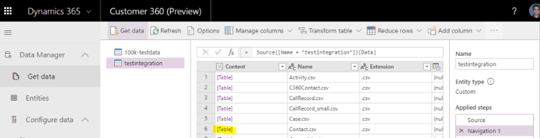
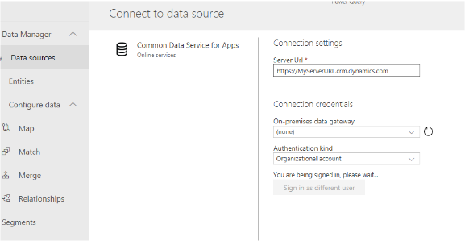
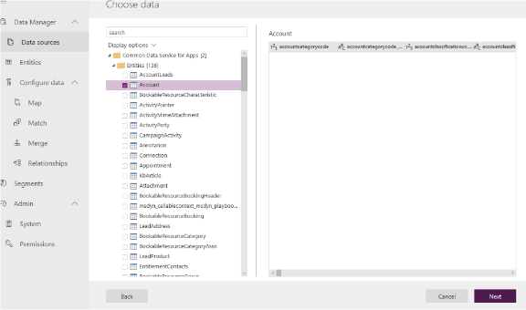
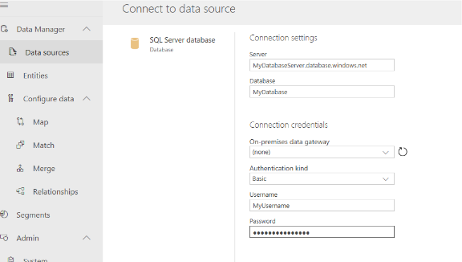
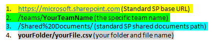

# Common connectors

This topic extends on the content from the [Data sources](data-sources.md) article. You'll learn how to load data into Dynamics 365 Customer Insights from the most frequently used connectors. Refer to the following sections to ingest data from the described sources.

## CSV file hosted on Microsoft Azure Blob storage

1. In Customer Insights, create a new data source.

2. Select **Azure Blob storage** from the list of connectors.

3. Enter the **Account name** and **Account key**, then select **Next**.

   > [!NOTE]
   > You can find your account name and key from the **Access keys** area in the Azure admin portal.

4. You now see a folder structure with all containers in the Blob storage. Select the container that includes your CSV file, and select **Next**.

5. You now see the available CSV files in the container. Select **[Table]** in the content column to see a preview of the file's content.

   > [!div class="mx-imgBorder"]
   > 

## Dynamics 365 apps using Common Data Service

1. In Customer Insights, create a new data source.

2. Select **Common Data Service for Apps** from the list of connectors.

3. Enter the **Server URL**.

   > [!div class="mx-imgBorder"]
   > 

4. Sign in with your credentials.

4. Choose the entities of interest and select **Next**.

   > [!div class="mx-imgBorder"]
   > 
   
   > [!NOTE]
   > For more information on the current limitations and issues with connecting to Common Data Service, see [Common Data Service connector reference - Limitations and issues](https://docs.microsoft.com/power-query/connectors/commondataservice#limitations-and-issues).

## Data stored in an Azure SQL database

1. In Customer Insights, create a new data source.

2. Select **SQL Server database** from the list of connectors.

3. Enter details for your **Server**, **Database** name, **Username**, and **Password**.

   > [!div class="mx-imgBorder"]
   > 

4. Choose data from the tables you want to bring into Customer Insights and select **Next**.

## CSV file hosted on a local machine

1. In Customer Insights, create a new data source.

2. Select **Text/CSV** from the list of connectors.

   > [!TIP]
   > If the CSV file that contains the data you want to ingest is a desktop file, you should first save it to a team share in the cloud: [Work with worksheet data in OneDrive](https://support.office.com/article/Work-with-worksheet-data-in-OneDrive-C051A205-1C06-4FEB-94D8-793B0126B53A)

3. Manually format the URL to your online document to get it to the following format:

   https://microsoft.sharepoint.com/teams/YourTeamName/Shared%20Documents/yourFolder/yourFile.csv

   > [!div class="mx-imgBorder"]
   > 

4. Enter the formatted URL to your CSV file and select **Next**.
