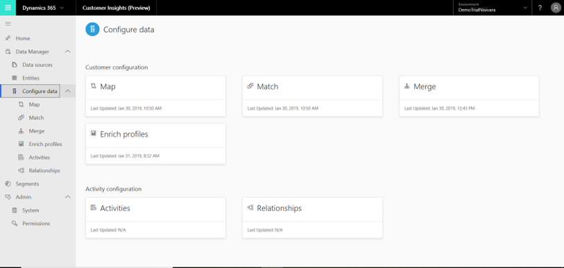

# Configure data

[!INCLUDE [cc-beta-prerelease-disclaimer](../includes/cc-beta-prerelease-disclaimer.md)

After completing the data ingestion process, you are ready to unlock the unique data-configuration features that Customer Insights offers. **Configure Data** includes six modules as represnted by the tiles in the screen below.
 
The goal behind the data configuration process is to unify data sources that once were disparate into a master customer dataset that includes more a complete view on your customers.  

- You should complete the three mandatory data configuration stages: Starting with **Map**, and continuing with **Match** and **Merge**. As a next step, make sure to explore those modules' sections, starting with the **Map** section.
- The **Relationship** module is optional but highly recommended for future utilization of the **Segments** page where you will produce customer segments. This can be done only after the completion of **Map**, **Match**, and **Merge**.
- The **Enrich Profiles** module is also optional but highly recommended for extracting richer insights around your customers. 
- The **Activities** module can be used to define some of your ingested attributes as activities.

After completing the mandatory configuration phases, visit the **Relationships**, **Enrich Profiles**, and **Activities** sections. 

> [!div class="mx-imgBorder"] 
> 
