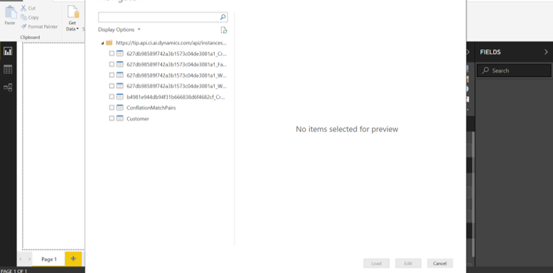
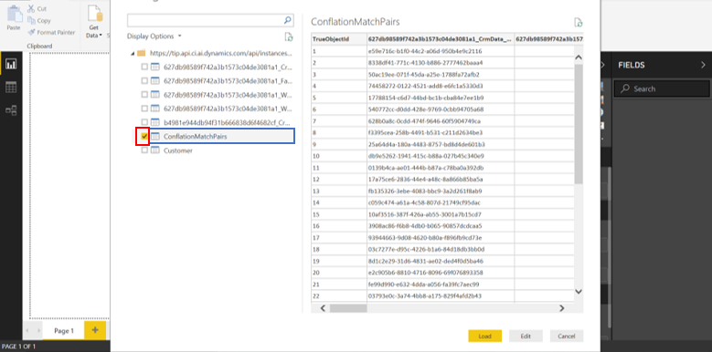

# Power BI connector

[!INCLUDE [cc-beta-prerelease-disclaimer](../includes/cc-beta-prerelease-disclaimer.md)]

In this section you will learn how to use the Power BI connector for unlocking the Customer Insights dashboard.

The Customer Insights dashboard enables you to use the unified data that you have unlocked through the data configuration process and start visualizing insights around each of your customers. From customer's details such as roles and locations, to communication details such as email addresses and phone numbers, to unique key performance indicators (KPIs) you might have defined using the **Measures** page (such as Customer Lifetime Spend or Engagement Score), many insights are available to explore. 

In order to use the Customer Insights dashboard, make sure that you have created at least one data source within the **Data sources** page and ingested at least one dataset (entity) into it. Also, make sure you have [Microsoft Power BI Desktop](https://powerbi.microsoft.com/desktop/) installed on your computer. Then, complete the following steps.

### Step One: Download MEZ file

Download the following MEZ file from Blobs: [https://go.microsoft.com/fwlink/p/?linkid=2077331](https://go.microsoft.com/fwlink/p/?linkid=2077331).

**Note**: If you first wish to store the MEZ file, you should use the following location: **\Documents\Power BI Desktop\Custom Connectors**

### Step Two: Publish the Customer Insights dashboard
 
 1. Bring Customer Insights data to Power BI. Open Microsoft Power BI for Desktop, and select **Get Data** in the menu at the top of the page.
 
    > [!div class="mx-imgBorder"] 
    > 

 
 2. Type **Customer Insights** in the search field, and then select **Customer Insights** on the right-side menu. Select **Connect** in the lower-left corner.

    > [!div class="mx-imgBorder"] 
    > 

3. Publish the Customer Insights dashboard as a service.

   - You will need to copy your instance ID (which can be taken from your app URL), and attach it to the following address:  
  https://prod-neu-01.api.ci.ai.dynamics.com/api/instances/**your instance ID**

   - Copy and paste the complete URL address (fixed part + **your instance ID**) to the URL field in Power BI, as shown here.

  > [!div class="mx-imgBorder"] 
  > 

4. Select **Sign in**.

   > [!div class="mx-imgBorder"] 
   > 
     
5. Use your Azure Active Directory credentials, and then select **Connect** as in the following example.

   > [!div class="mx-imgBorder"] 
   > 
     
### Step Three: Create a customized dashboard

After completing Step Two, you'll get to the following screen.

> [!div class="mx-imgBorder"] 
> 

1. Choose all the entities around which you want to build your Power BI report. In the following example, the user has chosen the Conflated Match Pairs entity. Note that this entity is the entity that was created during the data configuration process and that it encapsulates your unified customer data. It might be a good idea to include that entity in order to extract the most insightful observations from your data.

   > [!div class="mx-imgBorder"] 
   > 

2. At this point, you are ready to create your customized report using the Power BI left-side menu. Use the **Filters** fields to produce a report around:

   - A specific customer: Filter by **Customer Name** or **Customer ID**.
   - A customer segment: Filter by one or more of the other customer attributes (gender, location, or role, for example).
   
### See also
 [Add a filter to a Power BI service report (in Editing view)](https://docs.microsoft.com/power-bi/power-bi-report-add-filter) 
 [What is Power BI Desktop?](https://docs.microsoft.com/power-bi/desktop-what-is-desktop)
