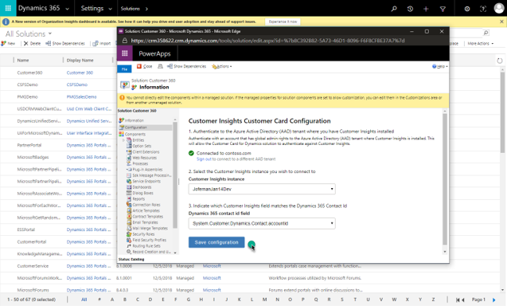
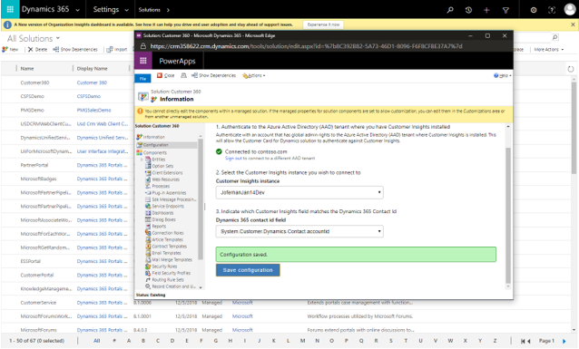

# Customer Card add-in

[!INCLUDE [cc-beta-prerelease-disclaimer](../includes/cc-beta-prerelease-disclaimer.md)]

## Requirements

- Dynamics 365 for Customer Engagement v9.0+ 
- Unified Interface enabled: Sales Hub, Customer Service Hub, Project Resource Hub 
- Users who will use the Customer Insights Customer Card in Customer Engagement need to be added as users on Customer Insights. You can do so in the **Permissions** page in the **Admin** section. See below.

> [!div class="mx-imgBorder"] 
> 

## Installation into Dynamics 365 for Customer Engagement

1. As an admin, go to the **Settings** section in Customer Engagement, and select **Solutions**. 

   > [!div class="mx-imgBorder"] 
   > 

2. Select the display name link for the Customer Insights solution.

   > [!div class="mx-imgBorder"] 
   > 

3. Here you will configure the overall settings for the customer card add-in. The first step is to log in with an admin Azure Active Directory (AAD) account you use to configure Customer Insights.

   > [!NOTE]
   > Check that the browser pop-up blocker is not blocking the authentication window when you select the authenticate button. 

   > [!div class="mx-imgBorder"] 
   > 

4. The next step is to select the Customer Insights instance you wish to fetch data from.

   > [!div class="mx-imgBorder"] 
   > 

5. The last step on the overall setting is to select which field on the Customer Insights Customer entity corresponds to the id of the Contact entity on your Customer Engagement organization. 

   > [!div class="mx-imgBorder"] 
   > 

6. Select **Save configuration** to save the setting. 

   > [!div class="mx-imgBorder"] 
   > 

   > [!div class="mx-imgBorder"] 
   > 

7. Next, you will need to assign the following user roles:

   - Customer Insights Customizer: Assign this role to the users who will customize the content to be shown on the card for the whole organization.
   - Customer Insights Card Standard User: Assign this role to the users who will use the card for consumption, but who won’t customize. 
   
   > [!div class="mx-imgBorder"] 
   > 

8. Now you can add the Customer Card controls into your Contact form. To do so, go to the **Settings** section in Customer Engagement, and then select **Customizations**. 
 
   > [!div class="mx-imgBorder"] 
   > 

9. Select **Customize the System**.

   > [!div class="mx-imgBorder"] 
   > 

10.	Browse to the Contact entity, expand its menu, and then select **Forms**. 
    
    > [!div class="mx-imgBorder"] 
    > 

11. Select the contact form you would like to add the customer card controls.

    > [!div class="mx-imgBorder"] 
    > 

    > [!div class="mx-imgBorder"] 
    > 

## Demographic control

1. To add the demographic control, in the form editor, drag any field from the field explorer to where you would like the demographic control to be placed.  

   > [!div class="mx-imgBorder"] 
   > 

2. Select the field you just added and select **Change Properties**. 

   > [!div class="mx-imgBorder"] 
   > 

3. Uncheck **Display label** on the form. 
   
   > [!div class="mx-imgBorder"] 
   > 

4. Go to the **Controls** tab and select **Add Control**.

   > [!div class="mx-imgBorder"] 
   > 

5. Select **Demographic_Control** and select **Add**.

   > [!div class="mx-imgBorder"] 
   > 

6. Select the **Web** option for the Demographic_Control.

   > [!div class="mx-imgBorder"] 
   > 

7. Select **Save** and **Publish** to publish the contact form where you have placed the demographic control.

   > [!div class="mx-imgBorder"] 
   > 

8. Go to the published contact form. You will see the demographic control. You might need to log in the first time you use it. To customize what you want to show on the demographic control, select the edit button in the upper-right. 

   The customization you perform here will apply across the organization.

   > [!div class="mx-imgBorder"] 
   > 

   > [!div class="mx-imgBorder"] 
   > 

## Timeline control

1. In the form editor, drag any field from the field explorer to where you would like the demographic control to be placed.  

   > [!div class="mx-imgBorder"] 
   > 

2. Select the field you just added and select**Change Properties**. 
 
   > [!div class="mx-imgBorder"] 
   > 

3. Uncheck **Display label** on the form.
   
   > [!div class="mx-imgBorder"] 
   > 

4. Go to the Controls tab and select **Add Control**.

   
   > [!div class="mx-imgBorder"] 
   > 

5. Select **Timeline_Control** and then **Add**.

   > [!div class="mx-imgBorder"] 
   > 

6. Select the **Web** option for the Timeline_Control.

   > [!div class="mx-imgBorder"] 
   > 

7. Select **Save** and **Publish** to publish the contact form where you have placed the timeline control.
   
   > [!div class="mx-imgBorder"] 
   > 

8. Go to the publishes contact form. You will see the timeline control. You might need to log in the first time you use it. 

   > [!div class="mx-imgBorder"] 
   > 

