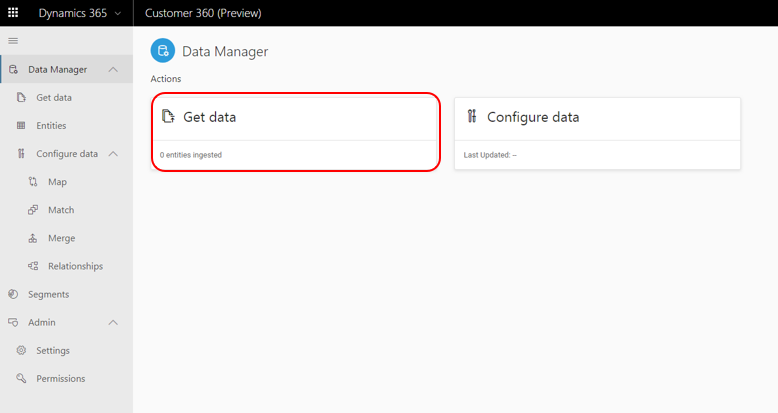

# Data Manager

[!INCLUDE [cc-beta-prerelease-disclaimer](../includes/cc-beta-prerelease-disclaimer.md)]

Data Manager includes two modules: **Data Sources** and **Configure Data** as shown below:

   > [!div class="mx-imgBorder"] 
   > 

In the next two Data Manager sections (*Data Sources* and *Common Connectors Guidance*), we will explain how to bring data from many of your sources: 

- Transactional sources
- Observational sources
- Behavioral sources
- Any other data you might have 

Connecting to your data sources is the first step towards unlocking one of the unique promises behind Customer Insights - consolidating and reconciling data on your customers from multiple sources that once were disparate and conflicting. 

In the [Data Sources](pm-data-sources.md) and [Common Connectors Guidance](pm-common-connectors.md) topics, you will learn how to complete the mandatory data ingestion process via the **Data Sources** page (accessible via a corresponding tab on the left-side menu).

**Note**: At this point on-premises data sources are not supported in Customer Insights. 

Then, you can either:
- Start the data configuration process (accessible both via the **Configure Data tile** within the Data Manager page, and via the **Configure Data tab** on the left-side menu). Once completed with the Data Sources section, review the Configure Data section.
- Or first explore the data that you have just ingested through the **Entities** screen (accessible via the left side menu too). Once you've completed the Data Sources section, review the Entities section. 

