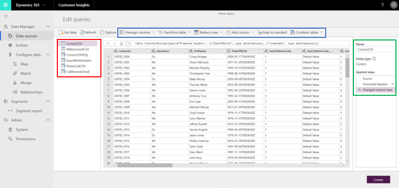
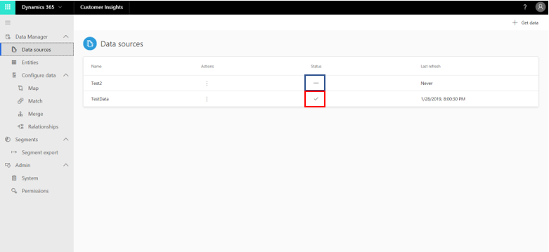

# Data sources

Dynamics 365 Customer Insights lets you use your data from [a wide range of data sources](data-sources-list.md).

Import data to Customer Insights with one of the many [out-of-the-box connectors](data-sources-list.md) that are available for sources such as Dynamics 365 apps, Azure SQL databases, and Azure Blob storage. Even if you don't find a suitable connector for your source, you can export the data from your source as a CSV file and import it to Customer Insights with the CSV connector.

## Bring your data into Customer Insights

> [!NOTE]
> Currently, on-premises data sources are not supported in Customer Insights.

### Create a new data source

1. In Customer Insights, go to **Data sources**.

2. Select **Get data**.

3. Provide a **Name** for the data source, and select **Save** to create the data source.

4. Choose one of the [available connectors](data-sources-list.md). To load data from Dynamics 365 apps, choose the **Common Data Service** connector.

5. Enter the required details for the selected connector. For more information about some of the most frequently used data sources (like Dynamics 365, CSV and text files, Blob storage, and Azure SQL Database), see [Common Connectors Guidance](pm-common-connectors.md).

> [!NOTE]
> If supported by the data source, you can [configure an incremental refresh](incremental-refresh-data-sources.md) to speed up the refresh process.

### Add, review, and transform entities

In this step, you'll add entities to your data source. In Customer Insights, entities are datasets. If you have a database that includes multiple datasets, each dataset is its own entity.

1. In the **Edit queries** dialog of Power Query you can review and refine the data. The entities that the systems identified in your selected data source appear in the left pane (1).

   > [!div class="mx-imgBorder"]
   > 

2. You can also transform your data. Select an entity to edit or transform. Then, open one of the menus (2) located at the top of the Power Query window to find a specific transformation. Each transformation is added as a processing step (3), which can be modified as needed.

   > [!NOTE]
   > It might not be possible to make changes to data sources that are currently being used in one of the app's processes (*segmentation*, *match*, or *merge*, for example). Using the **Settings** page, you can track the progress of each of the active processes. When a process completes, you can return to the **Data Sources** page and make your changes.

3. You can add additional entities to your data source by selecting **Get data** in the **Edit queries** dialog.

   These transformations are highly recommended:

   - If you're ingesting data from a CSV file, and the first row has headers, go to **Transform table** and select **Use headers as first row**.

   - Map your data to a standard format of data. Customer Insights allows you to map your data to the Common Data Model. To do so, select **Map to standard** in the Power Query header, and then map fields from your source data to Common Data Model fields.

4. Select **Create** at the bottom of the Power Query window to save the transformations. After saving, you'll find you data source on the **Data sources** page.

5. On the **Data sources** page, select the ellipses under **Actions** and then select **Refresh**.

## Review ingested data sources

You'll see the name of each ingested data source, as well as its status and the last time the data was refreshed for that source.

> [!div class="mx-imgBorder"]
> 

There are four possible statuses:

|Status  |Description  |
|---------|---------|
|Available   |Data source was successfully ingested if a date and time are shown. Or, data source doesn't need to be ingested, if no date and time are shown.          |
|Needs entities   |The data source has no data ingested yet.         |
|Refreshing    |Data ingestion is in progress. You can cancel this operation by selecting **Stop refreshing** in the **Actions** column. Stopping the refresh of a data source will revert it to its last refresh state.       |
|Unable to refresh     |Data ingestion ran into errors. Select the **See details** link to review the errors within 24 hours of the time of failure.         |

Loading data can take some time. After a successful refresh, the ingested data can be reviewed from the **Entities** page. For more information, see [Entities](pm-entities.md).

## Edit existing data sources

> [!NOTE]
> You can only edit data sources that aren't in the process of refreshing.

1. In Customer Insights, go to **Data sources**.

2. Select the vertical ellipses next to the data source you want to change and select **Edit** from the drop-down menu.

3. Apply your changes in the **Edit queries** Power Query dialog.

4. Select **Create** in Power Query after completing your edits to save your changes.

## Delete a data source

1. In Customer Insights, go to **Data sources**.

2. Select the vertical ellipses next to the data source you want to remove and select **Delete** from the drop-down menu.

3. Confirm your deletion.

## Next step

To review all the entities that were ingested to the system, see [Entities](pm-entities.md).
