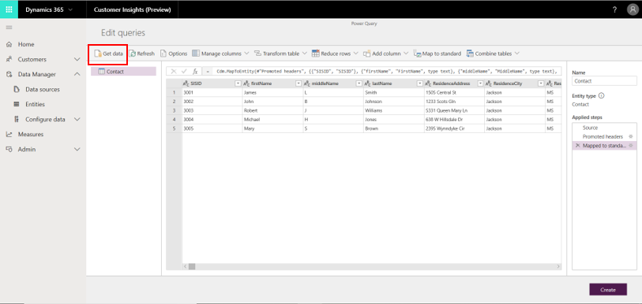
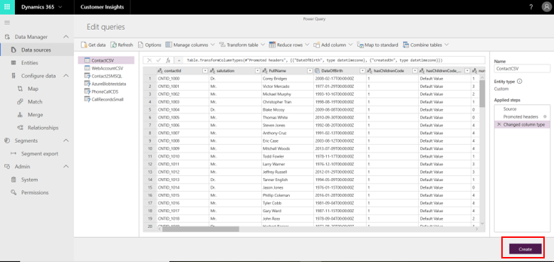
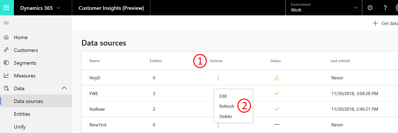
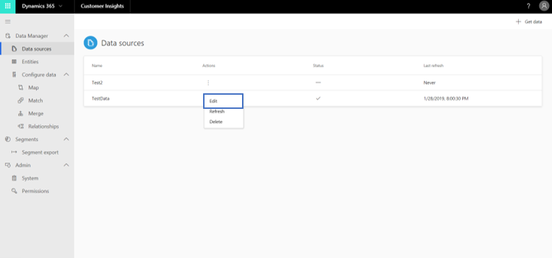
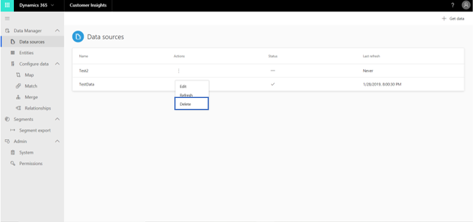

# Data sources

[!INCLUDE [cc-beta-prerelease-disclaimer](../includes/cc-beta-prerelease-disclaimer.md)]

<!--note from editor: Below--change "Blob store" to "Azure Blob storage"? (Cloud Style Guide) -->

You can bring in data to Dynamics 365 Customer Insights by using the 20+ out-of-the-box connectors that we make available for sources such as Dynamics 365, Azure SQL Database, and Blob store. Even if you don’t find a suitable out-of-the-box connector for your source, you can always export the data from your source as a CSV file and import to Customer Insights using our CSV connector. 

To import data to Customer Insights, you need to create a data source in the **Data sources** page. It’s recommended that you have multiple data sources, as that will allow you to have different refresh schedules and credentials for each of your data sources.

## Bring your data into Customer Insights 

> [!IMPORTANT]
> Currently, on-premises data sources are not supported in Customer Insights. 

### Step One (mandatory): Create a new data source on the Data sources page

Follow these steps to load the data into Customer Insights:

1. Navigate to **Data sources** from the **Data Manager** page.

   > [!div class="mx-imgBorder"] 
   > 

2. Select **Get data**.

   > [!div class="mx-imgBorder"] 
   > 

3. Provide a name for the data source, and select **Save**. This will create the data source. 

   > [!div class="mx-imgBorder"] 
   > 

4. Choose one of the many available connectors that are available.

   - Some of the following data sources are not yet supported, such as OData. 

   > [!div class="mx-imgBorder"] 
   > 

   - To load data from Customer Engagement, choose the  **Common Data Service for Apps** connector.

   > [!div class="mx-imgBorder"] 
   > 
   
5. After choosing a connector, you will be required to fill in some fields. For further guidance around filling in those fields for some of the most common data sources (for example, Dynamics 365, CSV and text files, Blob storage, and Azure SQL Database), review [Common Connectors Guidance](pm-common-connectors.md).  

### Step Two (mandatory): Add and review entities

<!--note from editor: In Step 4, list after screen shot: confirming that the minus sign outlined in blue = successfully ingested and checkmark outlined in red = no data ingested. -->

In the this step, you'll add entities to your data source. In Customer Insights, entities are datasets. For example, if you have a database that includes multiple datasets, each of those datasets is an entity (an Orders dataset or Sales dataset, for example). 

1. Use the Power Query window shown in the following example to review and possibly configure the data. The entities that the system identified in your selected data source will appear on the left (outlined in red):

   > [!div class="mx-imgBorder"] 
   > 

2. In this step, you can also edit and transform the data. First, choose an entity to edit or transform. Then use one of the menus located at the top of the Power Query window to find a specific transformation (those are outlined in blue in the preceding example). Also note that each transformation will be added as a processing step, as outlined in green in the preceding example, which can always be modified as needed.

3. Lastly, you can add additional entities to your data source by selecting **Get data** as outlined in red in the following example.

   > [!div class="mx-imgBorder"] 
   > 

Note that the next few transformations are highly recommended.

   - If you are ingesting data from a CSV file, and the first row has headers, you should open the **Transform table** menu and then select the **Use headers as first row** option.

   > [!div class="mx-imgBorder"] 
   > 

   - In addition, it is recommended that you map your data to a standard format of data. Customer Insights allows you to map your data to the Common Data Model. In order to do so, select **Map to Standard**, and then map fields from your source data to Common Data Model fields.

   > [!div class="mx-imgBorder"] 
   > 

3. Select **Create** at the bottom of the Power Query window to save.

   > [!div class="mx-imgBorder"] 
   > 

4. After saving, you can expect to see your data source added in the **Data sources** page.

   > [!div class="mx-imgBorder"] 
   > 

For each ingested data source, besides its name, you can expect to see the last time the data was refreshed for that data source, as well as its status. There are three possible statuses:

- Data was successfully ingested (example is outlined in blue in the preceding image).
- No data was ingested yet (example is outlined in red in the preceding image).
- Data is still loading into Customer Insights (represented by a *warning sign* icon).

At this point, you should refresh the data source that you just saved. Select the button outlined in red in the following image, and then select **Refresh**, as outlined in blue.

> [!div class="mx-imgBorder"] 
> 

At this point, repeat the same steps for each data source you want to ingest into Customer Insights.

### Step Three (optional): Review ingested data

It is possible that the data load will take some time. After successfully refreshing, the ingested data can be reviewed from the **Entities** page as shown in the following example. For more information on the **Entities** page, see [Data Manager: Entities](pm-entities.md).

> [!div class="mx-imgBorder"] 
> 

### Step Four (optional): Edit existing data sources

> [!NOTE]
> The Edit operation is available only for data sources that are not currently refreshing.

Follow these steps to edit an existing data source. 

1. Browse to the data source that you want to edit.

   > [!div class="mx-imgBorder"] 
   > 

2. Select **Edit** to edit the data source in Power Query.

   > [!div class="mx-imgBorder"] 
   > 

3. Select **Create** in the Power Query window after completing the edits in order to save your changes. If you want to remove a data source, select **Delete** for that data source.

   > [!div class="mx-imgBorder"] 
   > 

### Next steps:

At this point, you are ready to unlock unique customer insights through the mandatory **Configure data** sections (those include *Map*, *Match*, and *Merge*). If you first want to review all the entities that were ingested, see **Entities**. 

