# Enrichment

[!INCLUDE [cc-beta-prerelease-disclaimer](../includes/cc-beta-prerelease-disclaimer.md)]

Dynamics 365 Customer Insights enables you to consolidate customer data from all of your sources through the map, match, and merge phases. At the same time, Customer Insights goes beyond that and puts at your fingertips information about your customers that comes from proprietary data. This section covers the **Enrichment** page, which can be used to unlock data on affinities for hundreds of brands and dozens of interest-categories. These affinities are extracted for profiles that might be similar to your customers'. Some examples of interest-categories are *Home Appliances*, *Shoes* and *Financial Planning*.

The **Enrichment** page can be accessed through the app's left-side menu:

// replace 1
> [!div class="mx-imgBorder"] 
> 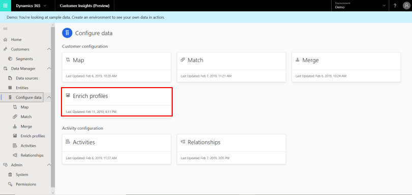

>[!NOTE]
>Completing both the data ingestion and data unification processes is a prerequisite to enrichment. If you don't complete one or more of those steps, you can expect to get the following notification.

  > [!div class="mx-imgBorder"] 
  > 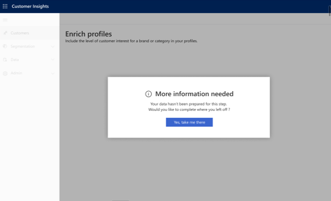

## Explore the Enrichment page

> [!div class="mx-imgBorder"] 
> 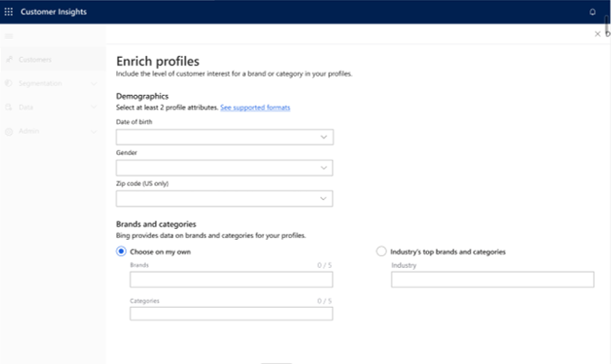

As shown in the preceding example, the **Enrichment** page includes two major sections:

- The **Demographics** section, where you should make selections for at least two of the three fields, **Date of Birth**, **Gender**, and **Zip Code**. The intent behind these selections is to focus on a specific cohort of profiles' types for which you wish to gain knowledge around preferred brands and interests. 
- The **Brands and categories** section, where you can take one of two approaches: **Choose on my own** or **Industry's top brands and categories**. We will explore both options.

### Make selections in the Demographics section

As mentioned earlier, you are required to make at least two selections. 

Only some formats are supported for each of the fields:

- Supported formats for **Date of Birth**: M/d/yyyy, MMMM d, yyyy-mm-dd, MMMM yyyy
- Supported formats for **Gender**: Male, Female, Unknown
- Supported formats for **Zip Code**: Should be a 5-digit US ZIP code (only US-supported at this point)

### Make selections in the Brands and categories section

> [!div class="mx-imgBorder"] 
> 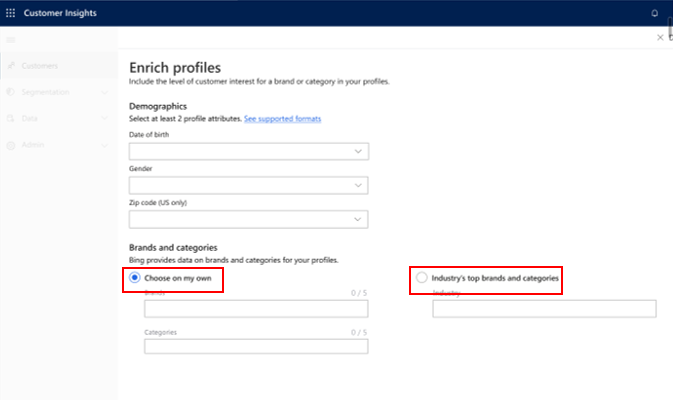

First, choose one of the following options (also highlighted in the preceding image). Then, complete your selections for that option.

- **Choose on my own**: This option allows you to choose brands and interest-categories that are of most interest to you and get affinities for those selections. For example, *Coca-Cola* and *Starbucks* were chosen in the following example.
  
    > [!div class="mx-imgBorder"] 
    > 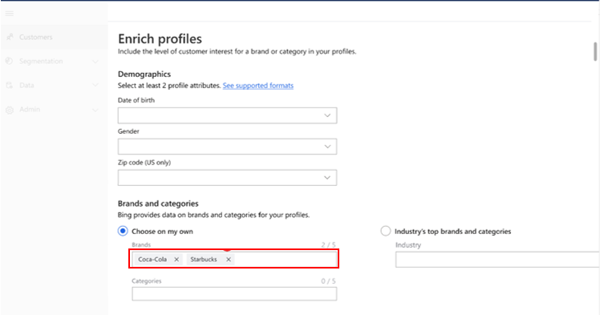

    To add a brand or interest, in the keywords field (shown in the preceding image), type a keyword. If that keyword matches a brand or interest name in the Microsoft database, it will be saved. You can save up to five selections. If there is no match, you will get the following notice, which you can use to send a suggestion to the Customer Insights team.

    > [!div class="mx-imgBorder"] 
    > 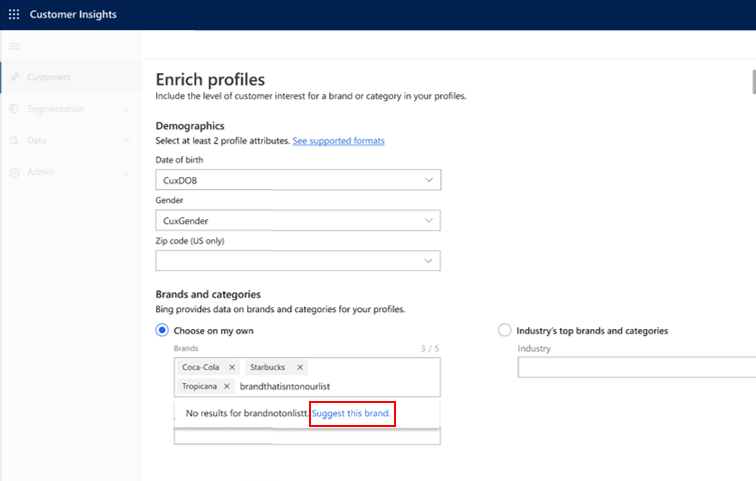

- **Industry's top brands and categories**: For a selected industry, get the brands and interests that your total customer base, taken together, has the highest affinity for. Note that in "customer base" we refer here only to those customers whose profiles are similar to the ones defined in the **Demographic profile attributes** part.
  
### Run the enrichment process

Select **Run** at the top of the screen.

> [!div class="mx-imgBorder"] 
> 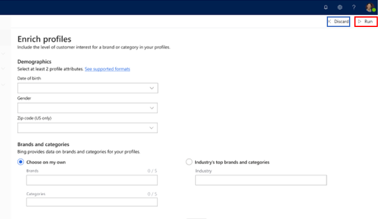

You'll see the following page as long as the enrichment algorithm is still running.

> [!div class="mx-imgBorder"] 
> 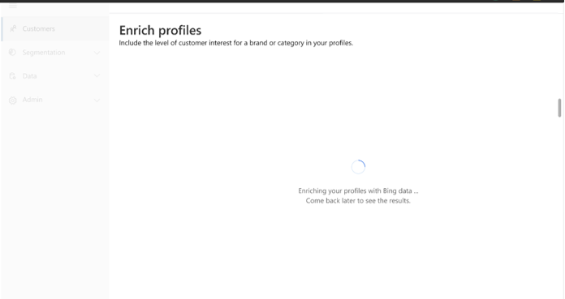

To reselect your definitions and keywords, use the **Discard** button.

### Validate the enrichment process output

If the enrichment process succeeds, you'll see the following screen.

> [!div class="mx-imgBorder"] 
> 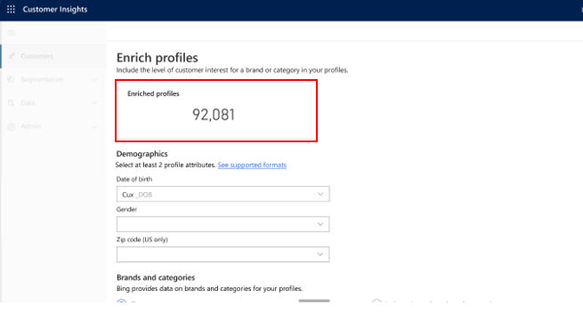

Use the **Enriched profiles** result to assess your enrichment definitions and keywords, and to consider whether any of them should be reconfigured.

If the enrichment process fails, you'll find the reason for that failure at top of the screen.

> [!div class="mx-imgBorder"] 
> 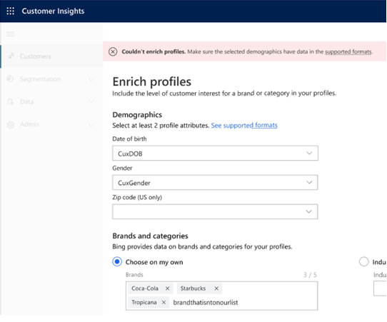

### Gain richer insights into your customer base

Once you have completed the enrichment process, you have unlocked additional information on affinities for brands and interests:

1. Explore affinities histograms on the home page.

   > [!div class="mx-imgBorder"] 
   > 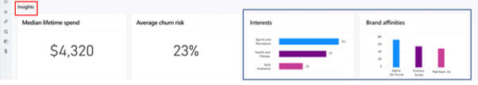

    This can be done within the **Insights** section (#1 in the preceding example). The diagrams shown in #2 present the top brand affinities and interests for your total customer base. Note that the Y-axis in those histograms represent the number of profiles who have a specific brand or category affinity.

2. Explore the **MsftAudienceIntelligence: Customer 360** entity on the **Entities** page:

   - Go to the **Entities** page.
   - Select the **MsftAudienceIntelligence: Customer 360** entity.

      > [!div class="mx-imgBorder"] 
      > 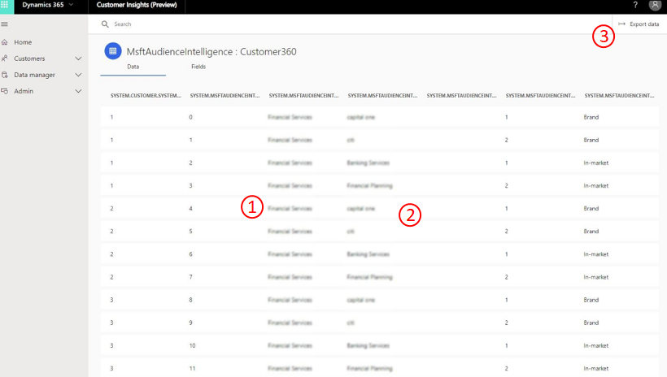

   - In the preceding example, one column (see #1) presents the brands and interests that were evaluated by the enrichment algorithm.
   - Another column (see #2) presents the verticals to which these brands and interests belong.
   - The rest of the columns specify relative affinities to these brands and interests among profiles that are similar to your customers'. Note that these affinity numbers represent ranks. A rank of 1 stands for the strongest affinity, and from there, the affinity decreases as the number increases.  
   - You can also export this entity using the **Export data** button in the upper-right corner of the screen (#3).

### Next step
You might want to extract more insights using the **Segments**, **Customer Card**, and **Connectors** modules if you haven't done so. You might also want to define **Measures** and/or **Activities** for richer insights. 
