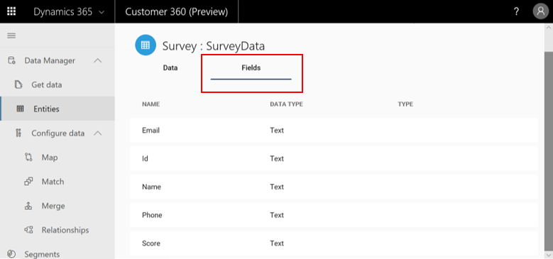

# Entities

[!INCLUDE [cc-beta-prerelease-disclaimer](../includes/cc-beta-prerelease-disclaimer.md)]

After ingesting your data using the **Data sources** page, you can visit the **Entities** page to evaluate how complete and useful it is. In Customer Insights, *Entities* are *datasets*. Many of the product processes - from data unification, to relationships and segmentation, to measures and activities, are all organized around the entities you will choose. Reviewing the Entities page can help you validate the output of each of those processes. 

> [!div class="mx-imgBorder"] 
> 

The **Entities** page includes seven columns: 
- **Name**: The name of your data entity—a category such as Account or Activity, for example. Note that a warning sign next to an entity name means that the data for that entity didn't load successfully. 
- **Source**: Answers the question *From what data source was this entity ingested?* (for example, a CSV file or Azure data source).
- **Created by**: Answers the question *By whom was this entity originally created?*
- **Created**: Answers the question *When was this entity created?*
- **Updated by**: Answers the question *By whom was this entity's data updated?*
- **Last updated**: Answers the question *When was the last time this entity's data was updated?*
- **Last refresh**: Answers the question *When was the last time this entity's data was refreshed?*

## Exploring a specific entity's data

Select an entity to explore the different fields and records included within that entity. In the example below, the *Survey: SurveyData* entity was selected:

> [!div class="mx-imgBorder"] 
> 

When you open the **Entities** page, the **Data** tab is selected by default (shown in the preceding image), and the **Data** table appears below it. This table provides details about each of this entity's records, including the record's value, when it was created, and when it was last refreshed.

After selecting the **Fields** tab, the **Fields** table appears. You can use this table to view all the details for the selected entity, such as field names, data types, and types. 

Note that the items in the **Type** column are Common Data Model (CDM) associated types. Those are semantic types that are either auto-identified by the system or can be manually identified using the **Map** screen (visit the **Map** section to learn more). Those types can differ from the attributes' data types (for example, the field *Email* below has a data type *Text* but it's (semantic) CDM-type might be *Email* or *EmailAddress*):

> [!div class="mx-imgBorder"] 
> 

Both the **Fields** table and the **Data** table show only a sample of your entity's data. To view the full data set, go to the **Data sources** page, select an entity, select **Edit**, and then view this entity's data with the Power Query editor as explained in [Data sources](pm-data-sources.md).

### Next step
See the [**Configure data** section](pm-configure-data.md) to learn how to complete the three mandatory data configuration phases: *map*, *match*, and *merge*.
