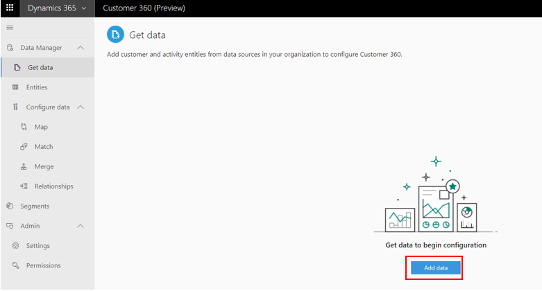
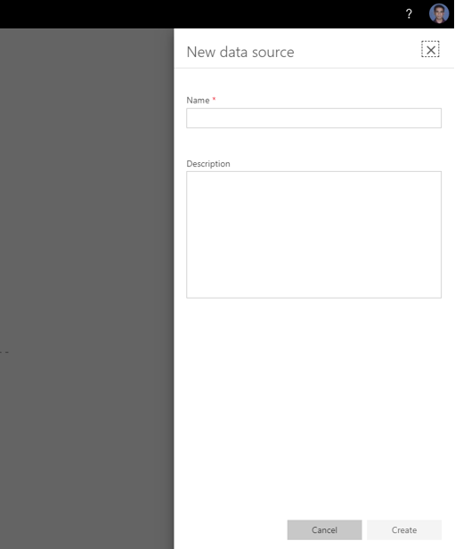
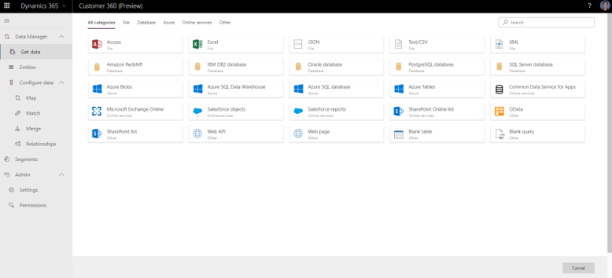
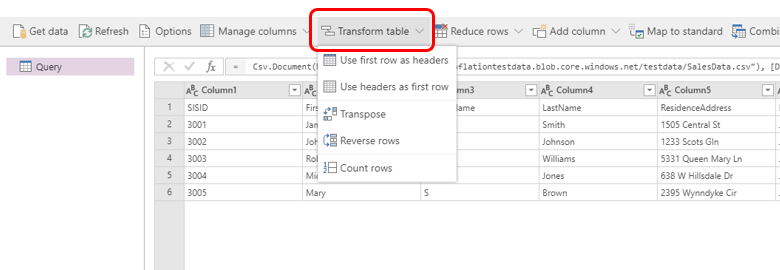
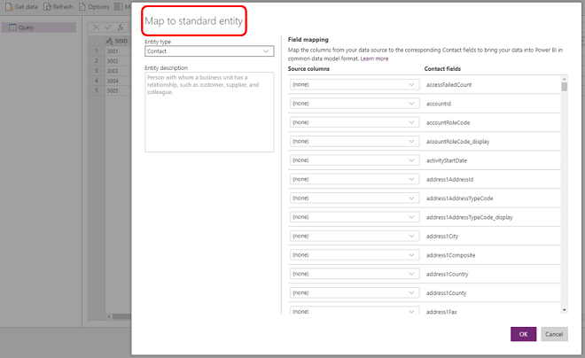
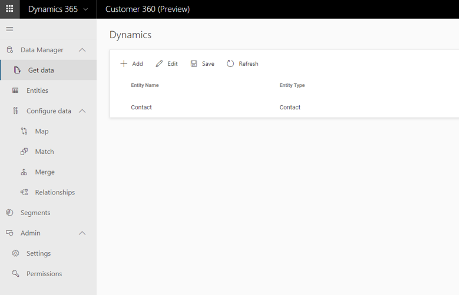
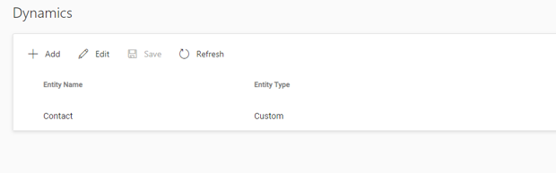
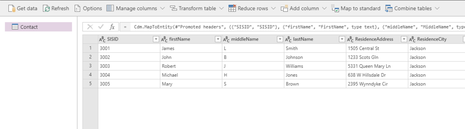

# Get Data

[!INCLUDE [cc-beta-prerelease-disclaimer](../includes/cc-beta-prerelease-disclaimer.md)]

**You can bring in data to Customer 360 by using the 20+ out-of-the-box connectors** that we make available for sources, such as Dynamics 365, SQL Azure, and Blob store. Even if you don’t find a suitable out-of-the-box connector for your source, **you can always export the data from your source as a CSV file and import to Customer 360 using our CSV connector.** To import data to Customer 360, you need to create a data source. It’s recommended to have multiple data sources based on your sources of the data as it allows you to have different refresh schedules and credentials for refresh.

## Common Connectors Guidance

## Get data steps

### Step 1 (mandatory): Creating a new data source
To load data to Customer 360 follow the following process:

1. Navigate to **Get Data** from the **Data Manager page:**

  > [!div class="mx-imgBorder"] 
  > 

2. Click **Add Data** as shown below:

  > [!div class="mx-imgBorder"] 
  > 

3. **Provide a name and description** for the data source and select **Create**. This will create the data source for you. 

  > [!div class="mx-imgBorder"] 
  > 

### Step 2 (mandatory): Adding Entities
Within the next step you will add **entities** to your data source. In Customer 360 **entities are datasets**. For example, If you have a database that includes multiple datasets about your customers, each of these data sets is an **entity** (such as an **Orders** dataset, a **Sales** dataset, etc). 

1. In order to start ingesting entities, pick one of the many available data sources that are available within the screen below:

  > [!div class="mx-imgBorder"] 
  > 
  
2. After choosing a data source, you will be required to fill some fields as shown in the example below. For further guidance around filling those fields for some of the most common data sources (Dynamics 365, csv. and excel files, Blub storage, Azure SQL Database, etc), review the **Common Connectors Definitions** sub-section **that can be found under this section** in the left menu. 

  > [!div class="mx-imgBorder"] 
  > 

3. From the list of available entities, select the entity that you want to load. **In this step you can also transform the data.** For example, if you are ingesting data from a .CSV file and the first row has headers then you can select **Transform Table** to do the following:

  > [!div class="mx-imgBorder"] 
  > 

In addition, it is highly recommended to map your data to standard format of data. Customer 360 allows you to map your data to the **Microsoft Common Data Model (CDM)** during your ingestion process. In order to do so, select **Map to Standard**, and then map fields from your source data to CDM fields:

  > [!div class="mx-imgBorder"] 
  > 

4. Select **Save** to save the data source:

  > [!div class="mx-imgBorder"] 
  > 

5. After saving, select **Refresh** to load the data to Customer 360:

  > [!div class="mx-imgBorder"] 
  > 

Note: In the future this step will happen automatically.

**At this point, repeat the same steps for each data source into which you want to ingest data using Customer 360.**

### Step 3 (optional): Reviewing the Ingested Data
Customer 360 will take a couple of minutes to load the data. After successfully refreshing, the ingested data can be reviewed from the **Entities page** as shown below. For more information on the **Entity Page** visit the **Entities section**.

> [!div class="mx-imgBorder"] 
> 

### Step 4 (optional) Editing existing data sources
Note: The **Edit** operation is only available for Data sources that are not currently refreshing. 
Follow the below steps to edit an existing data source: 

1. Browse to the data source that you wish to edit:

  > [!div class="mx-imgBorder"] 
  > 

2. Click on the **Edit** button to edit the data source in Power Query: 

  > [!div class="mx-imgBorder"] 
  > 

3. Lastly hit **Save** as we did when we originally created our data source

### Next steps: 
At this point you are ready to unlock unique customer insights through the **Data Configure** sections (those include **Map**, **Match** and **Merge**). If you wish to review all the entities that were ingested as part of the **Get Data** process, review the **Entities** section first. 

// To add to a seperate sub-section that will be called *Common Connectors Definitions*:

// To add to a seperate sub-section that will be called *Recommended Trasformations*:
