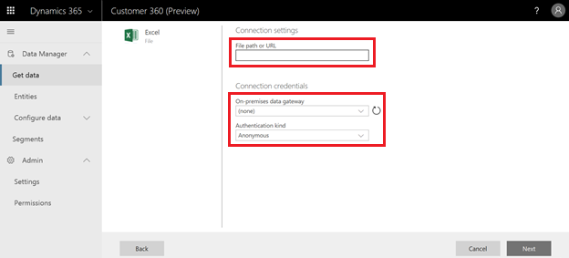
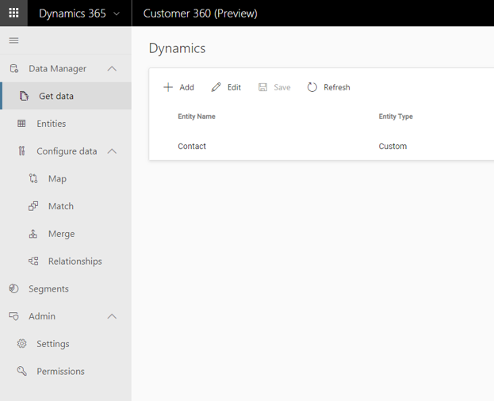

# Get Data

[!INCLUDE [cc-beta-prerelease-disclaimer](../includes/cc-beta-prerelease-disclaimer.md)]

Complete the following steps to load data from your data sources.

### Step one: Data Source Creation

Select **Get Data** as shown below: 

[]

- **If it’s the first time you are using Customer 360** you need to create a data source, and that is available through the highlighted **Add** button:

[add image 2b]

Then you should give your data source a name as shown below. You can also add an informative description.

[]

Lastly hit **Save** at the right bottom corner of the window. 

### Step Two: Ingesting Entities 

Within the data sources page that is shown below you should locate the specific sources that apply to your organization. First identify their types which are represented by the tabs at the top of the page (highlighted below). Then, search for your specific sources under the relevant tabs.

> [!div class="mx-imgBorder"] 
> 

Lastly, upon clicking a data source that you wish to ingest, you will need to complete all the required fields for that data source. An example for Excel (.csv) file mandatory fields is shown below. Once all field are filled, approve by selecting **Next** at the bottom of the page.

> [!div class="mx-imgBorder"] 
> 

### Step Three: Editing Entities

You can edit any entity that you have ingested in step two through the **power query editor.**
Editing columns, combining tables, and several other useful functionalities are available in the top screen menu (as shown in red below):
    
[6]
     
If you are new to power query, you might want to spend a couple of minutes on the following documentation that will walk you through these functionalities:
[link1]

### Step Four: Refreshing Data

Once finishing selecting and editing data sources, you will get to the following screen. The two final steps are to hit **Save** and then **Refresh** as shown below:

[7]

Note: In the future this step will happen automatically. 

### Next Step: 

Now you are ready to unlock unique customer insights through the **Data Configure** sections (those include **Map**, **Match** and **Merge**). If you wish to review all the entities that were ingested as part of the **Get Data** process, review the **Entities** section first. 

> [!div class="mx-imgBorder"] 
> 

> [!div class="mx-imgBorder"] 
> 

> [!div class="mx-imgBorder"] 
> 

> [!div class="mx-imgBorder"] 
> 

> [!div class="mx-imgBorder"] 
> 

> [!div class="mx-imgBorder"] 
> 

> [!div class="mx-imgBorder"] 
> 

> [!div class="mx-imgBorder"] 
> 

> [!div class="mx-imgBorder"] 
> 

> [!div class="mx-imgBorder"] 
> 

> [!div class="mx-imgBorder"] 
> 

> [!div class="mx-imgBorder"] 
> 

