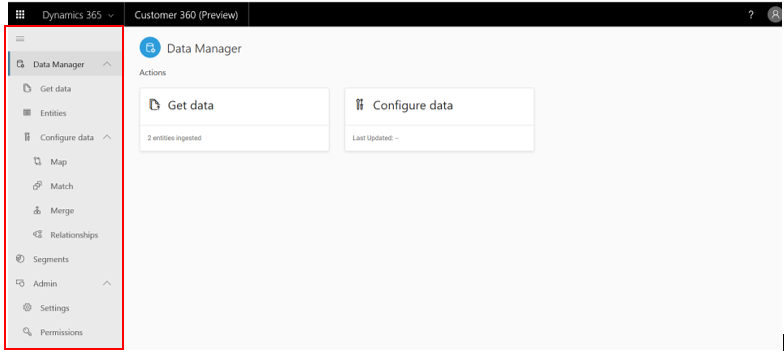

# Home Page

[!INCLUDE [cc-beta-prerelease-disclaimer](../includes/cc-beta-prerelease-disclaimer.md)]

**Home Page** is the first page you will see upon entering the Customer 360 app. If it's the first time you are using Customer 360, make sure you first went through the ***Onboarding Guide***. All product sections are accessed through their corresponding tab names in the left-side menu of the app as shown below:

// Replace with final menu once finalizaed:
> [!div class="mx-imgBorder"] 
> 

## Exploring the Home Page
The home page porpose is to quickly equip you, the user, with an holistic view on your unified customer base. Through the data configuration process you will use Customer 360 to unify datasets that once were siloed and disconnected, culminating at the creation of a unified dataset around your customers. Then you will use Segmentation, Customer 360 Dashboard, and other capabilities to unlock unique insights about your customers based on this unified dataset. 

// home page 1

Since many Customer 360 insights are dependent upon the completion of the data configuration process, at first many insights might not show up on the home page (example is highlighted above). As you go through the data configuration process, more and more insights will become unlocked.

// home page 2

As shown above, the homepage includes three major areas of insights. Note that the home page insights are based on the datasets that you bring into Customer 360. While some datasets are automatically loaded to Customer 360 from Dynamics 365 sources, all other datasources should be ingested using the **Data Sources** screen.

Those are the types of insights you can expect to find on the Homepage:
- **1. Aggragate-Level Insights (highlighted in blue):** Few tiles with unique insights about your overall customer base (including predictive KPIs such as average liklyhood of a customer to Churn)
- **2. Customer Profile List (highlighted in red):** This list includes your customers' profiles - each profile is represented by a row
- **3. Customer Segments (highlighted in green):** This part includes segments that were created around your customers 

## Next Step
As mentioned earlier, many of the home page insights are dependent upon the completion of the data configuration process, and this process, in turn, is based on loading data into Customer 360. Hence, next visit either the **Data Manager** or **Data Sources** screens.

 
