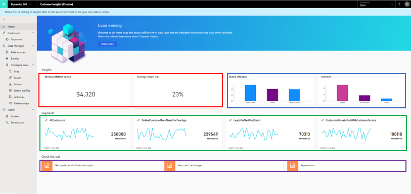

# Home 

[!INCLUDE [cc-beta-prerelease-disclaimer](../includes/cc-beta-prerelease-disclaimer.md)]

The **Home** page is the first page you see in the Customer Insights app. 

> [!div class="mx-imgBorder"] 
> 

If you are a trial user, make sure to switch from a demo environment before starting to use the product. This can be done via the environment switcher that is positioned on the top-right corner of the page (shown in red below):

> [!div class="mx-imgBorder"] 
> 

## Exploring the Home page

The **Home** page is designed to equip you with a holistic view around your unified customer base. Through the *Configure Data* process, you will use Customer Insights to take datasets that are siloed and disconnected and create a unified dataset of your customers. Then, you can use capabilities such as *Measures, *Enrich Profiles* and *Activities* to unlock richer insights. Lastly, you will use capabilities such as *Segments* and *Customer Card* to utilize and act upon those new insights.  

Many insights are dependent upon the completion of the data configuration process so few insights might show up initially on the Home page. Once you complete the [Data Manager](pm-data-manager.md)) [Configure Data](pm-configure-data.md) processes, more insights will appear on the Home page. 

The image below shows the types of insights you can expect to view on the **Home** page:

> [!div class="mx-imgBorder"] 
> 

Let's explore those insights:
- **Aggregate-level insights** (shown in red): Tiles with unique insights about your total customer base (may include predictive KPIs such as average likelihood of a customer churn).
- **Information on preferred brands and interests within your customer base (shown in blue):** This unique information can be unlocked via the **Enrich Profiles** screen after completing the *Map*, *Match* and *Merge* phases.  
- **Customer segments** (shown in green): Includes segments that were created around your customers. Note that some segments are auto-created by the system and will show up on the Home page prior to any manual segment creation. For information on how to manually create additional segments, visit the **Segments** section.
- **Links to specific parts within this documentation** (shown in purple).

## Next step
Many of the **Home** page insights are dependent upon the completion of the data configuration process and this process in turn is based on first loading data into Customer Insights. See the [Data Manager](pm-data-manager.md) or [Data Sources](pm-data-sources.md) topics to learn how to complete the data loading process. 

 
