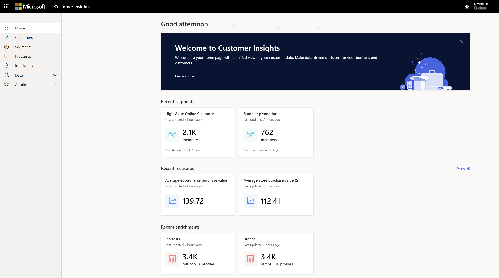

# Home 

[!INCLUDE [cc-beta-prerelease-disclaimer](../includes/cc-beta-prerelease-disclaimer.md)]

The first page you see in the Dynamics 365 Customer Insights app is the home page. 

> [!div class="mx-imgBorder"] 
> 

<!--note from editor: In sentence below--switch from a demo environment to what?  Also, are all the modes available to trial users?  -->

If you are a trial user, make sure you switch from a demo environment before you start. You can do this with the **Environment** toggle in the upper-right corner of the page.

> [!div class="mx-imgBorder"] 
> 

## Exploring the home page

The Customer Insights home page gives you a holistic view of your customer base and metrics to track the health of your business. To access these insights on the home page, take a few steps to onboard, configure, and enrich your data. 

Through the data manager and unify processes, you will take datasets that are siloed and disconnected, and create a unified dataset of your customers. Then, you can use capabilities such as *Measures*, *Enrich Profiles*, and *Activities* to unlock richer insights. Lastly, you will use capabilities such as *Segments* and *Customer Card* to act on the new insights.

The following image shows the types of insights you can expect to view on the home page.

> [!div class="mx-imgBorder"] 
> 

Let's explore those insights:

- **Aggregate-level insights** (#1): Tiles with business insights (from the measures you define on the **Measures** page). Only Business measures will show up here. Can include predictive key performance indicators (KPIs) such as average likelihood of customer churn.
- **Information on preferred brands and interests within your customer base** (#2): This unique information can be unlocked via the **Enrich Profiles** page after completing the *Map*, *Match*, and *Merge* phases.  
- **Customer segments** (#3): Includes segments that were created around your customers. For more information on how to manually create additional segments, visit the **Segments** section.

### Next step
Many of the home page insights are dependent upon the completion of the data configuration process, and this process in turn is based on first loading data into Customer Insights. See the [Data Manager](pm-data-manager.md) or [Data Sources](pm-data-sources.md) topics to learn how to complete the data loading process. 

Complete these steps before you start building insights on top of your data. 

 
