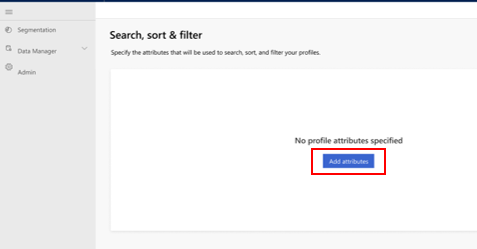

## Search, sort, and filter

[!INCLUDE [cc-beta-prerelease-disclaimer](../includes/cc-beta-prerelease-disclaimer.md)]

The end result of the data configuration process is the creation of the Customer Profile entity that equips you with a unified view into your total customer base. At the same time, there are cases in which you might want to quickly pull information on a specific customer or a group of customers. That can be done via the **Search** and **Filter** capabilities on the **Profiles** page.

> [!div class="mx-imgBorder"] 
> 

To further understand how to utilize those capabilities, visit the *Profiles* section. In this section, we will cover the complementing capability that enables you to edit the attributes by which you are searching, filtering, and sorting profiles. This is done on the **Search, sort & filter** page.

## Add attributes

On the first page, select **Add attributes** to get started.

> [!div class="mx-imgBorder"] 
> 

In the **Attributes** panel, choose all the attributes by which users will be able to search, filter, and sort customers on the **Profiles** page. You can use the **Search** field (shown in red) to search for a specific attribute by its name. Note that you can select only attributes that exist in the Customer Profile entity you created during the data configuration process.

> [!div class="mx-imgBorder"] 
> 

You will go to the **Search, sort & filter** page. In the example shown below, many attributes were already selected.

> [!div class="mx-imgBorder"] 
> 

You can always add more attributes via **Add attribute** (shown in red below). You can also remove any selected attributes using the button shown in blue.

> [!div class="mx-imgBorder"] 
> 

## Explore the Search, sort & filter page

Let's explore the table on this page, going left to right:

> [!div class="mx-imgBorder"] 
> 

**Name**: Presents the attribute's name as appears in the Customer Profile entity.
**Data type**: Specifies whether it's a *String*, a *Number*, or a *Date* type of data.
**Search**: Specifies whether this attribute can be used for searching customers on the **Profiles** page (using the **Search** field).
**Filter**: Specifies whether this attribute can be used for filtering customers on the **Profiles** page (using the **Filter** panel).
**Sort** Specifies whether this attribute can be used for sorting customers.
**Filter options**: Selecting **Edit** enables you to define how this attribute can be used for searching, filtering, and sorting.

## Edit the way an attribute can be used for searching, sorting, and fitering

After selecting **Edit** for a given attribute, one of three possible panels will show up, depending on the attribute's data type.

The **Filter** menu on the **Profiles** page can include a varying number of attribute levels (for example, anywhere between 2 and 10 age groups to filter customers by). Using the **Editing** panel, you can specify:

1. How many results will appear on the filter panel
2. In what order they will be organized

The following example is the **Editing** panel for string-type attributes.

> [!div class="mx-imgBorder"] 
> 

In this panel, you can specify the number of desired results on the **Filter** panel as well as the order policy by which they will be organized. 

The following example is the **Editing** panel for number-type attributes.

> [!div class="mx-imgBorder"] 
> 

In this panel you can specify the intervals included on the **Filter** panel as well as the order policy by which they will be organized.

The following example is the **Editing** panel for date-type attributes.

> [!div class="mx-imgBorder"] 
> 

In this panel you can specify the intervals included on the filter panel as well as the order policy by which they will be organized.

Save your selections using **Save** (shown in red below). Select **Run** (shown in blue) once you are ready to apply your settings so your definitions will affect the way other users can search and filter for customers using the **Profiles** page.

