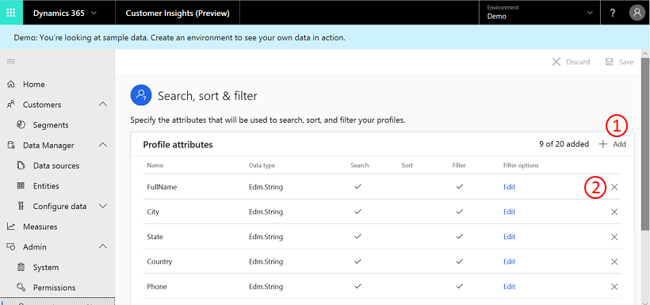
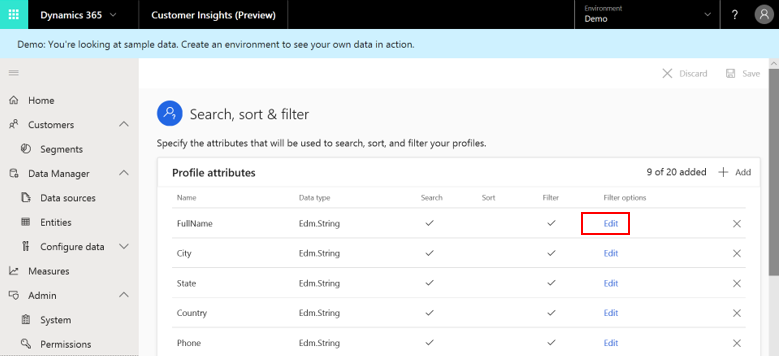
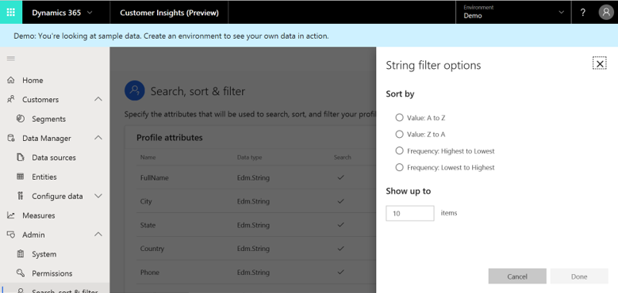
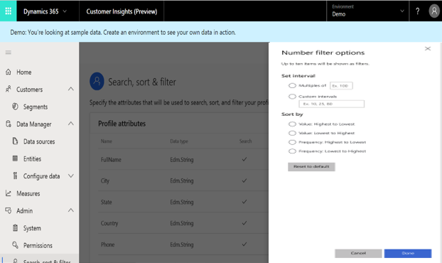
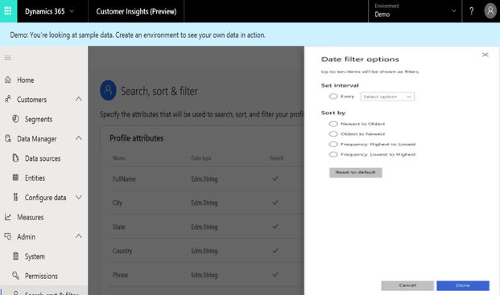

# Search & filter index

The result of unifying your customer data is a Customer Profile entity that provides a unified view into your total customer base. To quickly [find information on a specific customer or a group of customers](pm-profiles.md), you can configure the **Search** and **Filter** capabilities on the **Customers** page. Read on to learn how an admin can edit the attributes on the **Search & filter index** page which are available for searching and filtering to their users.

> [!div class="mx-imgBorder"]
> 

## Add fields and specify attributes

If it's the first time you define searchable attributes as an administrator, you need to define indexed fields first. We suggest you choose all the attributes by which users will be able to search and filter customers on the **Customers** page. You can only specify attributes that exist in the Customer Profile entity that you created during the data unification process.

1. Open the **Customers** page and select **Go to Search & filter index**. If you defined the attributes before, select the **Search & Filter index** control on the **Customers** page.

2. Select **Add fields** to specify the indexed fields.

3. Select the attributes in the list you want to add as indexed fields. You can always add more attributes by selecting **Add** (#1 in the image below). You can also remove any selected attributes using **Delete** symbol (#2 in the image below).

> [!div class="mx-imgBorder"]
> 

## Explore the Indexed customer fields table

The following information is presented in the table.

- **Name**: Represents the attribute's name as it appears in the Customer Profile entity.
- **Data type**: Specifies whether the data type is a string, a number, or a date.
- **Included in search**: Specifies whether this attribute can be used for searching customers on the **Customers** page using the **Search** field.
- **Add Filter**: Control to define how this attribute can be used for filtering on the **Customers** page.

## Editing filtering options for a given attribute

The **Filter** menu on the **Customers** page can include a varying number of attribute levels (for example, different age groups to filter customers by).

> [!div class="mx-imgBorder"]
> 

1. Select **Add Filter** for a given attribute on the **Search & filter index** page. You can define the number of results and the order in which they'll be organized. Depending on the attribute's data type, one of the following panes appears.

- String-type attributes

  > [!div class="mx-imgBorder"]
  > 

  Specify the number of desired results on the **Filter** panel and the order policy by which they will be organized.

- Numerical-type attributes

  > [!div class="mx-imgBorder"]
  > 

  Specify the intervals included on the **Filter** panel and the order policy by which they will be organized.

- Date-type attributes

  > [!div class="mx-imgBorder"]
  > 

  Specify the intervals included on the filter panel and the order policy by which they will be organized.

2. Select **Save** to apply your changes.

3. Select **Run** once you are ready to apply your settings.

   > [!div class="mx-imgBorder"]
   > 
