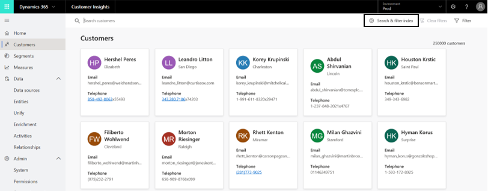
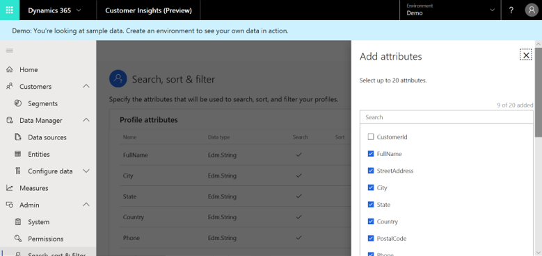
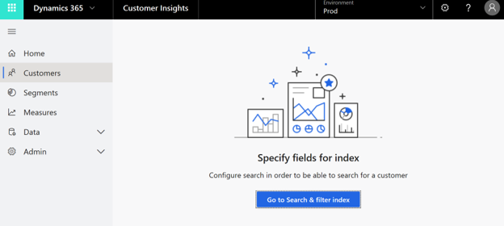
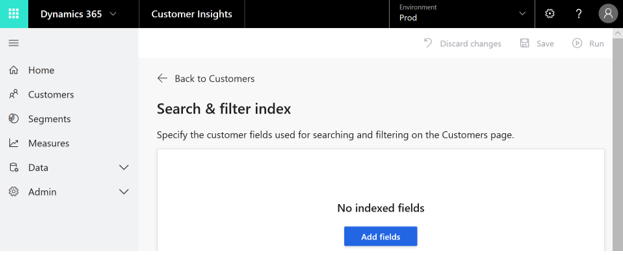
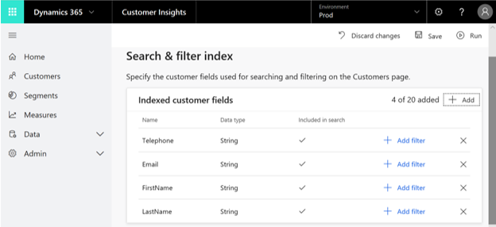
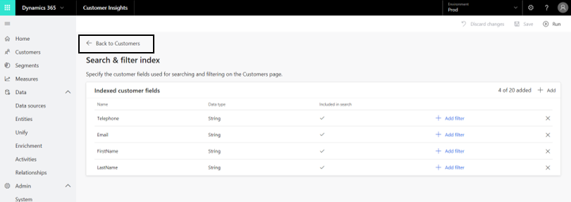

## Search & filter index

[!INCLUDE [cc-beta-prerelease-disclaimer](../includes/cc-beta-prerelease-disclaimer.md)]

The end result of the data unification process is the creation of the Customer Profile entity that equips you with a unified view into your total customer base. At the same time, you might want to quickly pull information on a specific customer or a group of customers. That can be done with the **Search** and **Filter** capabilities on the **Customers** page.

> [!div class="mx-imgBorder"] 
> 

To further understand how to utilize those capabilities, visit the [**Customers** section](pm-profiles.md). In this section, we will cover the complementing capability that enables you to edit the attributes by which you are searching and filtering profiles. This is done on the **Search & filter index** page that is accessible via the **Search & filter index** button on the **Customers** page:

> [!div class="mx-imgBorder"] 
> 

## Adding attributes

In the panel shown below, choose all the attributes by which users will be able to search and filter customers on the **Customers** page. You can use the **Search** field to search for a specific attribute by its name. Note that you can select only attributes that exist in the Customer Profile entity that you created during the data unification process.

> [!div class="mx-imgBorder"] 
> 

> [!div class="mx-imgBorder"] 
> 

> [!div class="mx-imgBorder"] 
> 

At this point you will see the **Search & filter index** page. In the following example, many attributes were already selected.

> [!div class="mx-imgBorder"] 
> 

You can always add more attributes with **Add** (#1 in the following example). You can also remove any selected attributes using the button shown in #2.

> [!div class="mx-imgBorder"] 
> 

## Exploring the Search & filter index page

Let's explore the table on this page, going left to right.

> [!div class="mx-imgBorder"] 
> 

- **Name**: Presents the attribute's name as it appears in the Customer Profile entity.
- **Data type**: Specifies whether the data type is a string, number, or date.
- **Included in Search**: Specifies whether this attribute can be used for searching customers on the **Customers** page (using the **Search** field)
- **Add Filter**: Selecting this button enables you to define how this attribute can be used for filtering on the **Customers** page

## Editing filtering options for a given attribute

The **Filter** menu on the **Customers** page can include a varying number of attribute levels (for example, anywhere between two and 10 age groups to filter customers by). 

After selecting **Add Filter** for a given attribute on the **Search & filter index** page, one of three possible panels will show up, depending on the attribute's data type. Using this panel you will be able to determine:

- The number of results that will appear on the **Filter** menu on the **Customers** page. 
- The order in which they will be organized.

The following image shows the panel that will open for string-type attributes.

> [!div class="mx-imgBorder"] 
> 

In this panel, you can specify the number of desired results on the **Filter** panel, as well as the order policy by which they will be organized. 

The following image shows the panel that opens for numerical-type attributes:

> [!div class="mx-imgBorder"] 
> 

In this panel, you can specify the intervals included on the **Filter** panel, as well as the order policy by which they will be organized.

Lastly, the following image shows the panel that opens for date-type attributes.

> [!div class="mx-imgBorder"] 
> 

In this panel, you can specify the intervals included on the filter panel, as well as the order policy by which they will be organized.

Save your selections using **Save**. Select **Run** once you are ready to apply your settings. 

> [!div class="mx-imgBorder"] 
> 

Once processing has completed, your definitions now dictate how other users can search and filter for customers using the **Customers** page. To go back to the **Customers** page, select the following button:

> [!div class="mx-imgBorder"] 
> 

