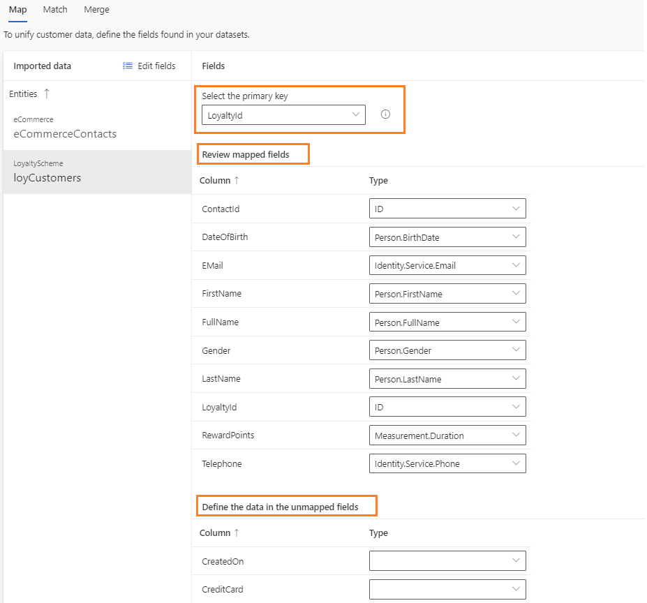

# Map

[!INCLUDE [cc-beta-prerelease-disclaimer](../includes/cc-beta-prerelease-disclaimer.md)]

There are two main goals behind the **Map** phase:

- **Entity selection:** Identify the entities which, upon unification, may lead to a dataset with more complete information about your customers.
- **Attribute selection:** For each entity, identify the columns you wish to combine and reconcile in the next data configuration phases: *Match* and *Merge* (those columns are also called *attributes*).

Select the **Map** tile on the **Configure Data** page to start the *Map phase*.

> [!div class="mx-imgBorder"] 
> 

## Select first entities

Start the *Map* phase by selecting **Add entities**.

> [!div class="mx-imgBorder"] 
> 

Within the next screen, add all the entities which, upon unification into a unified customer dataset, might lead to a better understanding about your customers:

> [!div class="mx-imgBorder"] 
> 

In the example above, the user used the **Search** field to search for the Contact and Survey entities since these include information that might be valuable to combine. An example might be understanding what address corresponds to what survey participant (given that the Address attribute exists only in the Contact entity). 

Then, the user selected the Contact and Survey entities. Those were found within the **Dynamics** and **Surveydata** data sources that were ingested through the **Data Sources** page. 

Lastly, the user selected **Save**.

> [!NOTE] 
> You should search for and select at least two entities in order to benefit from the data configuration process.

## View system auto-selections

The following page appears after completing your entities' selections.

> [!div class="mx-imgBorder"] 
> 

- On the left, you can see your ingested entities. By default, the first entity is auto-selected (contactCSV in the example above). To move to any other entity, select that entity's tile. 

- Note that the system auto-selected for you all the attributes for which attribute-type was auto-identified. Those attributes include Names, Email Address, as well as several others in the example above. As shown in red, those pre-selected attributes appear in the first column while their types are specified in the third column. You should review those pre-selected attributes since they will be used to combine your entities in the next configuration phase: *Match*. 

## Add and remove attributes

This can be done via **Edit**.

> [!div class="mx-imgBorder"] 
> 

After selecting **Edit**, the **Attributes Panel** will open.

> [!div class="mx-imgBorder"] 
> 

Use either the **Search** field or scroll down the **Attributes List** to locate and select your attributes of interest. Finish by selecting **Save**. Note that you can also choose all the attributes by selecting **Select all**. Once one attribute is selected, the same button can be used to unselect all your selections (now appear as **Clear all**).

## Add and remove entities

Click **Select** to either add or remove entities.

> [!div class="mx-imgBorder"] 
> 

Select the entities that you want to add to your existing entities list and deselect entities that you want to remove.

> [!div class="mx-imgBorder"] 
> 

## Select primary keys and define attribute types

> [!div class="mx-imgBorder"] 
> 

There are two mandatory selections you must complete prior to the completion of the *Map* phase.

1. **Primary key:** (shown in red above) It's mandatory to select one attribute as a primary key for each of your chosen entities. Note, for an attribute to be a valid primary key, it should not include either duplicate values, missing values, or Nulls. 
2. **Attribute Type:** Categories under which your attributes fall such as **Email** or **Name**. Adding a custom entity type is also possible. Select the type field for that attribute and type your custom attribute-type name. You can also change the attribute-types that were auto-identified by the system.  

## Next Step

As part of the data configuration process, proceed to the **Match** page either by selecting **Match** in the left-side menu or by selecting the **Match** tile within the **Configure Data** page. Visit the **Match** section to learn about this phase.
